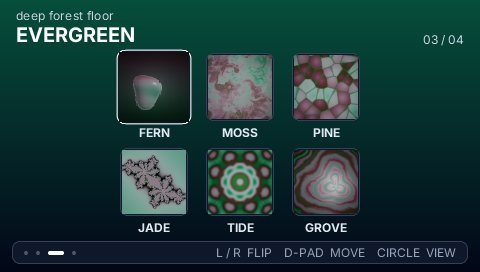
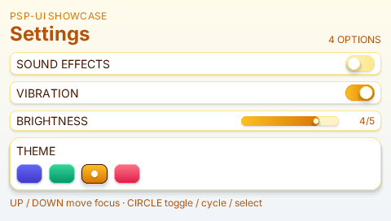
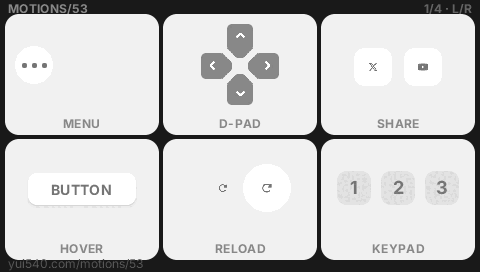
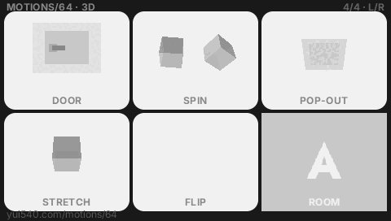

<h1> PocketJS</h1>

[](https://www.npmjs.com/package/@pocketjs/framework)
[](https://www.npmjs.com/package/@pocketjs/cli)
[](./LICENSE)
[](https://discord.gg/cTce4eXzSK)

High-performance component UI outside the browser, with native rendering,
standard Vue Vapor and Solid support, a Tailwind design system, and 60 FPS
animation under an 8 MB memory budget. Write Solid JSX, Vue Vapor JSX, or Vue
single-file components, run them on QuickJS, and let PocketJS move layout,
styling, text and animation into a tiny `no_std` Rust core.

It runs on real PSP and PS Vita hardware, PPSSPP, Vita3K, the browser (WASM),
native macOS windows (wgpu) and headless Bun. Full design + contracts:
[docs/DESIGN.md](./DESIGN.md). PocketJS is growing into a family of specialized
runtimes — Rust cores, spec-pinned surfaces, one QuickJS guest — documented
in [docs/RUNTIMES.md](./RUNTIMES.md); the 3D base lives in
[engine/pocket3d/](./pocket3d/), and its first game runtime is
[OpenStrike](https://github.com/pocket-stack/open-strike).

## Screenshots

https://github.com/user-attachments/assets/dbbf656f-a3b2-411d-ab52-fece6a10f68a

These PocketJS UIs run smoothly at 60 FPS on a Sony PSP within an 8 MB memory
budget, including animated transitions and input feedback.

| Gallery | Settings |
| --- | --- |
|  |  |
| **Motion Lab — baked keyframe timelines** | **Motion Lab — 3D pipeline** |
|  |  |

## Quickstart

```sh
bun install
bun run bootstrap                       # one-time pinned PSP toolchain setup
bun pocket check --target psp         # schema + capabilities + ordinary app TypeScript
bun pocket compile --target psp       # check + emit JS/pak from the resolved plan
bun pocket build --target psp -- --release

# Low-level compiler commands used by framework apps/tests:
bun tools/build.ts hero             # -> dist/hero.js + dist/hero.pak
bun tools/build.ts hero-vue-vapor-main --framework=vue-vapor
bun tools/build.ts hero-vue-sfc-main --framework=vue-vapor
```

Or drive everything through the [`pocket` CLI](https://www.npmjs.com/package/@pocketjs/cli):
`npm i -g @pocketjs/cli`, then `pocket doctor` checks the Bun / Rust / PSP
toolchain (`pocket setup` runs the same pinned bootstrap), `pocket create <name>`
scaffolds a format-2 manifest, and `pocket check|compile|build --target
psp|vita` delegate to the canonical resolver. Low-level host-development
commands such as `pocket dev`, `pocket psp`, `pocket vita`, and `pocket play`
remain available.

The build is two-pass: pass 1 transforms every module reachable from the entry
(framework-specific JSX + TypeScript, or Vue SFC compiled directly to Vapor;
content-hash cached in `.cache/`) while collecting class strings + text
codepoints from the AST. The Tailwind compiler then writes `styles.bin` +
`framework/src/styles.generated.ts`, the font baker rasterizes Inter atlas
slots for exactly the characters your app uses, and everything is packed into
`dist/<app>.pak`. Pass 2 bundles the cached transforms with Bun (iife,
unminified).

```tsx
import { createSignal } from "solid-js";
import { Text, View } from "@pocketjs/framework/components";

export default function Counter() {
  const [count, setCount] = createSignal(0);

  return (
    <View class="flex-col items-center gap-4 p-4 bg-slate-50">
      <Text class="text-xl text-slate-950">Count: {count()}</Text>
      <View
        class="p-2 rounded-md bg-blue-600 focus:bg-blue-500 transition-colors duration-150"
        focusable
        onPress={() => setCount(count() + 1)}
      />
    </View>
  );
}
```

Mounting entries should look like ordinary app bootstrap code; the framework
handles host detection, the generated style table, pak image uploads and the
host frame callback:

```tsx
import { mount } from "@pocketjs/framework/solid";
import App from "./app.tsx";

mount(() => <App />);
```

Styling rules (compile-time, no runtime CSS): a class literal compiles iff
*every* token is a supported utility (see docs/DESIGN.md "Tailwind subset (v1)");
dynamic styling is ternaries of full literals, `style={{...}}`, or `animate()`.
`classList`, `hover:` and template-interpolated classes are compile errors.
`rounded-full` requires `w-N h-N` in the same literal.

Framework selection is explicit: product builds set `app.framework` to
`"solid"` or `"vue-vapor"` in `pocket.json`. Low-level framework/compiler/host work can
still use `pocket.config.ts` or pass `--framework=...` to the individual
scripts. App state and component lifecycle come from the native framework
package (`solid-js` or `vue`); PocketJS supplies host components, input,
animation, assets and native runtime wiring.

### Vue single-file components

Set `"framework": "vue-vapor"` in `pocket.json`, then import `.vue` files from
the app entry. PocketJS compiles them in Vapor mode, so ordinary
`<script setup>` is enough; no `vapor` attribute is required in the SFC.

```ts
import { mount } from "@pocketjs/framework/vue-vapor";
import App from "./App.vue";

mount(App);
```

The supported shape is `<script setup>` plus `<template>`. Import reactivity
from `vue` and host components from `@pocketjs/framework/vue-vapor/components`.
Runtime `<style>` blocks, template preprocessors, external blocks, and
Options-API-only components are not supported.

[`apps/hero-vue-sfc`](./apps/hero-vue-sfc) renders the same screen as the JSX
Hero demos. See [`apps/vue-sfc-lab`](./apps/vue-sfc-lab) for `v-model`,
conditionals, lists, props, events, and slots.

`@pocketjs/framework/components` also exposes small app-shell primitives:
`Screen`, `Focusable`, `FocusScope`, `ActionHandler`, `FocusGrid`, `Portal`,
`Modal`, and `ActionBar`. `FocusGrid` gives a subtree explicit row/column d-pad
traversal today; a virtualized grid can sit behind the same focus contract
later. `Portal` mounts into the runtime overlay root, so modal/action-bar UI
never participates in the active screen's flex layout. `Modal` owns a focus
scope and blocks background button handlers while leaving frame animation
lifecycle callbacks running; route switching is still ordinary app state, not a
required router package.

## Commands

```sh
bun run bootstrap                    # idempotent PSP toolchain setup
bun play vita hero                    # build, install and launch in Vita3K
bun play vita gallery --fullscreen    # stretch to the host's full screen
bun play --help                       # list every runnable demo
bun run test                          # spec contract + tailwind parser tests
bun pocket check --target psp         # validate pocket.json + resolved target contract
bun pocket compile --target psp       # typecheck and compile, for custom native hosts
bun pocket build --target psp         # typecheck, compile, and package the target
pocket build --target vita -- --release
pocket play vita hero                 # build, install and launch in Vita3K
bun tools/build.ts <app> [--framework=solid|vue-vapor] [--extra-chars=…]
bun run psp <app>                  # low-level PSP demo build
bun run vita <app>                 # low-level Vita demo build
bun run dev [app]                  # browser dev host
bun run wasm                       # rebuild the wasm core
bun run e2e:vita                     # Vita3K, native-density 960x544 golden E2E
bun run e2e:launcher:vita            # Vita3K, multi-app launcher/swap E2E
bun psplink                           # interactive real PSP switcher over PSPLINK
bun run hw hero --trace              # real PSP via PSPLINK + host0 trace
bunx tsc --noEmit                     # typecheck (babel owns the JSX transform)
```

The PSP bootstrap owns every production input: Rust nightly + `rust-src`, the
`cargo-psp` tools built at an exact `pocket-stack/rust-psp` revision, and a
SHA-256-verified `pocket-stack/pspdev` SDK release. It installs them under the
shared `${XDG_CACHE_HOME:-~/.cache}/pocket-stack` cache, so independent
PocketJS and downstream-app checkouts can reuse one installation.
Set `POCKET_STACK_CACHE_DIR` to move that cache. An explicit `PSP_SDK` takes
precedence over `PSPDEV`, which takes precedence over the pinned cache; an
invalid explicit path fails rather than silently selecting another SDK. PSP
builds export both variables to the resolved path. PSPLINK is only needed by
the real-hardware `hw`/`psplink` loop, not to compile an EBOOT.

Manifest-driven builds resolve `pocket.json` once into a small
`ResolvedBuildPlan`. The JS/font/pak compiler and native backend consume that
same serialized plan; `planHash` is only its build-time checksum. At startup,
the bundle checks the native host's target and HostOps ABI. The app entry and
its reachable imports use the app's ordinary TypeScript configuration.

The selected target profile also resolves `viewport.rasterDensity`. Layout and
DrawList coordinates stay in the app's logical viewport; the compiler bakes
font coverage and SVGs at that density, prefers same-directory `@2x` PNG,
sprite and raw-PAK siblings when present, and asks the core to bake its own
masks at the same density. Dynamic texture producers read the identical value
from `platform.pixelRatio`—they never branch on a target name:

```ts
import { platform } from "@pocketjs/framework/platform";

const canvas = makeTexture(logicalWidth * platform.pixelRatio);
```

Missing raster siblings deliberately fall back to the 1x source; malformed
siblings fail the build if their dimensions do not preserve logical size.

Capabilities are plain framework API identifiers. `requires` must exist on the
selected host; `enhances` resolves to booleans available from
`@pocketjs/framework/platform`:

```ts
import { hasFeature } from "@pocketjs/framework/platform";

if (hasFeature("input.analog.left")) installAnalogNavigation();
else installButtonNavigation();
```

Literal `hasFeature()` calls are folded to booleans during a manifest build, so
the unavailable branch is absent from the target bundle. `platform.features`
remains available for computed queries and introspection. Capabilities describe
fixed host API support, not permissions or live device state.
Custom native hosts should use `extractHostBuildInputs()` and
`hostBuildEnvironment()` from `@pocketjs/framework/manifest`; the complete
Plan remains an internal build IR.

The complete design, including authority boundaries, compatibility rules,
typed backend dispatch, target/ABI runtime checks, extension points, and
current limitations, is documented in
[Platform contracts](./site/content/docs/platform-contracts.md).

The Vita host is documented in [hosts/vita/README.md](./hosts/vita/README.md).
It preserves PocketJS's 480x272 logical layout while rasterizing geometry,
fonts, vectors and core masks at Vita's native 960x544 density. Physical
controls, left-analog input, and front-panel multi-touch snapshots are supported;
PSP builds retain their controller-only fallback.

## The Pocket Launcher (on-device app switching)

One PSP EBOOT or Vita VPK can embed every app admitted by that target plus a
Cover Flow launcher ([docs/LAUNCHER.md](docs/LAUNCHER.md)): pick an app with the deck,
press SELECT inside any app to summon the deck back over a frozen shot of
where you were, then resume or pick another. Switching is a whole-guest swap
(fresh QuickJS realm + core + guest GPU resources per app); three append-only
surface ops (`appTable`/`appLaunch`/`appShot`) carry the protocol, and ordinary
single-app packages retain the original path.

```sh
bun run launcher scan --target vita               # target admission -> registry
bun run launcher covers --target vita             # + deterministic sim covers
bun run launcher build --target psp -- --release  # -> multi-app PSP EBOOT
bun run launcher build --target vita -- --release # -> dist/vita/launcher-main.vpk
bun run e2e:launcher                              # PPSSPPHeadless 3-swap journey
bun run e2e:launcher:vita                         # Vita3K 7-swap/resource-reuse journey
```

## DevTools + time travel

Pocket DevTools ([docs/DEVTOOLS.md](docs/DEVTOOLS.md)) is built into every bundle: a
component tree with semantic names (`debugName` / `<Named>`), hover-to-
highlight **on the device screen** (real PSP included, over the PSPLINK USB
cable), pause/step, a REPL, `console.log` from hardware, and an always-on
input-tape flight recorder — sessions replay byte-exactly because the whole
runtime is fixed-dt deterministic.

```sh
bun run devtools                      # panel + hub + USB bridge, one process
bun run devtools cards                # + build, link and launch cards on a real PSP
bun run tape replay <app> <tape.json> --png 60   # render any frame headlessly
bun run tape:check                    # session-golden replay regression
```

On-demand screenshots (📷 in the panel) work in the browser host and through
the PSP mailbox. On a real PSP the raw VRAM rides the usbhostfs mount and the
bridge encodes the PNG desktop-side. Vita exposes the core inspection ops, but
its DevTools transport and screenshot capture are not wired yet.

## Determinism + the sim host

Time is a frame counter, not the wall clock ([docs/DETERMINISM.md](docs/DETERMINISM.md)):
the virtual clock (`@pocketjs/framework/clock`) makes the simulation rate a
host policy (`?hz=2` on the web host runs the 2 FPS world on a real screen),
the effect shell (`@pocketjs/framework/effects`) quantizes async results onto
frame boundaries, and the headless sim host (`hosts/sim/`) replays scripted
user journeys as byte-exact per-frame pixel traces — `tests/sim.test.ts` is
the proof, `tools/flake-lab.ts` the wall-clock control experiment.

Fonts: Inter (OFL), vendored in `assets/fonts/`.
