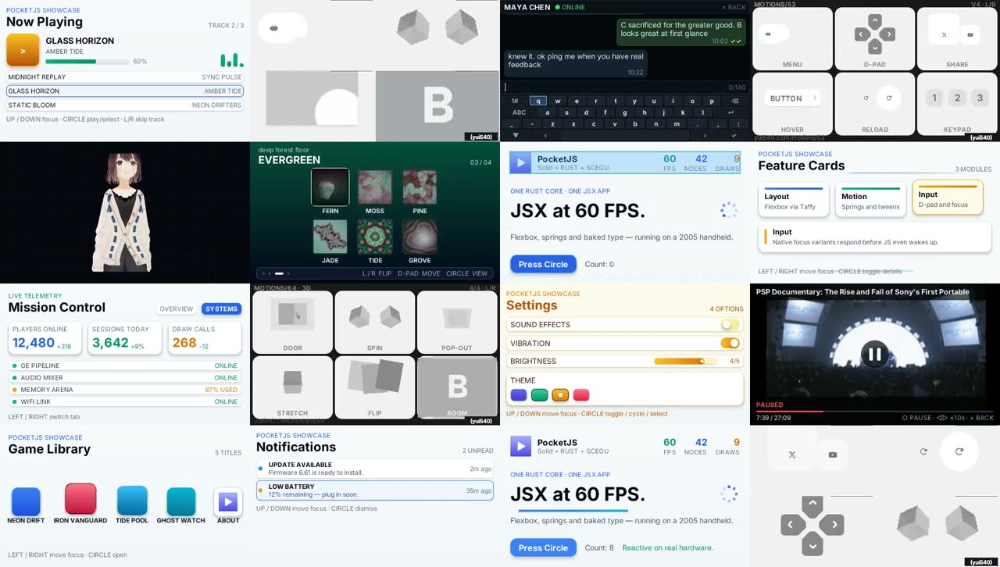
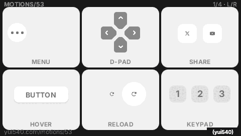
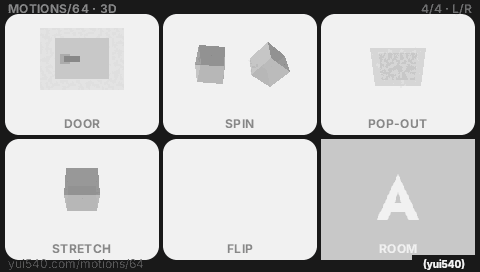

<h1> PocketJS</h1>

[](https://www.npmjs.com/package/@pocketjs/framework)
[](https://www.npmjs.com/package/@pocketjs/cli)
[](./LICENSE)
[](https://discord.gg/cTce4eXzSK)

[Website](https://pocketjs.dev) ·
[Playground](https://pocketjs.dev/playground/) ·
[Documentation](https://pocketjs.dev/docs/overview/) ·
[Blog](https://pocketjs.dev/blog/) ·
[Changelog](https://pocketjs.dev/changelog/)

## Rich interactive JavaScript where no browser fits.

PocketJS is a compact runtime family for building **user interfaces, games,
3D experiences, and AI-native applications** across radically different
devices. Write familiar JavaScript and TypeScript components; native cores and
host modules own layout, rendering, simulation, audio, and other per-frame work.

Where a machine can host JavaScript, a small guest runs Solid, Vue Vapor, or
Octane against those native cores. Where even a JavaScript engine is too much,
[Pocket Vapor](./vapor/README.md) compiles a strict Vue Vapor program into
native code. Neither path ships a browser DOM, browser layout engine, or
runtime CSS engine.

<a href="https://pocketjs.dev">
  
</a>

## What it carries

PocketJS is broader than a UI renderer. The PocketJS runtime family now carries
four kinds of software, each backed by shipped open-source work.

| Software | What PocketJS provides | Proof |
| --- | --- | --- |
| **User interfaces** | Solid, Vue Vapor, and Octane over one native tree, with flexbox, compile-time Tailwind, baked motion, touch, focus, and text input | [Three frameworks, one core](https://pocketjs.dev/blog/octane-on-psp/) |
| **Games** | Scriptable native simulation and rendering cores composed with a full JSX HUD | [OpenStrike at 60 FPS on a real PSP](https://pocketjs.dev/blog/shipping-openstrike/) · [A creature-RPG as a voxel diorama](https://pocketjs.dev/blog/pocket-voxel/) |
| **3D experiences** | Portable BSP worlds, native 3D backends, and VRM digital humans with one-process desktop surfaces | [Pocket Character](https://pocketjs.dev/blog/pocket-character/) |
| **AI-native apps** | When time, randomness, and effects enter through the virtual clock, seeded state, and recorded contracts, fixed-step sessions can be replayed, forked, and diffed byte-for-byte; small enough to host an agent in the guest | [The runtime agents want](https://pocketjs.dev/blog/ui-runtime-that-cant-flake/) · [Pocket Pi](https://github.com/pocket-stack/pocket-pi) |

## Run JavaScript where it fits. Compile it away where it doesn't.

PocketJS has two execution paths. They share component-oriented authoring,
explicit target demands, and verification tools; they do not pretend that one
runtime or one binary fits every device.

```text
Solid / Vue Vapor / Octane
        │
        └─ Guest build ──> JavaScript guest ──> declared native APIs ──> Rust cores and renderers

strict Vue Vapor subset
        │
        └─ Pocket Vapor ──> target-native C ──> ROM, firmware, or PDX
```

| | Guest runtime | Pocket Vapor AOT |
| --- | --- | --- |
| **Authoring** | Solid JSX, Vue Vapor JSX, Vue SFC, or Octane JSX | Strict TypeScript/Vue Vapor JSX subset |
| **Execution** | JavaScript guest plus native cores and host modules | Native target program; no JS engine, GC, or allocator |
| **Admission** | `pocket.json` requirements resolved against a target profile | Compiler-derived demands checked against a target or board profile |
| **Outputs** | Target-specific bundles, assets, `.pocket` variants, EBOOTs, VPKs, and host packages | `.gba`, `.gb`, `.nes`, firmware, and `.pdx` artifacts |
| **Current examples** | PSP, PS Vita, PocketBook, and macOS widget registered Guest profiles | Game Boy Advance, Game Boy, NES, ESP32 MeowBit, and Playdate compiler targets |

Pocket Vapor is not a low-memory mode for arbitrary PocketJS apps. It is a
deliberately strict Vue Vapor subset with its own compiler and target
contracts. The current [`.pocket` format](./docs/PLATFORM.md) packages Guest
target variants; AOT programs are built separately today.

## Familiar code, native machinery

Guest apps choose one of three framework adapters over the same native UI tree:

| Framework | State and lifecycle | Source forms |
| --- | --- | --- |
| **Solid** | `solid-js` | JSX |
| **Vue Vapor** | `vue` | JSX and `<script setup>` single-file components |
| **Octane** | `octane` | Compiled hooks and JSX, with no virtual DOM |

Framework primitives come directly from `solid-js`, `vue`, or `octane`.
PocketJS owns the runtime, host components, lifecycle wiring, input, animation,
assets, and native boundary.

```tsx
import { createSignal } from "solid-js";
import { mount } from "@pocketjs/framework/solid";
import { Text, View } from "@pocketjs/framework/solid/components";

function Counter() {
  const [count, setCount] = createSignal(0);

  return (
    <View class="w-full h-full flex-col items-center gap-4 p-4 bg-slate-50">
      <Text class="text-xl font-bold text-slate-950">Count: {count()}</Text>
      <View
        class="px-4 py-2 rounded-xl bg-blue-600 focus:bg-blue-500 active:bg-blue-700"
        focusable
        onPress={() => setCount(count() + 1)}
      >
        <Text class="text-base font-bold text-white">Press Circle</Text>
      </View>
    </View>
  );
}

mount(() => <Counter />);
```

Class literals compile into compact style records. The Rust core performs
flexbox layout and emits the draw list; target backends render it through GE,
GXM, wgpu, software rasterization, e-ink updates, or another declared host.
There is no runtime CSS parser, cascade, or browser layout engine.

See [Frameworks](https://pocketjs.dev/docs/frameworks/),
[Architecture](https://pocketjs.dev/docs/architecture/), and
[Styling](https://pocketjs.dev/docs/styling/) for the supported forms and
compile-time rules.

## Try it

The fastest zero-install path is the online
[Playground](https://pocketjs.dev/playground/). Local browser development needs
[Bun](https://bun.sh/) and [Rust via rustup](https://rustup.rs/):

```sh
git clone https://github.com/pocket-stack/pocketjs
cd pocketjs
bun install
rustup target add wasm32-unknown-unknown
bun run dev                    # build WASM + the Hero app, then serve the browser host
```

The CLI operates inside a PocketJS checkout:

```sh
npm install -g @pocketjs/cli
pocket doctor                  # report missing host and target tooling
pocket setup                   # install the pinned web + PSP toolchain
pocket create my-app
pocket check --target psp --manifest apps/my-app/pocket.json
pocket build --target psp --manifest apps/my-app/pocket.json -- --release
```

Vita packaging additionally needs VitaSDK and the pinned Rust toolchain
documented in [`hosts/vita/README.md`](./hosts/vita/README.md).

To explore Pocket Vapor without a device:

```sh
bun run vapor:dev             # run the component on the real Vue oracle in a browser
bun run vapor:check           # show target admission and lossy lowering
bun run vapor:test            # oracle + compiler + console parity suites
bun vapor/compiler/cli.ts vapor/examples/todo/todo.tsx --target gb
```

## The platform around the program

- **Capability contracts.** An app declares its viewport and required or
  optional APIs. A target must satisfy that contract before compilation and
  packaging continue.
- **Deterministic packages.** Guest builds can become inspectable, verifiable,
  and target-thinnable `.pocket` files instead of ad hoc port directories.
- **System software.** The framework and supporting hosts provide a multi-app
  launcher, focus and touch input, gesture physics, OSK and text editing,
  credit-based PCM audio, and explicit host-service boundaries.
- **Replayable time.** When time, randomness, and effects enter through the
  virtual clock, seeded state, and recorded contracts, tapes and traces can
  reproduce sessions byte-for-byte.
- **Specialized native cores.** UI, 3D, and game systems expose small declared
  APIs to the product guest while keeping hot state and per-frame work native.

Start with [Platform contracts](https://pocketjs.dev/docs/platform-contracts/),
[The `.pocket` platform](./docs/PLATFORM.md),
[The runtime family](./docs/RUNTIMES.md), and
[Determinism](./docs/DETERMINISM.md).

## The proof is what it can carry

| Project | What it proves |
| --- | --- |
| [**Pocket Launcher**](./docs/LAUNCHER.md) | Whole-app lifecycle, target admission, frozen shots, and Guest switching on PSP and Vita |
| [**OpenStrike**](https://github.com/pocket-stack/open-strike) | A scriptable FPS core, portable BSP worlds, and a Solid HUD at a locked 60 FPS on real PSP hardware |
| [**Pocket Voxel**](https://github.com/pocket-stack/pocket-voxel) | A ROM-fed Game Boy creature-RPG as a walking voxel diorama: the whole game state lives in the TypeScript Guest over a Rust scene core, at a locked 30 FPS on real PSP hardware |
| [**Pocket Figma**](https://github.com/pocket-stack/pocket-figma) | A 14,430-node Figma document baked into streamed tiles for pan and zoom on a PSP |
| [**Pocket YouTube**](https://github.com/pocket-stack/pocket-youtube) | USB host services, search, video, audio, seeking, CJK text, and a system keyboard on a PSP |
| [**Pocket Character**](https://github.com/pocket-stack/pocket-character) | A VRM digital human in one native transparent desktop process instead of an Electron stage |
| [**Pocket Vapor Todo**](./vapor/README.md) | A strict Vue Vapor program lowered to console ROMs and firmware, checked step-by-step against a real Vue oracle |
| [**Pocket Pi**](https://github.com/pocket-stack/pocket-pi) | A coding agent running inside the QuickJS Guest environment without Node underneath |

<p align="center">
  <a href="https://github.com/pocket-stack/pocket-voxel"></a>
</p>

<p align="center"><em>Pocket Voxel, captured on a PSP-2000: the flat Game Boy world standing up as geometry. <a href="https://pocketjs.dev/blog/pocket-voxel/">The making-of story</a>.</em></p>

## Platforms and evidence

Target status is evidence-specific. A registry entry, an emulator parity suite,
a hardware protocol receipt, and a manual screen check prove different things.

| Platform or host | Path | Current evidence |
| --- | --- | --- |
| **Sony PSP** | Registered Guest profile | Real-hardware applications plus PPSSPP input journeys and frame goldens |
| **PS Vita** | Registered Guest profile | Real-hardware install, boot, GXM presentation, controller, and interactive flows; Vita3K-driven 960×544 CPU pixel oracle plus GXM texture/font residency checks |
| **PocketBook** | Registered Guest profile | Hardware boot, rendering, centering, and animated partial refresh; broader input and panel acceptance remains in progress |
| **macOS widget** | Registered Guest profile | Dynamic native window, pointer, keyboard/IME, clipboard, and runtime glyph paths |
| **Browser, desktop, headless Bun** | Guest development and verification hosts | WASM/native rendering, interactive development, deterministic simulation, and image goldens |
| **Nokia E7 / Symbian** | Hardware-tested development Guest host | SIS install, launch, visible rendering, keys, and rotation on the reference device; not a production target profile |
| **iOS (NativeScript host)** | Development Guest host | Simulator boot, rendering, touch, and the guest↔host service round trip in both guest modes (sidecar realm and the NativeScript runtime as guest engine); not a production target profile |
| **GBA, Game Boy, NES** | Pocket Vapor AOT | Per-interaction emulator parity against the Vue oracle, including logical characters and styles |
| **ESP32 MeowBit** | Pocket Vapor AOT | Optional physical-board UART replay verifies the logical grid and exercises LCD commits; it neither reads panel pixels nor actuates GPIO buttons |
| **Playdate** | Pocket Vapor AOT | Native-boundary tests and Simulator/device package smoke; physical display and input acceptance remains manual |
| **ESP32-P4** | Native renderer integration | Reusable RGB565/PPA backend and ESP-IDF component smoke; not a stock application target |

The authoritative Guest inventory lives in
[`contracts/spec/platforms.ts`](./contracts/spec/platforms.ts). Pocket Vapor
uses compiler-side target and board contracts instead; see
[`vapor/DESIGN.md`](./vapor/DESIGN.md). Recent machine-family work and its exact
validation level are tracked in the [changelog](https://pocketjs.dev/changelog/).

## Choose a path

| Goal | Start here |
| --- | --- |
| Build a Guest application | [Getting started](https://pocketjs.dev/docs/getting-started/) |
| Compare Solid, Vue Vapor, Vue SFC, and Octane | [Frameworks](https://pocketjs.dev/docs/frameworks/) |
| Compile for machines without a JS engine | [Pocket Vapor](./vapor/README.md) |
| Add or embed a native host | [Native contract](https://pocketjs.dev/docs/native-contract/) · [Platform contracts](https://pocketjs.dev/docs/platform-contracts/) |
| Build a game or specialized runtime | [Runtime family](./docs/RUNTIMES.md) · [Pocket3D](./engine/pocket3d/README.md) |
| Debug, replay, and verify | [DevTools](./docs/DEVTOOLS.md) · [Determinism](./docs/DETERMINISM.md) |
| Browse complete examples | [`apps/`](./apps/) · [PocketJS blog](https://pocketjs.dev/blog/) |

## Repository map

| Path | Responsibility |
| --- | --- |
| [`framework/`](./framework/) | Public framework APIs, renderers, components, input, lifecycle, and build-time styling |
| [`engine/`](./engine/) | `no_std` UI core, render backends, native modules, Pocket3D, and platform-native crates |
| [`contracts/`](./contracts/) | Generated wire specs, capability registry, manifests, build plans, and package formats |
| [`hosts/`](./hosts/) | PSP, Vita, web, desktop, e-reader, phone, and MCU host integrations |
| [`vapor/`](./vapor/) | Pocket Vapor compiler, oracle, board contracts, target runtimes, and parity harnesses |
| [`apps/`](./apps/) | Framework demos and system applications used by the launcher and acceptance suites |
| [`tools/`](./tools/) | Build, package, launcher, device, DevTools, and release commands |
| [`tests/`](./tests/) | Contract, compiler, simulation, emulator, package, and golden verification |

Common repository checks (emulator journeys require their external toolchains):

```sh
bun run test                  # contracts, compiler, packages, sims, and host suites
bun run golden                # deterministic WASM/web frame goldens
bun run e2e                   # PPSSPP journey
bun run e2e:vita              # Vita3K native-density journey
bun run site:build            # docs, playground, Stage, and landing build
```

## Motion Lab attribution

| Baked keyframe timelines · (yui540) | 3D motion pipeline · (yui540) |
| --- | --- |
|  |  |

The original motion studies are by [yui540](https://yui540.com/). PocketJS
accepts yui540's two stated conditions for continued use: Motion Lab carries
the requested `(yui540)` on-screen credit, and any other yui540 animation
requires separate permission before it is ported. The accepted scope and
capture-maintenance rules are recorded in
[`apps/motions/ATTRIBUTION.md`](./apps/motions/ATTRIBUTION.md).

## License

PocketJS is [MIT licensed](./LICENSE). Inter is vendored under the OFL in
[`assets/fonts/`](./assets/fonts/).
