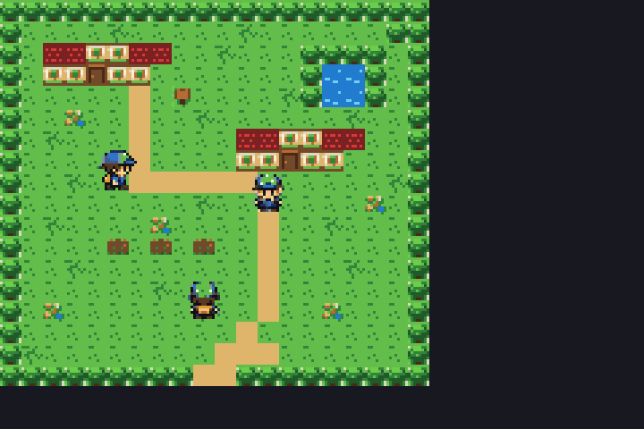
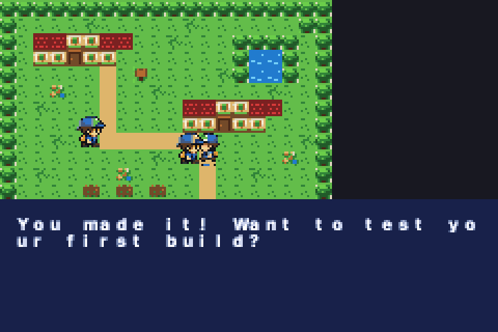
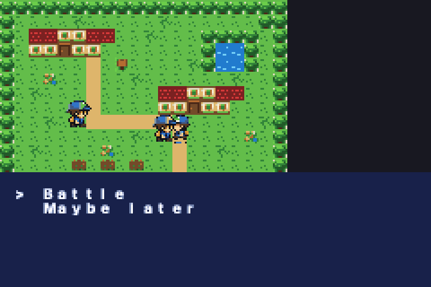

# @pocketjs/aot

**Write cartridge RPGs in TypeScript and JSX; ship GBA-native tiles, sprites, palettes, and bytecode.**

`@pocketjs/aot` is a first-class PocketJS architecture that coexists with `@pocketjs/framework`. Where the framework runs a live Solid/Vue reactive UI on PSP-class hardware, `@pocketjs/aot` goes *below the runtime line*: it **partially evaluates** a TypeScript/JSX game program at build time and emits a small fixed GBA runtime plus binary game data. No JS engine, no Solid, no VDOM, no CSS runtime ships on the cartridge.

> TypeScript and JSX are the authoring language. Partial evaluation is the compiler strategy. GBA-native tile/sprite data and bytecode are the runtime artifact.

This is not a TypeScript-to-GBA compiler. It is a domain-aware partial evaluator for a constrained RPG DSL (design: `pocketjs_gba_partial_evaluation_design.md`).

## Status

A complete **vertical slice** runs end-to-end: a retro monster-RPG-style overworld authored in TSX compiles to a real `.gba` ROM and passes a headless mGBA E2E suite (19 assertions on real emulated hardware) covering boot, grid movement, collision, NPC dialogue, a choice menu, a battle→flag→item reward, and warping between maps.

|  |  |  |
|---|---|---|

*Left: the Littleroot-style town (houses, pond, sign, NPCs, player). Middle: NPC dialogue in a palette-shaded, subpixel-covered textbox. Right: the `choose()` menu with cursor. All rendered by the C runtime from compiled PJGB data — no JS on the cartridge.*

## Architecture

```
Source TS/TSX (@pocketjs/aot DSL)
  -> evaluate     static JSX/declaration zone is EXECUTED at build time  (compiler/evaluate.ts)
  -> bake         tilesets/sprites/font -> GBA 4bpp tiles + BGR555 pals  (compiler/bake.ts)
  -> residualize  script(function*(){...}) ASTs -> stack-VM bytecode     (compiler/script.ts)
  -> model        JSX scene trees -> concrete maps/actors/warps          (compiler/model.ts)
  -> lower        validate + emit PJGB chunks                            (compiler/lower.ts)
  -> pack         chunks -> PJGB cartridge blob                          (compiler/pack.ts)
  -> rom          link the fixed C runtime with arm-none-eabi-gcc -> .gba (compiler/rom.ts)
  -> mGBA         headless libmgba harness drives input + asserts state  (test/)
```

The **two zones** (design §8):

- **Static declaration zone** — `defineGame`/`defineMap`/`<Map>`/`<Layer>`/`<Npc>`… is *executed* at build time. JSX builds a scene tree, not a UI tree; pure components expand and never reach the GBA.
- **Residual script zone** — `script(function*(){ yield say(...) })` is *never executed*. The compiler reads the generator AST and lowers supported statements to bytecode, folding static values and residualizing runtime values (flags, choices, battle results) into branches.

## The DSL

```tsx
import { defineGame, defineMap, Map, Layer, Npc, Warp, Sign, PlayerSpawn,
         script, say, choose, hasFlag, setFlag, battle, giveItem,
         lockPlayer, releasePlayer, facePlayer } from "@pocketjs/aot";

const RivalTalk = script(function* () {
  yield lockPlayer();
  yield facePlayer("rival");
  if (yield hasFlag("beat_rival_1")) {
    yield say("The road ahead is tougher than it looks.");
  } else {
    yield say("You made it! Want to test your first build?");
    switch (yield choose(["Battle", "Maybe later"] as const)) {
      case "Battle":
        yield battle("rival_1");
        yield setFlag("beat_rival_1");
        yield giveItem("potion", 1);
        yield say("Take this Potion. You will need it.");
        break;
      case "Maybe later":
        yield say("No problem. I will be right here.");
        break;
    }
  }
  yield releasePlayer();
});

export default defineGame({ title: "POCKET TOWN", start: "littleroot:spawn", maps: [/* ... */] });
```

See `demo/game.tsx` (the town + route), `demo/assets.ts` (DSL declarations), and `demo/imagegen/` (the source sheet plus deterministic GBA 4bpp extractor).

## Binary contract

`spec/pjgb.ts` is the single source of truth for the **PJGB cartridge format**, the **script VM ISA**, and the **debug block**. `spec/gen-c.ts` generates `runtime/pjgb_gen.h` so the C runtime can never drift from the TS compiler (mirrors the repo's `spec/gen-rust.ts` convention). The runtime reads fixed-width tables and offsets — it never parses JSON.

## The GBA runtime (`runtime/`)

A small, no-allocation native engine in C: bare-metal `crt0.s` + `gba.ld`, a chunk loader, Mode-0 tiled BG + hardware-sprite OAM with VBlank DMA, grid movement/collision, a suspendable stack-VM (`script_vm.c`), and a subpixel-covered tile textbox/choice menu. It writes live game state into a fixed EWRAM debug block so the emulator harness can assert without symbols. Cross-compiles with `arm-none-eabi-gcc`; boots in mGBA (and is structured for real hardware, pending a Nintendo-logo header pass — see design §26.6).

## Build & test

```bash
# prerequisites: bun, arm-none-eabi-gcc + binutils, mgba (libmgba)
bun aot/spec/gen-c.ts                       # regenerate runtime/pjgb_gen.h
bash aot/test/harness/build.sh              # build the headless mGBA runner (once)
cd aot
bun run build                               # refresh imagegen assets + build ROM
bun run test                                # refresh assets + run the headless mGBA E2E suite
```

Outputs: `dist/pocket-town.gba`, `.pjgb` (cartridge blob), `.ir.json` (inspectable IR), `.debug.json` (flag/text/map symbol map for the harness).

## v1 scope & follow-ups

Deliberately narrow (design §5, §26): tile-based overworld with scripts. v1 uses 8×8 BG tiles (16×16 metatiles are a documented follow-up), one tileset per game, 16×16 sprites, ≤32×32 maps (single screenblock), and stubbed `battle`/`giveItem`. Not yet: TMX/Aseprite import, audio, save media, and the real-hardware header/logo pass.
