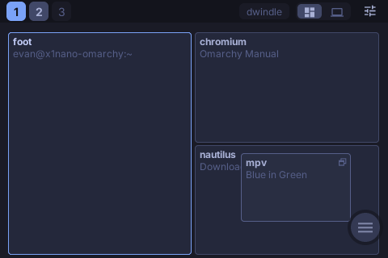
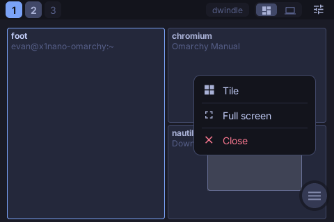
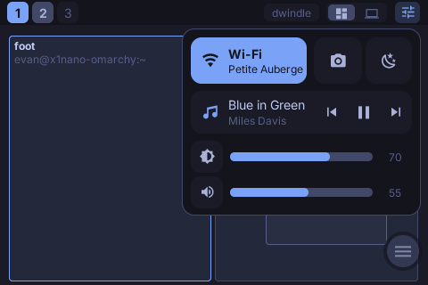
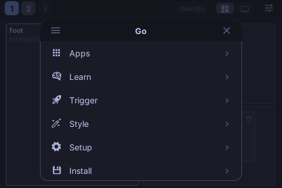
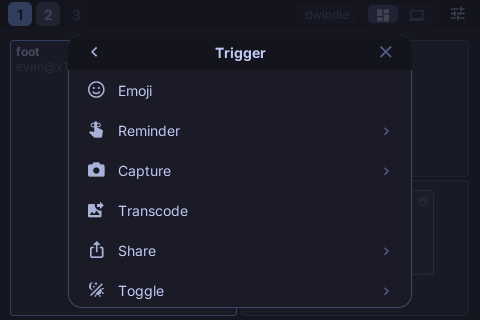
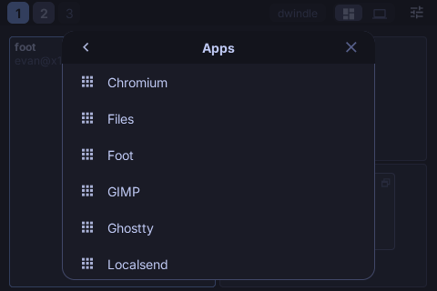
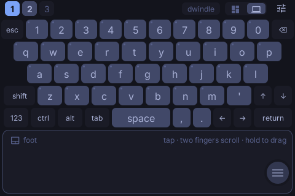
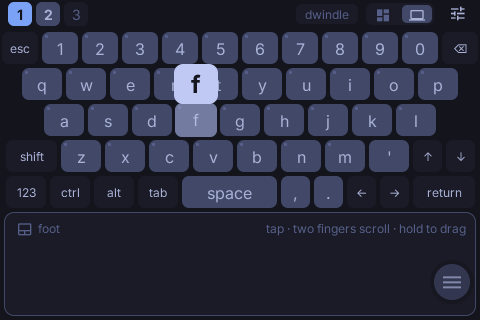
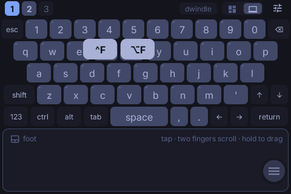
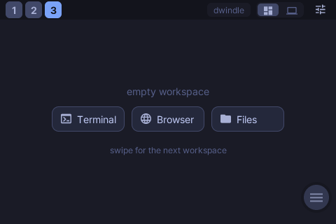

# Pocket Remote

An Omarchy companion on the iPod touch 4: a landscape touch surface that
mirrors the desktop and drives it. **The iPod runs the PocketJS guest; a
small daemon on the Omarchy machine mirrors Hyprland into snapshots and runs
the same commands the keyboard bindings run.** Nothing on the wire is a
command string — the device names an action id or a row of Omarchy's own
menu, the daemon looks it up.

Licensed under the GNU General Public License v3.0 or later (`LICENSE`).

```
 iPod touch 4 (480x320 landscape)      USB (usbmuxd)      Omarchy machine
 ┌────────────────────────────────┐    PKNT/TCP      ┌──────────────────────────┐
 │ apps/pocket-remote (Solid)     │◀───────────────▶│ host/serve.ts (Node)     │
 │ hosts/iphone2g/svcwire.c       │  or WiFi+beacon  │  .socket.sock  requests  │
 └────────────────────────────────┘                  │  .socket2.sock events    │
                                                     │  omarchy-* / wtype       │
                                                     │  pocket-pointer (wl)     │
                                                     └──────────────────────────┘
```

## Screens

Rendered in the headless sim by `bun tools/pocket-remote.ts shots media/`
against a scripted desktop; the panel is 480x320.

| | |
|---|---|
|  |  |
|  |  |
|  |  |
|  |  |
|  |  |

## The screen

```
┌────────────────────────────────────────────────────────────────┐
│ 1 2 3                         dwindle   [▦ | ⌨]   ☰            │  strip 28 px
├────────────────────────────────────────────────────────────────┤
│                                                                │
│   stage: live miniature of the focused monitor                 │
│          tiles = windows, accent border = focus       ┌──┐     │  292 px
│   deck:  five rows of keys over a trackpad            │◎ │     │
│                                                       └──┘     │
└────────────────────────────────────────────────────────────────┘
```

Two verbs: **tap**, and **hold**. A hold either opens something under the
finger (a tile's popup, the control centre's sliders) or picks something up
(the ball, a floating window, a key's variants). Novices see the choices;
after a day the strokes are made without looking.

- **Strip.** One tab per workspace Hyprland has, the active one filled, plus
  one empty tab so there is always somewhere new to go (the Omarchy bar's
  rule). Tap switches; hold a tab to bring the focused window there and
  follow it. The badge names the active workspace's layout and toggles it
  (SUPER+L). The **mode switch** picks the stage or the deck. The last button
  opens the **control centre**.
- **Stage.** The focused monitor scaled to fit, every window a tile labelled
  by class and title, the focused one bordered in the accent, floating
  windows marked. **Tap focuses. Hold a tile** and a popup opens at the
  finger — Float / Tile, Full screen, Close — the classic kind: one container
  of rows with hairlines between them. **The finger that opened it picks a
  row**: slide onto one and let go, one gesture; lift without sliding and the
  popup stays up for a tap. **Drag a floating window and it moves**, on the
  laptop, under the finger (Hyprland places it every third frame and on
  release). Drag a tiled window onto another to swap them, onto a tab to
  move it there. Swipe empty stage to step workspaces; an empty workspace
  offers Terminal, Browser and Files.
- **Deck.** The laptop's C surface on the iPod: five compact rows of keys
  over a trackpad, so typing and pointing need no mode of their own. Keys go
  straight to the desktop (`wtype`) as they are pressed; a pressed key rises,
  brightens and shows its character in a bubble above the finger. Comma and
  period sit beside the space bar, apostrophe after the letters, backtick on
  the symbol layer; esc, tab, ctrl, alt and the arrows are always there.
  **Chords two ways**: sticky modifiers (tap ctrl, then the key; ctrl arms,
  paints itself, drops after one key) and hold-and-slide variants (hold `x`
  → `^X` `⌥X`, hold `1` → `F1` `^1`; release on the key itself types it
  plain). The **trackpad** is a relative pointer with acceleration: one
  finger moves, a tap clicks, two fingers scroll, a two-finger tap is the
  right button, a hold picks something up and the button stays down until
  the finger lifts.
- **The ball.** Omarchy's menu (SUPER+SPACE) has a handle that floats over
  everything and lives on a side edge. **Tap it and the menu opens as a
  sheet** in the middle of the screen: the same rows in the same order with
  the same glyphs, one column, scrolling — a menu reads as a list, and two
  columns of eleven-character labels made the eye jump. A submenu opens in
  place with its title and a back chevron; an action runs on the laptop and
  the sheet goes away. **Apps lists the machine's own applications** (the
  daemon reads the XDG desktop entries and pages them over; the row opens
  that list here rather than on the laptop). **Hold the ball and it comes
  along**; let go and it slides to the nearer edge at that height. It fades
  while idle.
- **Control centre.** Under its button: Wi-Fi (tap toggles the radio),
  a screenshot, nightlight, what is playing with its transport, then
  brightness and volume as sliders. Levels follow the finger **relatively** —
  touching a slider never jumps the level to the finger — and a tap on a
  track nudges by a step. Opened by a tap it stays until a tap outside;
  **hold the button and slide** down onto a slider to adjust and let go, and
  it puts itself away.

Every touch target answers a press with a tint that eases in and out — a
capacitive panel has no hover and the remote's own feedback is the only local
one; the action itself is confirmed on the desktop. A toast over the stage
names the last action.

## Why these choices

**A tiling desktop is addressable.** Workspaces have numbers, windows have
addresses, actions have names. That is why the stage has no cursor: the Siri
Remote needs a trackpad because tvOS is spatial; Omarchy is a namespace, and
a namespace wants direct targets. The stage is the one spatial element and it
is a picture of the real arrangement, not a proxy. The deck's trackpad exists
for the applications inside the windows, which are spatial.

**The menu is Omarchy's, not a summary of it.** `menu.ts` is generated from
the machine's `omarchy-menu.jsonc` (`bun tools/pocket-remote.ts menu x1nano`)
and carries every row's id, parent, kind, label and glyph in the shell's
order. The daemon parses the same file live — the default plus the user's
extension — runs an action's command under `bash -lc` exactly as the shell
does, evaluates every `when` and `checked` in one bash run every thirty
seconds and after any action, and sends the hidden and the checked ids; the
device applies them to its static table. A row the device names has to exist
on the machine as well, so the wire still carries no command strings.

**The remote wears the theme and its iconography.** The daemon reads Omarchy's
`colors.toml` and every themed node repaints through `jump()` on its mirror
when the palette changes (theme.ts); class literals carry Tokyo Night so the
first frame looks right before the daemon speaks. The icons are the Nerd Font
glyphs Omarchy's bar and menu draw: `fonts.json` names a 68 KiB subset of the
symbols face (`tools/font-subset.ts`) as a fallback for codepoints Inter does
not map, and the atlas baker takes those glyphs from it, so an icon is text —
it recolours with the theme and needs no rectangle art.

**The panel's own two axes.** A View's main axis is horizontal and its
cross-axis default is stretch, so `justify-*` places a label across and
`items-center` is what puts it on the middle line; a fixed-size box without
it paints its text against the top edge. Icons are glyphs from an atlas baked
at the panel's density, which is also why the ball's mark is a glyph rather
than a ring of bordered Views — a stroked circle is rasterised at logical
size and looked soft at 2x. The subset's advances are normalised to each
glyph's ink (`tools/font-subset.ts`): a monospaced Nerd Font patch gives every
glyph one cell of advance while drawing the double-width icons across two, so
a centred icon sat visibly right of centre.

**Geometry through the mirror, not the style object.** A `style` object is
evaluated once, and Solid's `Show` keeps one instance while the value behind
it changes — so anything whose position follows live state (the key bubble
over the pressed key, a popup that re-records itself as the highlight moves,
a key whose row gains a column on the symbol layer) writes `insetL`/`insetT`
with `jump()` from an effect. The bubble parked on the first letter typed
until it did.

**A release is the commit, not the tap.** `onUp` arrives before `onTap` for
one release, so a handler that clears its highlight in `onUp` leaves `onTap`
with nothing to run — the popup's rows and the sheet's rows therefore act on
`onUp`. This is also what makes hold-and-slide and tap-then-tap the same code
path.

**Motion is a pool, not a tree.** Tiles live in a fixed pool of 24 slots
(protocol `WINDOWS_MAX`) keyed by window address. A snapshot re-targets the
pool; the frame loop eases each slot toward its target and writes geometry
straight to the node mirror. A floating tile under the finger keeps its own
geometry until the daemon echoes the placement, so a snapshot cannot yank it
back mid-drag.

**Optimistic where the desktop will agree.** Tapping a tab commits the new
active workspace locally before the daemon confirms. Level drags update
locally and send at most every three frames; host echoes are ignored for half
a second after a release so a slider never snaps back on the way.

## Hyprland's request socket speaks Lua

Hyprland 0.5x (the Lua-config generation Omarchy 4 runs) evaluates
`dispatch <text>` on `.socket.sock` as `hl.dispatch(<text>)`, so the old
`dispatch workspace 1` grammar fails with a Lua parse error — from `hyprctl`
too. **Every dispatcher is therefore a Lua constructor call**
(`hl.dsp.focus({ workspace = "1" })`, `hl.dsp.window.move({ window =
"address:0x…", x = 100, y = 200 })`), the same ones Omarchy's own bindings and
scripts use. The daemon builds window and workspace targets only from
validated pieces (`luaWindow`, `luaWorkspace`), so nothing off the wire can
reach the Lua evaluator as code. Placements arrive monitor-relative and get
the focused monitor's origin back on, because Hyprland places in layout
coordinates.

## The pointer

Hyprland has no dispatcher for a click and nothing in Omarchy's repositories
drives a pointer from a script, but Hyprland speaks `zwlr_virtual_pointer_v1`.
`host/pointer/pocket-pointer.c` is a client of that protocol and nothing
else: it reads one command per line (`m dx dy`, `b code state`, `s dy dx`,
`e`) and forwards them as pointer events. The daemon keeps one running and
restarts it if it dies. It is built on the Omarchy machine at deploy time
with `wayland-scanner` and `cc` against the vendored protocol XML — no
uinput, no root, no extra daemon.

## The wire

Spec ops 30–32 (`svcOpen`/`svcPoll`/`svcSend`) over the SVC WIRE (PKNT) TCP
transport, exactly the mailbox the PSP, Vita and 3DS companions speak.
`hosts/iphone2g/svcwire.c` is the legacy Apple hosts' transport — a port of
the 3DS one (non-blocking BSD sockets pumped once per guest frame, no
threads) — compiled in only when `POCKET_SVC_WIRE` is defined.

Lines are JSON (`protocol.ts`, `REMOTE_PROTO` 2). Host → device: `hello`,
`auth`, `state`, `levels`, `theme`, `cc` (Wi-Fi and what is playing), `menu`
(hidden and checked ids), `apps` (one page of the application list), `toast`.
Device → host: `hello`, `act`, `ws`, `win` (focus, close, swap, move, place,
float, full), `vol`, `bri`, `mute`, `media`, `type`, `key`, `ptr`, `click`,
`scroll`, `drag`, `wifi`, `menu`, `launch`. **A snapshot has to fit one 8 KiB
poll batch**, so titles are clipped to 28 code points, windows to the 24 most
recently focused, coordinates are integers, and the application list arrives
forty entries at a time. Pointer motion is accumulated on the device and sent
at most once per frame.

**The cable.** The device listens on port 8624. When the iPod is plugged into
the Omarchy machine, usbmuxd lists it and `iproxy` forwards a host port to
that listener; the daemon polls `idevice_id -l` every three seconds, forwards
a port per device and dials it. Same wire, roles of `connect()` reversed — the
device still speaks the hello first — no WiFi, no beacon, no firewall rule,
and **a device on the cable is trusted without a dialog: physical possession
is the pairing.** This needs the `usbmuxd` package on the machine.

Discovery over WiFi is still there: the daemon (or the relay) broadcasts the
PKNT beacon once a second and the device connects to the datagram's source.

## Trust

The LAN is not a trust boundary. The daemon accepts commands only from
addresses in `~/.local/state/pocket-remote/allowed.json` or from the cable; a
new WiFi device is put on hold and `hyprland-dialog` asks on the desktop
whether to allow it. Until allowed, a device sees the mirror but every
command is dropped. The action vocabulary is closed (`actions.ts`); menu rows
are ids resolved against the machine's own menu file; typed text goes through
`wtype` capped at 256 characters per line; keysyms are a short allow-list;
pointer deltas are bounded.

## Running it

On the Omarchy machine (`ssh` alias `x1nano`; Node comes from mise):

```
bun tools/pocket-remote.ts deploy-host x1nano   # copy the daemon, build the pointer helper, install + start the user unit
bun tools/pocket-remote.ts logs x1nano          # journal tail
bun tools/pocket-remote.ts menu x1nano          # regenerate menu.ts after an Omarchy update
bun tools/pocket-remote.ts shots out/           # render every screen in the headless sim
```

On the iPod, plugged into the Omarchy machine:

```
POCKETJS_IPODTOUCH4_APP=pocket-remote POCKETJS_IPODTOUCH4_VIA=x1nano bun ipodtouch4 deploy
POCKETJS_IPODTOUCH4_APP=pocket-remote POCKETJS_IPODTOUCH4_VIA=x1nano bun ipodtouch4 launch
```

`POCKETJS_IPODTOUCH4_VIA` runs device discovery and the `iproxy` tunnel on
the machine over ssh and jumps every ssh/scp to the device through it
(`ProxyJump`), so the deployment key and the pinned host key stay here. The
app coexists with Pocket Clear: its own bundle, executable, URL scheme and
receipt files (`tools/ipodtouch4.ts` `IPODTOUCH4_APPS`).

## Landscape on a portrait panel

The plan asks for 480x320 native. The host keeps the window at the panel's
own 320x480, rotates the content view a quarter turn about its centre (home
button on the right) and lets the CAEAGLLayer's drawable follow the view's
bounds, so GL renders 960x640 and UIKit's `locationInView:` already reports
touches in the view's rotated space.

## Testing

- `tests/pocket-remote.test.ts` — wire constants pinned to spec.ts, framing,
  protocol clipping, the action table, layout arithmetic (stage, ball, popup,
  control centre, sheet, deck), the Hyprland → snapshot reduction, the Omarchy
  readers (levels, theme, network, MPRIS), the menu source parser against a
  JSONC sample and the baked table, the deck's keyboard.
- `tests/pocket-remote-sim.test.ts` — the built bundle in the headless sim
  over a fake svc channel: a snapshot becomes tiles, the strip switches
  workspace, the ball opens the sheet, a submenu opens in place, the sheet
  scrolls and lists the machine's applications, holding a tile opens its
  popup and the same finger picks a row, the control centre opens and mutes,
  the deck types a chord, the key bubble follows the key, and the trackpad
  moves the pointer. (No tree probe while a finger is down: the probe
  advances the world by one touchless frame and would end the hold.)
- `bun tools/pocket-remote.ts client 127.0.0.1:8623 --for 4` — a scripted
  device against a live daemon.
