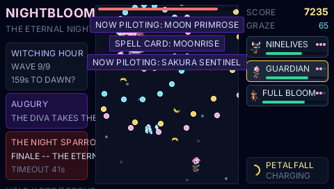

# NIGHTBLOOM — a garden against the eternal night

A vertical danmaku shooter on the PocketJS deterministic runtime, in the
grammar of Touhou's *Imperishable Night*: the player pilots one plant at the
bottom of a portrait playfield, the eternal-night youkai horde descends from
the treeline above, and the piloted form switches mid-fight. The night opens
with ONE form on the roster — the black-and-gold moon cat — and wakes the
rest as you play; when the pilot dies, you switch within its last breath or
the run ends. The art is PixelLab-generated and committed.

On the 480x272 landscape screen the field is the classic arcade adaptation:
a portrait column in the center, HUD panels on both sides (the night on the
left, the roster on the right).



*The FINALE. The diva's phoenix form sings THE ETERNAL NIGHT; the moon
cat holds the pilot seat, NINE LIVES charging, while the long spell-card
names scroll through the left panel like a ticker.*

## Play it

```bash
bun scripts/dev.ts nightbloom-main    # then open http://127.0.0.1:8130/?demo=nightbloom-main
```

| input | keyboard | does |
| --- | --- | --- |
| d-pad | arrows | fly (8-way) |
| CROSS (hold) | X | fire |
| SQUARE (hold) | A | focus — half speed, hitbox shown |
| CIRCLE / R | Z / E | switch to the next living form |
| L | Q | switch back |
| TRIANGLE | S | the piloted form's spell card |
| SELECT | Shift | the garden codex (forms, foes, laws) |
| START | Space | start / pause |

Survive the night: nine waves across DUSK and MIDNIGHT, a midboss, and THE
NIGHT SPARROW DIVA's three spell cards at the witching hour — and every
card change is a METAMORPHOSIS: each boss phase wears its own 64x64
transformation portrait (stage dress, flared wings, a phoenix final form
that grows 52 -> 58 -> 66 px), announced by a flash ring and the boss's
own cry — the diva chirps, the umbrella clangs.

**The roster wakes as you play.** Only the BLACK MOON CAT answers at dusk — the
gorilla card shows a live moon-mote counter until 28 collected enemy drops
wake the mountain. Its reveal no longer shares the midboss-defeat frame.
**And no pilot switches
itself**: when the piloted form dies the LAST BREATH opens — a 1.5 s window
to switch to a waking form (O / L / R). Miss it, or die with nobody else
awake, and the night takes the run.

## The roster — two forms, two answers

| form | wakes | shot | the ability |
| --- | --- | --- | --- |
| BLACK MOON CAT | at dusk | pearly prismatic homing paws | a black-and-gold moon cat, a white moon waxing on its brow; **dances with death** — wider graze ring, double graze glow |
| MOON PRIMROSE | collect 28 enemy-drop moon motes | **banana boomerangs** | a hulking gorilla with carved abs and the sweetest little face; at most three aloft, each cuts through on the way out AND the way home, every damaging touch heals the most wounded form by 2, and only a caught banana can be thrown again (the HUD counts his hand); motes are worth double glow |

Spell cards reinforce each role: NINE LIVES (homing burst and nearby clear),
MOONRISE (heal 24 and +100 glow to the whole waking
roster).

The avatar is alive, not a decal: it breathes on a tick-driven bob, leans
into its strafe and **mirrors to face the way it flies**, and **grows with
its stage** — 22 px, 27 px, 32 px, each stage its own portrait,
pokemon-style (the hitbox never grows; what you dodge with is always the
little white dot). When a `?` card wakes, a slanted rainbow shine sweeps
it left to right, trailing colored dust that thins with distance. And the
world never stops scrolling: a foe you don't kill rides the drift off the
bottom of the field — nothing parks on the screen forever.

**Two evolution laws.** Forms grow by their own work — glow comes from the
damage the piloted form deals, the motes it gathers (auto-collected above
the high line, the PoC), and the bullets it grazes — and ascend I → II → III
into wider patterns and deeper pools. Foes grow with the hour: DUSK sends
stage I, MIDNIGHT II, the WITCHING HOUR III.

## What it demonstrates, mechanically

tidelight proved the deterministic runtime on a branching story; NIGHTBLOOM
proves it on a bullet-hell:

- the battle advances in **fixed 1/60 s micro-ticks**, `ticksPerFrame()` per
  host frame, batches aligned so the tick count at any virtual second is
  identical at every `simulationHz` — **the 2 Hz world dodges the same
  spiral** (`?hz=2` on the web host to watch it);
- danmaku pattern math runs on a **quantized sine table** (1/8192 steps),
  because raw `Math.sin` is not bit-specified across JS engines and a spiral
  must replay byte-exactly on every host;
- press edges land on the first tick of a frame's batch; held verbs
  (movement, fire, focus) read the raw held mask, whose level track goes
  true at the same battle tick at every rate — hold-driven tapes subsample
  exactly;
- waves draw entry slots from one seeded xorshift32; float fx drift by
  battle-tick age; the phase augury arrives through the effect shell
  (`backend.ts`).

**Sound** is an output, never an input: the engine emits `SfxKind` events
(the hit thock, the kill pop, graze pings, spell declarations, per-boss
transformation cries, the dawn arpeggio) into a host sound sink. `sfx.ts` installs one where WebAudio
exists — every voice is synthesized from oscillators and a deterministic
noise buffer, no assets — and resumes on the first key press per the
browser's autoplay policy. The headless sim and the PSP never install a
sink, and the simulation is byte-identical either way.

`test/nightbloom.sim.test.ts` drives two tapes through the headless sim
host: THE MARKSMAN, a full clear (~163 s — the black moon cat opens alone, the
moon-mote gate wakes the gorilla, and both forms see the dawn),
and THE SLEEPER, whose lone black moon cat falls at ~34 s with nobody awake to
switch to. It asserts repeat-identity, chaos immunity,
strict 4 Hz / 2 Hz subsampling of both tapes, cross-rate byte-equal outcome
screens, augury effect timing, and the exact score / graze / kill / bloom
ledger. Wired into `bun run test`.

## Content pipeline

Same contract as the tidelight demo: every sprite and backdrop is generated
by the PixelLab pixel-art API (pixellab.ai) from the seeded manifest in
`data.ts` — `gen-assets.ts` is a no-op unless an asset is deleted or
`--force` is passed, and committed PNGs are re-encoded through the pak-safe
canonical subset.

```bash
bun demos/nightbloom/gen-assets.ts             # generate missing assets
bun demos/nightbloom/gen-assets.ts --only=p-catnip-2.png
```

Evolution stages are `init_image` chains — stage II derives from stage I,
III from II — so a creature keeps its identity as it ascends. Stats, prompts
and sprite filenames live in one table (`validateContent()` runs in the sim
test), and the bosses wear the stage-III art drawn large. Enemy danmaku is
native dots (no textures) — player shots, mochi and motes use the sprite
art. Auth: `PIXELLAB_API_KEY` in the repo root `.env` (gitignored).
