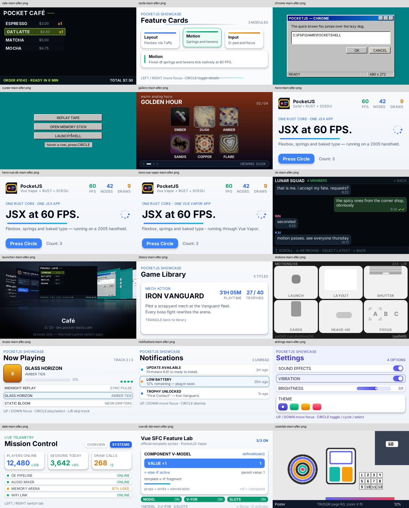
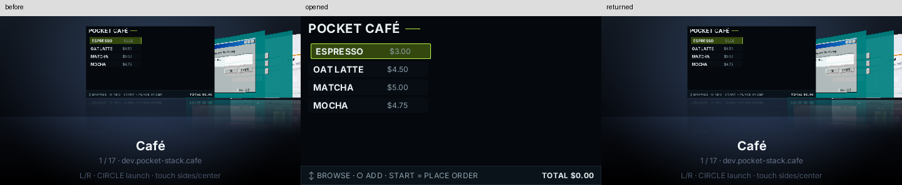

# Solid 2 native runtime

PocketJS pins **solid-js and @solidjs/universal 2.0.0-rc.6**, with
**babel-preset-solid 2.0.0-rc.2**. These are release candidates. The migration
follows the [upstream guide](https://v2.solidjs.com/migration/from-solid-1).
This is a coordinated renderer/compiler/runtime upgrade; external Solid 1 apps
must migrate their effects, lifecycle and package imports before updating the
PocketJS dependency. Vue Vapor and Octane keep their existing runtime paths.

## Frame delivery

Solid 2 stages ordinary signal writes. PocketJS controllers run in `latest()`
so successive input operations can read the staged state without forcing a
render after each setter. `runFrameHooks()` flushes after the controller phase;
the public frame handler flushes again after focus/press dispatch, before native
sweep and draw. **Signals and native properties commit within the same host
frame.** Physics reads the latest staged offset when integrating another step.
No controller needs its own microtask loop.

The compiler resolves Solid core, signals and universal renderer to the same
PocketJS-owned dependency graph, including for external application checkouts.
This prevents duplicated owners and cleanup registration across module copies.
The universal renderer uses zero-size, absolute, hit-transparent sentinels. Its
marked scalar-text adapter reuses the native text node; a counter update does
not allocate a replacement text node on every frame. Portal/auxiliary roots
are constructed under their component owner rather than an `onSettled` callback.

## Pocket Doc code patterns

| Concern | Before | After | Effect |
| --- | --- | --- | --- |
| Materialized reads | App maps, request tickets, row-specific cancellation and manual texture freeing | Four typed resource collections sharing one scheduler | Reuse, eviction, retries and completion budgets have one implementation |
| Native caret/animation effects | `createEffect(() => blink.setHeld(caretDragging()))` | `createEffect(caretDragging, held => blink.setHeld(held))` | Dependency reads are separated from native writes |
| Modal input blocking | Effect reads state, calls `onCleanup(pushTouchBlock())` | Compute returns blocked state; apply returns the release function | Lifetime follows the Solid 2 effect contract |
| Reply application | `batch(() => receive(reply))` | `receive(reply)` in the host frame | Default batching coalesces notifications before the frame's explicit commit |
| Previous memo value | `createMemo(previous => ..., initial)` | `createMemo<T>((previous = initial) => ...)` | Uses the v2 memo signature without another state signal |
| JSX/runtime ownership | `solid-js/universal`, DOM-oriented JSX type stand-in | `@solidjs/universal`, renderer-neutral `Element` | Removes the artificial global DOM Node declaration |
| Replay actions | Invoke a setter and immediately inspect native output | Guest-local action boundary uses `latest(run); flush()` | Tests exercise the same commit semantics as an input frame |
| Save/delete/draft operations | Explicit command IDs, local draft and provider journal | Same command protocol | No automatic mutation replay or collaborative-ordering claim |

For example, the modal lifetime is now:

```ts
import { createEffect } from "solid-js";
import { pushTouchBlock } from "@pocketjs/framework/gesture";

createEffect(
  () => !!store.menu() || store.mode() === "create",
  blocked => { if (blocked) return pushTouchBlock(); },
);
```

A cache definition replaces the app's request, ticket and disposal loops:

```ts
const tiles = scheduler.createCache({
  key: tileKey, maxEntries: 72, maxCost: 72 * 40960,
  maxResponseBytes: 5000, cost: () => 40960,
  load: offloadResource(io, "document.tile", JSON.stringify),
  materialize: decodeAndUploadOneTile,
  dispose: tile => getOps().freeTexture?.(tile.handle),
  changed: input => rowChanges.notify(input.row),
});
```

The async cache and the Solid async graph solve different parts of delivery.
Solid 2 `createMemo(() => promise)` and `Loading` work with the native renderer;
a renderer test verifies fallback, frame-hook progress while pending, and later
reveal. **Pocket Doc keeps explicit ResourceState boundaries for owned textures.**
A normal async boundary can retain its last committed branch during refresh;
that branch must not retain a handle the cache has evicted and freed. The
resource boundary preserves the cache's ready/pending/error and disposal rules.
Creating one Promise/RPC per rendered row would bypass shared admission and is
not the migration pattern. Async graph support alone does not cache IO, bound
uploads, implement collaboration, or accelerate rasterization.

## Measured changes

The same isolated 1,000-file corpus and **3,231-frame / 93-check replay** pass
before and after the Solid upgrade. Both versions reach four pending requests,
72 resident Markdown textures and 72 resource entries. The recorded inertial
scroll offsets match. The **839-frame QuickJS replay** also passes.

| Build | Guest JS bytes | Passing QuickJS stack check |
| --- | ---: | ---: |
| Original Pocket Doc / Solid 1 | 250,723 | 128 KiB |
| Shared resources / Solid 1 | 264,913 | 128 KiB |
| Shared resources / Solid 2 | 334,683 | 192 KiB |

The Solid 2 application does not pass the former 128 KiB smoke limit. The 3DS
host already provides **384 KiB**; this upgrade does not raise that native limit.
The 192 KiB check still leaves a stricter validation target than the host's
configured limit. Bundle size and stack cost increased; the preserved scrolling
behavior does not establish a speedup or a physical 60 FPS result.

The measured benefits are retained interaction coverage and explicit shared
resource limits. The implementation benefits are fewer app-owned scheduling
paths, split effects, automatic write batching and a native async-graph path.
Hardware frame-time improvement is unmeasured. The new application binary needs
a separate device-install and interaction receipt.


## Validation

The framework renderer/resource/scrolling/keyboard suite passes **126 tests /
881 assertions**, including invalid-demand admission and native frame commits. Development-condition renderer/resource/list checks
pass **75 tests / 327 assertions**; controller fixtures outside a root still
emit owner-cleanup diagnostics. Integration checks cover package exports,
compiler portability, QuickJS C hosts, DevTools and platform profiles. IM,
launcher, deep-zoom and audio simulations pass **35 tests / 519 assertions**;
clock and base simulation checks pass **16 tests / 84 assertions**.

The website builds and links all **28 playground variants**. The first full
browser pass completed 25 variants; Chrome/Solid and Library/Vue/Octane needed
separate reruns and then passed. The verifier now reports incomplete compilation
at its wait boundary instead of continuing with a missing frame callback.
The embedded Clear documentation demo passes its scripted touch drag.

**18 PSP applications pass real-device PSPLINK regression.** The set comprises
all 17 PSP-admitted example manifests plus the standalone Launcher. Each fresh
release build is loaded on the USB-connected PSP. Device `devStats` reports the
same FNV-1a64 bundle identity as its compiled JS and asset pack. DevTools replays
button masks, the frame counter advances, and the device supplies before/after
480×272 VRAM captures. No guest error is recorded. The captures have been
inspected for text, layout and resulting state: Hero count, Café order receipt,
Gallery page, Library detail, IM thread, Settings values and Vue SFC model value.



[Per-application receipts](validation/solid2-psp.json) include PRX SHA-256,
expected/reported bundle identity, input tape and capture frame numbers.
A separate 18 MB multi-app PRX also passes native guest replacement:
replayed Circle opens Café from Launcher, and `appLaunch` returns to Launcher.
The whole-package hash matches the embedded package set before and after both
switches. SELECT-based summon, audio samples and physical button feel were not
audited.
Debug USB mailbox IO is enabled during this regression, so these observations
are not production frame-time measurements.



[Multi-app switch receipt](validation/solid2-psp-launcher.json).

To repeat a single build, use its manifest and the repository's PSP toolchain:

```sh
bun tools/pocket.ts build --target psp --manifest apps/hero/pocket.json \
  --project-root . --outdir dist/psp-check -- --release
```

Serve the PRX directory with `usbhostfs_pc`, enable the DevTools mailbox before
loading, and use `pspsh -e 'ldstart host0:/pocketjs-psp.prx'`. The existing
[DevTools protocol](DEVTOOLS.md) supplies `devStats`, `replay` and `screenshot`;
pixels are read from VRAM through a RAM bounce buffer and transferred over USB.
