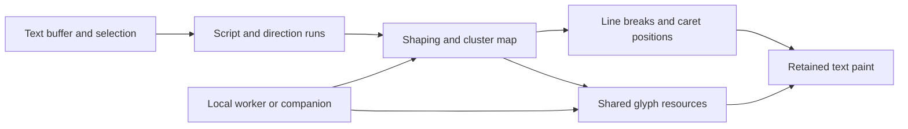

# Text layout and reusable glyph resources

**Editing a label must not invalidate every pixel in that label.** Clear's former `remoteText` implementation keyed coverage by the whole string. Replacing `Tap to Edit 你好` with `Tap to Edit 你` discarded the complete tile grid and showed a skeleton while the companion rasterized another string. The same invalidation occurred when the inline caret moved.

## Current implementation

`@pocketjs/framework/text` owns a realm-wide glyph resource cache and creates bounded line layouts. `@pocketjs/framework/text-view` paints those layouts into a retained child pool. These modules have no Solid, Vue or IME dependency. Clear's Vue adapter supplies lifecycle, color and conversion-wait presentation.

| Owner | Data and work |
| --- | --- |
| Editor | Unicode source text, revision, selection and composition |
| Line layout | Source offsets, advances and positions in logical pixels |
| Framework text resources | Immutable coverage identity, demand, references, retries and texture disposal |
| Text painter | Local text spans, positioned coverage images and placeholders for missing cells |
| Companion text provider | Font-file reads, font metrics and coverage rasterization |
| Rime provider | Preedit, candidate windows and committed Unicode text |

**A text change updates positions before requesting resources.** Latin spans use the core's baked font metrics and text nodes. Other scalar values use cached advances and coverage. Deleting a resident Han character, moving the caret, or reordering resident Han characters requires no new raster request. A cache miss affects that cell; existing Latin and Han content stays visible. Color and container alignment are presentation state.

The companion exposes `text.font` and `text.glyph` through `tools/text-provider.ts`. `text.font` returns an identity derived from the font contents and rasterizer revision, alongside the declared `scalar` mapping. Glyph identity includes that face, scalar value, logical size, weight and raster density. The first valid face response admits requests. Reconnection verifies the face identity while resident coverage remains usable offline. A changed face creates different cache keys.

**One `createResourceScheduler` owns glyph work per realm.** It allows two concurrent reads, one new read per frame and one materialization per frame. The cache admits at most 96 glyphs and reserves at most 32 KiB per glyph before allocation. Visible layouts pin their demands; the editor and candidate viewport have priority over surrounding rows. Clear supplies its row viewport with one row of overscan. Completed entries remain cached after a label releases them, subject to eviction.

Coverage remains packed at two bits per pixel. The native decoder accepts a power-of-two envelope of at most **8,192 pixels**, using the same 32 KiB scratch buffer and one-upload-per-frame budget. A glyph can use a tall rectangle instead of several 16-pixel strips. This extends the existing coverage operation without adding a renderer opcode. The device app must be rebuilt for the expanded rectangle bounds.

`TextLayout` retains the source string and UTF-16 ranges alongside positioned parts. `createTextPainter` retains the source in the framework mirror for inspection. Glyph handles belong to the resource cache; a painter cannot free a handle borrowed by another label. The current painter preserves Clear's white coverage and dimmed completion palette. Arbitrary glyph colors need per-draw mask tint in the shared core's text contract.

## Framework architecture for shaped text

**Scalar lookup is not a complete Unicode shaping model.** The current core's baked font path maps code points through a cmap and sums advances. The native text backend can install host measurement and wrapping. The implementation above extends the baked scalar path; it does not add bidi resolution, ligatures, contextual Arabic shaping or grapheme-aware editing.

The general text system needs separate source, shaping, glyph and line-layout records:

| Record | Identity and contents |
| --- | --- |
| Text buffer | Unicode source, revision, composition range and selection |
| Shaping request | Source range, surrounding context, font-set revision, script, language, direction and features |
| Shaped run | Source-to-cluster map, glyph IDs, advances, offsets and boundaries requiring reshaping |
| Glyph resource | Font content revision, face index, glyph ID, variation axes, rasterizer revision, pixel size and sampling settings |
| Line layout | Run references, line breaks, baselines, visual positions and caret stops |

**Glyph IDs and source characters are different identities.** A ligature can cover several characters; a character can produce several glyphs. HarfBuzz exposes clusters and flags boundaries that require reshaping after a break. Editing boundaries also need Unicode grapheme segmentation. These facts prevent a universal implementation from treating `Array.from(text)` as a shaping or editing algorithm. See the [HarfBuzz shaping guide](https://harfbuzz.github.io/getting-started.html) and [Unicode text segmentation](https://www.unicode.org/reports/tr29/).

The portable implementation should place segmentation, shaping, line breaking and cluster-to-caret mapping in one Rust module compiled for native hosts and WASM. A capable host runs it in a worker; a constrained host sends the same bounded requests to a companion. The guest receives plain records with source revisions and positions, never a platform font object. Rime continues to return Unicode text and candidates; it does not own font selection or layout.

An edit invalidates the affected shaping runs and any context required by their shaping boundaries. Unaffected runs retain their metrics and glyph references. A line-width change can reuse shaping and glyph resources while recomputing line breaks. A color change affects paint alone. A density change can request another raster rendition without changing logical caret positions.

**No deleted character may remain visible while a replacement is pending.** The source model applies the edit at the input edge. For an independent resident cluster, local layout removes it and moves the surviving glyphs in the same update. For contextual text, the shaper determines the affected range; the UI retains unaffected runs and confines any temporary presentation to that range. A universal guarantee of zero network work requires a resident shaper and the required font resources, not a whole-string bitmap cache.

## API migration

The cache and painter in this change are usable by any PocketJS UI framework through explicit lifecycle calls. They provide the scalar line path used by Clear on both devices. The next native text contract should accept shaped runs and glyph references through the shared core, so `<Text>` can use these resources with the same measurement and paint records. That work also needs glyph-upload admission, native/WASM equivalence tests, cluster-aware selection and wrapping tests. It is separate from the scalar coverage implementation shipped here.

Acceptance for that contract should include Latin kerning and ligatures, Han insertion/deletion, combining marks, emoji sequences, Arabic joining, mixed-direction selection, font fallback, font revision changes, density changes and cache eviction with multiple views. Each case must compare source offsets, metrics and rendered output across native and WASM providers.

## Clear candidate panel

**Candidate browsing is a read, not a composition key.** `createIme.browse(offset)` issues `ime.candidates` against the current bounded transcript. Each response contains at most 15 candidates; the guest retains at most 512 candidate entries. Rime caps the response's text budget. Browsing does not append page keys or change preedit. `selectAbsolute(index)` accepts only candidates obtained for the current revision, then appends one absolute selection action to the transcript. Typing, cancellation and reconnect fence older windows.

The keyboard's 44-point candidate bar shows three candidates and, during PY composition, a plain cross and a disclosure arrow with 44-point targets. Space carries the mode label. A 20-point preedit badge above the candidate bar uses the text layout's measured width; empty composition removes the badge and its editor clearance. The disclosure replaces the key grid with a candidate viewport. This viewport continues after the inline candidates, or includes them when an inline phrase needs more width. Cells wrap according to phrase length; long candidates continue across lines with the same selection index. A fixed view pool presents visible cells and overscan. **Candidates that remain in the viewport retain their mounted slots.** Departing cells supply slots for entering cells; appending a candidate window preserves the existing cell objects. Binary bounds find the visible slice, whose identity stays unchanged between row crossings. The framework kinetic scroller moves the content container; dragging suppresses candidate selection until a later tap. Collapsing the panel restores the keyboard without changing composition.

**A glyph completion invalidates layouts that read that glyph.** Each layout records its glyph identities and resident values. Request start and unrelated glyph completion leave the layout revision unchanged. A font-face change invalidates layouts with remote glyphs; eviction invalidates readers before the next paint. This keeps a candidate arriving from the companion from rebuilding other candidates and the committed editor text.

**Text demand planning runs when glyph identities, visibility, priority or ownership change.** Stable layouts reuse the admitted working set. The scheduler continues to process its bounded starts and completions once per frame. Candidate content and its scrollbar move through `translateY`; scrolling between row crossings does not write layout offsets. An entering row can update its recycled cells without repositioning the surviving rows.

See [Clear setup and controls](CLEAR_IME.md). Regression tests cover raster bounds, shared-cache reuse, deletion while offline, unchanged pixels outside the edit, candidate-window revision fences, scroll cancellation and absolute selection.
