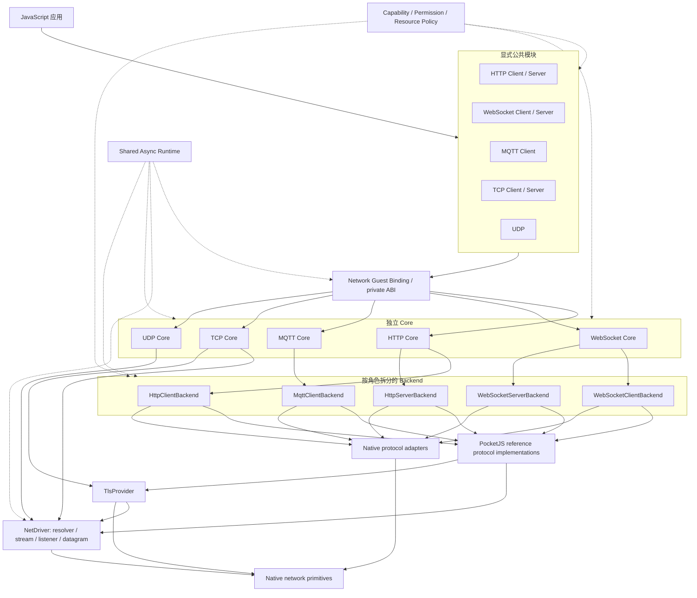
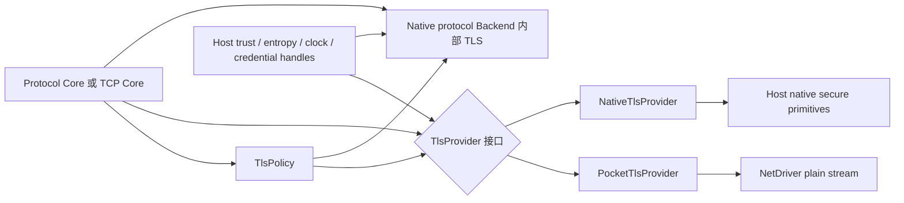
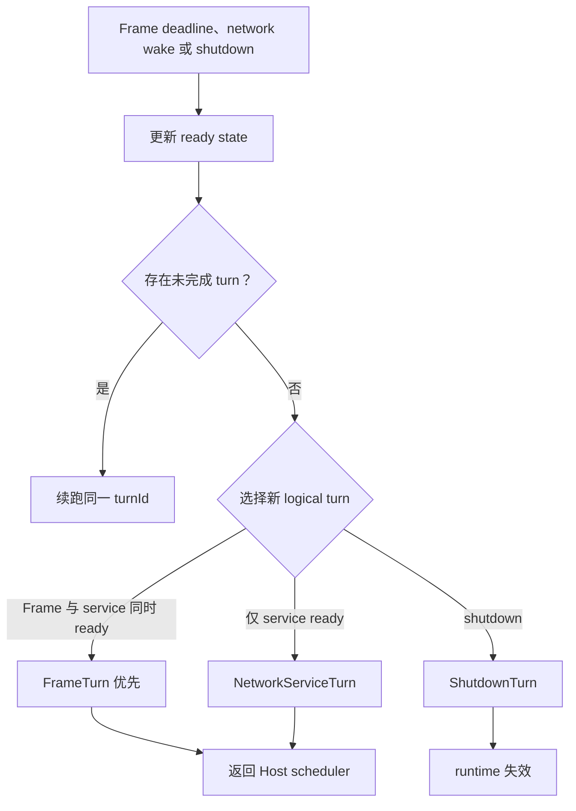
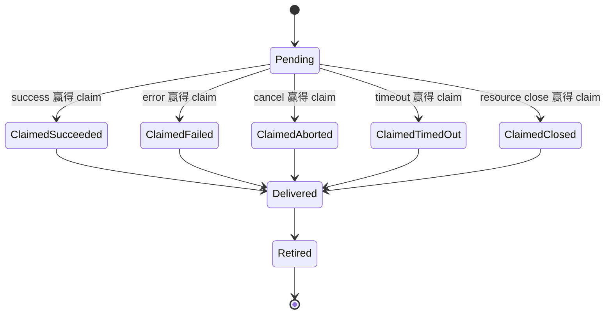

# PocketJS 网络架构

本文定义 PocketJS 端侧运行时（QuickJS Guest）的网络目标架构。Bun 只用于核对协议能力清单；公共范围、交付顺序和资源边界由 PocketJS 的端侧应用、现有 Host 与硬件约束决定。所有能力都使用 PocketJS 的显式模块导入、能力裁剪、权限检查、资源预算和 Host 装配模型。

**本设计替换当前 NET v1，不保留它在 `@pocketjs/framework/net` 下的旧导出、`globalThis.net` 或 `net.http` 公共兼容层。** `@pocketjs/framework/net` 路径由新的公共支持模块接管，协议模块统一位于它的子路径；当前实现中已经验证的有界分配、Host 注入和错误规范化机制可以迁移，但旧接口不是新架构的约束。

未来的浏览器 Host profile 直接使用浏览器提供的 `fetch`、WebSocket 等能力，并继续受浏览器 CORS、CSP 和安全上下文规则约束。本文重点是端侧 PocketJS 在 QuickJS 中提供一致能力；浏览器不模拟原始 TCP、UDP 或监听端口，且该 profile 按第 1.1 节保持 staged。

## 1. 已确定的范围

- 目标公共模块包括 HTTP Client / Server、WebSocket Client / Server、MQTT Client、TCP Client / Server 和 UDP；**目标目录不等于首批交付范围**。
- 公共入口来自显式的 `@pocketjs/framework/*` 导入；Build Plan 决定可装配能力，manifest 生成不可变访问策略，Host 在每次连接和监听时执行该策略。import 本身不授予权限。
- HTTP、WebSocket、MQTT、TCP 和 UDP 分别拥有 JS-free Protocol Core。各 Backend 的 wire 状态机独立；各模块共享异步运行时、operation、completion queue、buffer、timer 和 wake 机制。
- HTTP、WebSocket 和 MQTT 的 reference implementation 与 native implementation 使用同一个按角色拆分的 Backend 契约。
- Network Guest Binding 位于公共 SDK 与 Protocol Core 之间，持有 JS 对象、Promise 和 handler，并通过版本固定的私有 ABI 交换 command/completion。Protocol Core 和 Backend 永远不调用 Guest。
- TLS 是按协议角色附加的可选能力。明文能力不会自动获得 TLS，TLS 失败也不会回退到明文。
- 网络事件通过独立的 NetworkServiceTurn 进入 QuickJS。即使没有 UI frame，Promise continuation 和 JavaScript 网络 handler 也会运行。
- `v1` 表示本文固定的角色级 API/wire contract 版本，不表示所有角色在同一个版本或同一台 Host 上同时发布。首批只交付 HTTP Client；其余角色按本节阶段表逐项进入。
- AOT 网络执行不在本阶段范围内。AOT 构建可以拒绝网络模块，后续设计不能复用 QuickJS callback 细节作为 AOT ABI。

### 1.1 规范状态

本文按下列状态读取，后文更细的 API 描述不会覆盖该状态：

| 状态 | 范围 | 含义 |
|---|---|---|
| 共同基线 | 第 8–20、24–25 节中的 capability、permission、Backend、turn、operation、queue、buffer、错误、资源、teardown 与 conformance 机制 | 从第一项网络能力开始生效；后续协议不能绕开 |
| 第一项公共能力 | 明文 HTTP Client，以及它实际使用的 `@pocketjs/framework/net` 支持类型 | 完成 ESP-IDF Phase 1A 后只声明 `network.http.client`；HTTPS 在 Phase 1B 单独准入 |
| 同一 Host 的后续能力 | HTTP Client TLS、WebSocket Client | HTTP TLS 通过独立 Phase 1B 后才声明 `network.http.client.tls`；WebSocket 只有 HTTP/substrate gate 通过后才进入 ESP-IDF Phase 1C。WSS 的 TLS role 另行 admission |
| staged target | HTTP Server、WebSocket Server/upgrade、MQTT、公共 TCP/UDP、Browser profile 与第 23 节完整 record/replay tooling | 保留目标契约和能力命名，**当前不构成交付承诺**；必须有具体用户故事、Host 预算和独立互操作测试后单独晋级 |
| future | TLS-PSK、mDNS/设备发现、HTTP/2/3、MQTT 5、DTLS 与真正无 UI daemon | 只保留边界或命名空间，不进入本轮公共 API |

NetDriver 的 plain stream、listener 和 datagram 形状继续作为完整 substrate 设计保留；这不等于 Phase 1 对应用开放 TCP、UDP 或 Server capability。staged role 也不能因为文档已有字段就被 Host descriptor 宣告为已实现。

### 1.2 交付顺序与首批 Host

| 阶段 | Host 与公开角色 | 必须通过的出口条件 |
|---|---|---|
| Phase 0 | 旧 NET v1 | 冻结旧 surface；在首个新 capability 合入前移除 `@pocketjs/framework/net` 的旧导出以及应用可达的 `globalThis.net` 和 `net.http`，内部代码只可作为迁移素材暂留；随后才由新的支持模块接管该 package path |
| Phase 1A | **ESP-IDF：明文 HTTP Client** | Shared Async Runtime、HTTP/1.1、权限、资源、取消/timeout、无 UI frame delivery、独立 HTTP peer 与目标硬件资源测试全部通过；只广告 `network.http.client` |
| Phase 1B | **ESP-IDF：HTTP Client TLS** | 在已经通过的 HTTP Core 上选择 ESP-TLS source；TLS 1.2、Host trust、可信时钟、hostname verification、SNI、无明文 fallback、独立 TLS peer 与握手资源测试全部通过后才广告 `network.http.client.tls` |
| Phase 1C | **ESP-IDF：WebSocket Client** | 复用已经通过的 substrate；通过独立 RFC 6455 suite、长连接、断链与背压测试。WSS 还必须独立准入 `websocket.client` TLS role |
| Phase 2A | **PSP：明文 HTTP Client parity** | 不扩大 JS surface；先证明 PSP 网络初始化、link/address 变化、IPv4 resolver/plain stream、owner-thread wake、内存预算和真机 teardown，再运行 HTTP 公共断言 |
| Phase 2B | **PSP：HTTPS/TLS gate** | 单独选择并验证 PSP TLS source/HTTPS Backend；通过独立 TLS peer、错误时钟和握手内存测试前不声明 `network.http.client.tls` |
| Phase 2C | **PSP：WebSocket Client parity** | Phase 2A/2B 通过后执行 WebSocket 长连接、WLAN 断开/恢复、休眠/恢复和真机资源测试；WSS 仍需要独立 TLS source/descriptor/peer gate，不能继承 Phase 2B 的 HTTP TLS |
| 后续阶段 | staged target 中的单个 role | 每个 role 独立提出用户故事、Host 列表、预算和 conformance gate；不能把整组协议一次晋级 |

第一 ESP-IDF 落点使用 **ESP-IDF v6.0 最低基线**；首轮硬件工作锁定 v6.0.2 tag 的 commit `7101770dc6db2667b3c477cc31365dd1acd6db4e`。ESP32-P4 产品 Host 是首个产品集成目标，ESP32-S3 同时作为独立 Host profile 验证。当前 `hosts/esp32p4` 只提供可复用的 PPA renderer 侧和 smoke build，**不是已经具备 QuickJS 网络能力的完整产品 Host**；仓库也没有 ESP32-S3 产品 Host。Phase 1 必须分别补齐产品 BSP、Guest owner thread、network interface、wake、limits、descriptor、资源报告与生命周期集成后，目标 profile 才可声明完成。一个 profile 的结果不能外推到另一个 profile。

首轮板级 gate 使用以下固定组合：

| Host profile | 开发板与数据路径 | 首轮验证边界 |
|---|---|---|
| ESP32-S3 | AtomS3R，ESP32-S3-PICO-1-N8R8，原生 Wi-Fi | 独立 firmware build/link、STA/DHCP、HTTP Client 与资源测试；板间测试中可以临时运行 HTTP Server，但这不开放公共 Server capability |
| ESP32-P4+C6 | Tab5 rev 1.3，P4 经 SDIO 连接板载 C6 | 独立 firmware build/link、C6 power/reset/transport、STA/DHCP、HTTP Client 与资源测试 |

ESP32-P4 不原生提供 Wi-Fi。目标产品必须在 Host descriptor 中明确选择并验证具体 `esp_netif` 数据路径，例如外接 PHY 的 Ethernet，或通过 companion chip 提供的 [Wi-Fi expansion](https://docs.espressif.com/projects/esp-idf/en/v6.0/esp32p4/api-guides/wifi-expansion.html)；不能把“ESP-IDF Host”解释为必然存在 Wi-Fi。link driver、BSP 和凭据配置属于产品 Host，公共网络模块不直接暴露板卡 SDK 概念。

Tab5 rev 1.3 的 image 必须选择 pre-v3 silicon，并锁定 1.x revision range：`CONFIG_ESP32P4_SELECTS_REV_LESS_V3=y`、`CONFIG_ESP32P4_REV_MIN_100=y`。首轮 C6 transport 使用 `CONFIG_ESP32P4_TAB5_C6_BOARD=y` 对应的 SDIO1/四线/40 MHz board preset，并锁定 `esp_wifi_remote` 1.6.4 与 `esp_hosted` 2.12.12。BSP 必须在 `esp_wifi_init()` 前打开 Tab5 的 `WLAN_PWR_EN`；revision 支持不能通过烧 eFuse 或忽略 revision check 绕过。

Tab5 的 P4 GPIO15 经 1 kΩ 电阻直接连接 C6 `EN`，运行态必须保持高电平。`esp_hosted` 2.12.12 的 Tab5 preset 默认选择 active-low reset，并在 reset sequence 结束后把 GPIO15 保持为低，导致 SDIO CMD5 超时；host defaults 必须显式设置 `CONFIG_ESP_HOSTED_SDIO_RESET_ACTIVE_HIGH=y` 并取消 `CONFIG_ESP_HOSTED_SDIO_RESET_ACTIVE_LOW`。同时设置 `CONFIG_FREERTOS_HZ=1000`，避免 Hosted 在 100 Hz tick 下报告 bus-level jitter 风险。每次 clean configure 后必须从生成的 `sdkconfig` 复核 revision range、reset polarity、SDIO pins 和 tick frequency。

### 1.3 PSP 第二阶段边界

当前 PSP Host 是固定 frame loop 上的单 QuickJS worker，仓库尚未接入 PSP network、HTTP 或 TLS SDK。Phase 2A 不是“把 ESP-IDF adapter 换一层 FFI”，而是先补齐下列 Host 基础设施：

- PSP utility/network module 与 AP profile 生命周期、WLAN/link/address 状态、IPv4 resolver/plain stream，以及不会隐式弹出系统配置 UI 的启动策略；
- owner wait 同时等待 network wake 和下一 frame deadline，native callback/worker 只写入有界队列；NetworkServiceTurn 不能等到下一次 vblank 才运行；
- `quickjs-counted` 的 job/instruction budget，以及 app switch 前有截止时间的 `Quiesce → ShutdownTurn → Release`；
- 精确锁定的 PSP toolchain 上的 build/link 证明，并在 PSP-1000 真机验证网络模块、内存、断链、WLAN-off、teardown 与 soak。PPSSPP 只用于 build、UI 和部分错误路径，不能替代真机网络/TLS conformance。

PSP 的内存 profile 不是固定的 2 MiB arena。当前 Host 使用 **1 MiB worker stack**；QuickJS、Rust allocation 与 newlib `malloc` 共享的 arena 默认取启动时最大可用分区减去 **2 MiB 外部安全余量**，实际容量随设备、包和启动状态变化。网络预算必须同时记录共享 arena、SDK native pool、socket buffer 与额外 thread stack 的峰值，继续保留外部安全余量；不能把模拟器一次测得的 arena 数字写成固定硬件预算。

Phase 2B 在两条路径中择一并记录到 descriptor：平台 `sceHttp`/HTTPS 可以作为带 `internalTls` 的 native `HttpClientBackend` 候选，但只有兑现 streaming、redirect、权限、错误和 TLS 合同后才能采用，且不能因此自称通用 `TlsProvider`；portable TLS provider 则与 Phase 2A 的 reference HTTP Backend 组合，并必须先通过 PSP 的 MIPS/no-std/toolchain、allocator、熵、trust store、SNI、证书时间与握手峰值验证。如果 Phase 2B 的 `backendByRole["http.client"]` 与 Phase 2A 不同，必须对最终 HTTPS Backend 重跑 Phase 2A 的完整 HTTP/framing/permission/resource suite，再运行 TLS suite。两条路径都未通过前，PSP 只允许保持 `.tls` capability 缺失。

## 2. 公共模块

下列代码列出目标 catalog。应用只从所需模块导入能力；构建目标尚未晋级的 staged module 必须在 Build Plan 阶段失败，不能生成运行期空壳：

```ts
import { fetch, serve, Headers, Request, Response } from "@pocketjs/framework/net/http";
import type { BodyStream } from "@pocketjs/framework/net/http";
import { connect, serve as serveWebSocket, upgrade } from "@pocketjs/framework/net/websocket";
import type { WebSocketUpgrade } from "@pocketjs/framework/net/websocket";
import { connect as connectMqtt } from "@pocketjs/framework/net/mqtt";
import { connect as connectTcp, listen } from "@pocketjs/framework/net/tcp";
import { udpSocket } from "@pocketjs/framework/net/udp";
import {
  AbortController,
  NetworkError,
  URL,
  getNetworkLimits,
} from "@pocketjs/framework/net";
import type {
  AbortSignal,
  NetworkAddress,
  NetworkData,
  NetworkLimits,
  TlsOptions,
} from "@pocketjs/framework/net";
```

同名函数通过模块归属区分，应用可以在导入时重命名。所有网络模块位于 `@pocketjs/framework/net` package path namespace：根模块只提供公共类型、`AbortController`、真正可用于 `instanceof` 的 `NetworkError` class，以及只读的 `getNetworkLimits()`；导入根模块不会装配 I/O 能力。各协议子模块重导出的公共类型必须保持同一对象身份。

compiler 为每个 value export 记录 surface demand：`fetch` 对应 HTTP Client，HTTP `serve` 对应 HTTP Server，WebSocket `upgrade` 同时对应 HTTP Server、WebSocket Server 和 upgrade。resolver 再按目标把 Client demand 匹配到端侧 capability 或第 22 节的 Browser capability；manifest 必须通过 flat requirement 或 `requiresOneOf` 显式列出允许的 provider。type-only import 不产生 demand；re-export 传递 demand；namespace import 或无法静态解析的属性访问按该模块全部 value export 检查。tree shaking 不能删除 manifest 已声明的能力或权限。

manifest 的 `engine.capabilities.requires/requiresOneOf/enhances` 是授权真源。compiler 只验证 bundle demand 已被 manifest 覆盖，不能因为看见 import 自动授予能力。

### 2.1 公共支持类型

`@pocketjs/framework/net` 在所有协议模块间提供同一对象身份：

```ts
type NetworkData = string | ArrayBuffer | ArrayBufferView;

type NetworkAddress = {
  family: "ipv4" | "ipv6";
  address: string;
  port: number;
};

type TlsOptions = {
  serverName?: string;
  minVersion?: "1.2" | "1.3";
  maxVersion?: "1.2" | "1.3";
  alpn?: readonly string[];
  ca?: Uint8Array;
  credential?: string;
  clientCertificate?: "none" | "optional" | "required";
  verification?: "full" | "development-insecure";
  revocation?: "host-default" | "required";
};
```

`URL`、`AbortController`、`AbortSignal` 和 `NetworkError` 都由该模块提供，不依赖 QuickJS 是否预装浏览器 Web API。`TlsOptions.credential` 是 manifest/Host 配置中的 credential id；Guest 只能传 id，native Host 把它解析为 opaque handle，private key 不进入 JS。`serverName` 在 v1 只能省略或等于已授权 hostname。Server 使用 credential 属于基础 Server TLS；Client credential 与 Server `clientCertificate` policy 需要 `.tls.client-auth`，`ca/alpn/minVersion=1.3/revocation=required` 分别需要第 8 节对应 capability。`development-insecure` 只受第 9/14 节的双重开发开关控制。

`TlsOptions.ca` 在同步调用内 snapshot，并受 CA byte/count hard limit 约束。输入只能是一个 DER 编码 X.509 certificate，或只包含一个以上 `-----BEGIN CERTIFICATE-----` block 的 UTF-8 PEM bundle；DER 尾随数据、PEM private-key/其他 block、无效 base64 和 block 外非空白文本都在连接前拒绝。custom CA **追加到 Host trust store**，不替换系统 roots；v1 不提供 replace-only trust mode。解析后的 certificate 只进入 native `TlsPolicy`，不会保留 JS buffer 引用。

`NetworkData` 的 string 按 UTF-8 编码；ArrayBufferView 只 snapshot 当前 `byteOffset/byteLength` 窗口。detached buffer 在任何 command 进入 native 前以 `invalid_state` 失败。

`getNetworkLimits()` 返回冻结的 `NetworkLimits` snapshot。它是 capability/profile 查询，不执行动态协商。

下列 Bun 能力不进入本次网络接口：

- 通过 `fetch` 读取文件、S3、Blob 或其他非网络 scheme；
- `BunFile`、Node.js stream 或 Node.js socket 兼容对象；
- HTTP routes、热更新和开发服务器功能；
- Unix domain socket；
- 隐式环境代理、隐式 cookie jar 和隐式 HTTP cache。

这些能力如有需要，应在文件、存储、开发服务器或兼容层中单独设计。

## 3. HTTP

### 3.1 Fetch 对象基线

`Headers`、`Request`、`Response`、body mixin 和 `RequestInit` 的 Web-compatible 行为固定到 [WHATWG Fetch snapshot `586cd2a`](https://github.com/whatwg/fetch/commit/586cd2a44c2a865b37c166dc0740f3fb8bb220d6)。仓库必须把选中的 Fetch API conformance cases 固定到 [web-platform-tests snapshot `6437d68`](https://github.com/web-platform-tests/wpt/commit/6437d68e10721ed4b9b68101ec1ab1a1b67a3995) 并记录 allowlist；升级任一 snapshot 需要显式修改公共 contract，不能跟随 living standard 漂移。

首批 HTTP Client 公共对象精确包括以下成员；snapshot 中没有列出的 `blob/formData/bytes/trailers` 等成员不进入 prototype，provider 也不能额外暴露：

- `Headers` constructor、`append/delete/get/has/set`、`entries/keys/values/forEach`、iterator 和 `getSetCookie()`；field name/value 的规范化、guard、重复值组合、`Set-Cookie` 分列和迭代顺序遵循上述 snapshot；
- `Request` constructor，以及只读 `method/url/headers/body/bodyUsed/signal/redirect`、`clone()`、`arrayBuffer()`、`text()` 和 `json()`；
- `Response` constructor，以及只读 `status/statusText/ok/headers/body/bodyUsed/url/redirected`、`clone()`、`arrayBuffer()`、`text()`、`json()`、`Response.json()` 和 `Response.redirect()`；
- `HeadersInit = Headers | Record<string, string> | Iterable<readonly [string, string]>`；HTTP body input 是 `NetworkData | BodyStream | AsyncIterable<Uint8Array> | null`；
- `RequestInit` 的标准字段限于 `method/headers/body/signal/redirect`，PocketJS 扩展字段固定为 `timeouts/maxRedirects/tls/limits/ref`。未知字段按普通 JS dictionary 语义忽略；已识别但当前 provider 不支持的字段必须在 I/O 前以 `unsupported` 失败。

PocketJS 的明确偏差是：body 锁定、重复消费、无效 streaming clone 和 detached input 使用稳定 `NetworkError`，而不是依赖平台 `TypeError` 文案；网络、权限、timeout 和资源失败也统一为第 19 节 `NetworkError`。JSON syntax error 仍是 `SyntaxError`。`clone()` 必须在 `bodyUsed=false` 时创建有界双分支 tee；任一分支达到 hard limit 时向上游施加背压，不能无界缓存。**应用不能先顺序读完一个大分支再读取另一个分支；不再使用的分支必须立即 `cancel()`，否则滞后分支达到上限后会按设计背压上游。** Browser adapter 必须把 native Fetch 对象包装成本模块对象并规范化上述行为，不能把 browser prototype、header guard 差异或错误文案直接泄漏为另一个公共 API。

### 3.2 Client

`@pocketjs/framework/net/http` 提供以下入口；它使用 Fetch 的 Request/Response 形态，具体偏差由本节固定：

```ts
function fetch(input: string | URL | Request, init?: RequestInit): Promise<Response>;
function serve(options: HttpServeOptions): Promise<HttpServer>;

interface BodyStream extends AsyncIterable<Uint8Array> {
  readInto(destination: Uint8Array): Promise<{ bytes: number; done: boolean }>;
  cancel(reason?: unknown): Promise<void>;
}
```

- 支持 `http:` 和在具备 TLS 能力时支持 `https:`。
- method 接受合法 HTTP token，但拒绝 `CONNECT` 和 `TRACE`；HTTP 4xx/5xx 是成功 exchange，`fetch()` resolve，状态通过 `Response.status/ok` 表达。
- request body 和 response body 使用有界流；`fetch()` 在响应头可用后 resolve，不等待完整 body。
- `Request.body` 和 `Response.body` 是模块定义的单消费者 `BodyStream`，支持 async iteration、`readInto()` 和 `cancel()`。第 3.1 节定义的 `NetworkData`、`BodyStream` 和 `AsyncIterable<Uint8Array>` 可以作为 request/response body 输入。
- 首批不暴露 `Request.trailers` / `Response.trailers`。正常读取到 terminal chunk/message end 时，HTTP parser 必须完整解析 incoming chunked trailer、执行第 21 节的字段与资源校验，然后丢弃已验证内容。应用 cancel/abort、redirect 放弃 body 或 peer 提前断开时不要求解析尚未到达的 trailer；Core 必须关闭连接，或只在有界 drain 已读到 message end 并完成同一验证后才允许复用。
- Client `Request`/`RequestInit` 的 `Trailer` request header 遵循选定 Fetch snapshot 的 request guard，不会被接受或发送。staged Server `Response` 或任何异常 internal command 如果仍携带 outgoing `Trailer`，必须在进入 wire encoder 前以 `unsupported` 失败。公共 outbound trailer producer/API 只有在出现明确的端侧用户故事并补齐 streaming/lifetime conformance 后才能作为独立扩展晋级。
- `BodyStream.readInto()` 同时最多一个 pending read，空 destination 被拒绝，只有 `{ bytes: 0, done: true }` 表示 EOF。Backend 报告下游容量后，Core 才能向 Guest Binding 发出下一次 producer credit。
- JS `AsyncIterable` 由 Guest Binding 持有。Core 只有在下游可写时发出 `BODY_PULL(maxBytes)` credit；每个 body 最多一个 pending `iterator.next()`。Binding 收到 chunk 后先检查 `maxBodyChunkBytes`，再把整个 chunk snapshot 到有界 BufferLease chain；超过上限以 `resource_limit` 失败，不能只借用 JS buffer。credit 小于 chunk 时，剩余部分留在 native lease 中等待下一次 pull，不再次调用 iterator。
- iterator 完成映射为 `BODY_END`，reject 映射为 body error；cancel、redirect 放弃 body 或 peer 断开时，Binding 至多调用一次 `iterator.return()`。return 自身失败只进入诊断，不能覆盖原始 cancel/error。
- body 一旦被 reader、async iterator 或聚合 helper 锁定，其他读取方式返回 `invalid_state`；取消 reader 会传播到 HTTP Core 和 Backend。
- `AbortSignal` 可以取消 DNS、连接、TLS handshake、发送、等待响应头和读取 body。
- redirect 默认使用 `follow`，每一次跳转都重新执行权限检查、scheme 检查和资源预算检查。
- redirect 支持 `follow`、`manual` 和 `error`，默认最多 5 跳且只能由应用降低。301/302 只把 POST 改为 GET，303 把 HEAD 之外的方法改为 GET，307/308 保留方法和 body。改为 GET 时移除 body 及其 content headers；跨 origin 时剥离 `Authorization`、`Proxy-Authorization` 和显式 Cookie header。
- redirect 需要重发 body 而 body 是已经消费的 `BodyStream` 或一次性 `AsyncIterable` 时，以 `invalid_state` 失败，不发送下一跳。
- timeout 分为 `connect`、`headers`、`idle` 和 `total`；所有 timeout 使用 Host 单调时钟。
- `Response.arrayBuffer()`、`text()` 和 `json()` 是有界聚合 helper，超过调用或 Host 限制时以 `resource_limit` 失败。
- 不提供 ambient cookie、cache 或 proxy。应用需要显式传入 header；Host 如需代理，应通过独立、可审计的配置提供。
- string header 按 HTTP 语法校验，禁止 CR/LF 注入；header count、name/value bytes 和总 block 都受 `NetworkLimits` 约束。
- SDK/Guest Binding 统一处理 body 锁定与 Promise settlement；Protocol Core 处理 redirect、取消、deadline、权限、预算和有序 completion。Backend 不自行增加重试或 redirect。

### 3.3 Server

`serve(options)` 在 bind、权限检查和可选 TLS credential/handshake 配置完成后 resolve `HttpServer`；任何启动失败都 reject，应用不会拿到半初始化 server：

```ts
const server = await serve({
  hostname: "127.0.0.1",
  port: 8080,
  tls,
  limits,
  fetch(request, server) {
    return new Response("ok");
  },
  error(error) {
    return new Response("internal error", { status: 500 });
  },
});
```

- handler 接收本模块定义的 `Request` 并返回 `Response`、`WebSocketUpgrade` 或相应的 Promise。
- HTTP Core 等待 handler Promise，但受 server handler deadline 和 inflight budget 约束；peer 断开时触发 `request.signal` abort。
- request 和 response body 均可流式传输；Backend 必须将 transport 背压传播到 body producer。
- `HttpServer.stop({ graceful, timeout })` 停止接收新连接；graceful 模式等待已接受请求完成，达到 timeout 后强制关闭剩余连接。
- `ref()` / `unref()` 控制 server 是否保持无 UI frame 的运行时存活，不改变 server 自身状态。
- handler 在发送响应头前抛错时调用 `error`。响应已经开始后发生错误时，Core 终止当前 body/连接，不尝试发送第二个响应。
- `error` handler 缺失、抛错或返回非法值时，未开始的响应使用固定 500 空 body 并关闭连接。
- HTTP Client Backend 可以维护有界连接池；HTTP Server Backend 支持有界 keep-alive。v1 禁用 pipelining，前一响应完成前不向 Guest 投递同一连接上的下一请求。
- v1 不支持 HTTP/2、HTTP/3、server push 或 transparent compression；没有对应 capability 时 native Backend 不得启用这些可观察行为。

## 4. WebSocket

`@pocketjs/framework/net/websocket` 同时提供 Client、独立 Server 和 HTTP upgrade。

```ts
function connect(url: string | URL, options: WebSocketConnectOptions): Promise<WebSocket>;
function serve(options: WebSocketServeOptions): Promise<WebSocketServer>;
function upgrade(request: Request, options: WebSocketUpgradeOptions): WebSocketUpgrade;

interface WebSocket {
  readonly readyState: "connecting" | "open" | "closing" | "closed";
  readonly bufferedAmount: number;
  send(data: NetworkData): WebSocketSendResult;
  ping(data?: NetworkData): boolean;
  pong(data?: NetworkData): boolean;
  close(code?: number, reason?: string): void;
  terminate(): void;
  ref(): this;
  unref(): this;
}

type WebSocketSendResult =
  | { status: "accepted"; bytes: number; needsDrain: boolean }
  | { status: "backpressure"; bytes: 0 }
  | { status: "closed"; bytes: 0 };
```

所有 WebSocket handler 的返回类型是 `void`，返回 Promise 不会延迟下一条协议事件。handler 抛出的异常属于 Guest execution error，不会被包装成 `NetworkError`；Host 的 Guest error policy 决定是否终止 runtime。

### 4.1 Client

`connect(url, options)` 在握手成功后 resolve `WebSocket`。options 包含 `headers`、`protocols`、TLS options、timeout、limits 和 handler：

```ts
const socket = await connect("wss://example.com/socket", {
  protocols: ["telemetry.v1"],
  socket: {
    open(socket) {},
    message(socket, data) {},
    drain(socket) {},
    ping(socket, data) {},
    pong(socket, data) {},
    close(socket, code, reason) {},
    error(socket, error) {},
  },
});
```

连接成功的 service turn 先把 socket 状态设为 open，再调用 `open`，最后 resolve connect Promise；对应 Promise continuation 在同一 logical turn 的 microtask checkpoint 中运行。握手前失败只 reject connect Promise，不调用尚未发布 socket 的 `error` / `close` handler。

### 4.2 Server 与 upgrade

- `serve(options)` 在 bind、权限和可选 TLS credential 检查成功后 resolve 独立 `WebSocketServer`。
- `upgrade(request, options)` 在 HTTP handler 中返回一次性的 `WebSocketUpgrade`，HTTP Core 随后将连接交给 WebSocket Core。
- upgrade 使用 `HttpUpgradeLease` 传递 transport、HTTP parser 未消费的 bytes、peer metadata 和 Backend handoff kind。
- lease 只能消费一次。reference HTTP Backend 可以交给兼容的 reference WebSocket Backend；native HTTP Backend 只有在 native WebSocket Backend 声明相同 handoff kind 时才能交接。
- upgrade 需要 `network.websocket.server.upgrade`。Build Plan 在构建时验证 HTTP Server / WebSocket Server 的 handoff kind；不兼容的 Host 不提供该 capability，因此静态使用 `upgrade` 会构建失败，不把可预知的不兼容推迟到运行时。
- JavaScript 永远不能访问 lease、native handle 或 parser 内部 buffer。
- `WebSocketServer.stop({ graceful, timeout })`、server/socket `ref()` / `unref()` 与 HTTP/TCP 使用同一存活语义。

### 4.3 消息与背压

- `message` 数据为 string 或独立的 `Uint8Array` snapshot；应用修改该对象不会修改 native buffer。
- `send(data)` 保持一个 WebSocket message 的原子边界。`accepted` 表示完整 message 已接受，`bytes` 可以为 0，因此合法空 text/binary message 没有歧义；`needsDrain` 表示已越过 high watermark。`backpressure` 表示 hard capacity 不足且 message 未接受；`closed` 表示连接已关闭。没有部分接受。
- `bufferedAmount` 只统计已经由 Core 接受、尚未交给 transport 的 payload。
- `ping()`、`pong()`、`close(code, reason)` 和 `terminate()` 是显式操作。
- `ping/pong` payload 遵守 RFC 6455 的 125-byte control-frame 上限，返回值表示完整 frame 是否被接受；不允许部分 control frame。
- receive queue、send queue、单 message 大小和 fragmented message 聚合都有硬上限。
- message 超过单条上限时发送 close code 1009；完整 message 无法进入 receive queue 时发送 1013 并关闭。send 参数本身超过上限时同步抛出 `NetworkError(code="message_too_large")`。
- `drain` 在 `send()` 返回 `backpressure` 或 `accepted/needsDrain=true` 后 arm；send queue 降到 descriptor 中固定的 `sendLowWaterBytes` 以下时触发一次。再次触发前必须重新 arm。
- v1 不启用 per-message compression；native Backend 不得自行协商。Client/Server 分别需要 `network.websocket.client.compression` / `network.websocket.server.compression`。

## 5. MQTT

`@pocketjs/framework/net/mqtt` 导出 `connect(options)`；下例在导入时把它命名为 `connectMqtt`。v1 使用 MQTT 3.1.1，支持 QoS 0/1、clean session、retained publish、Last Will、keepalive、topic wildcard 和可选重连。

```ts
function connect(options: MqttConnectOptions): Promise<MqttClient>;

interface MqttClient {
  publish(topic: string, payload: NetworkData, options?: PublishOptions): Promise<void>;
  subscribe(filter: string | readonly Subscription[], options?: SubscribeOptions): Promise<readonly SubscriptionResult[]>;
  unsubscribe(filter: string | readonly string[]): Promise<void>;
  end(options?: { force?: boolean; timeoutMs?: number }): Promise<void>;
  ref(): this;
  unref(): this;
}

type MqttMessageInfo =
  | { qos: 0; retain: boolean; dup: boolean; packetId?: never }
  | { qos: 1; retain: boolean; dup: boolean; packetId: number };
```

MQTT handler 返回 `void`，返回 Promise 不阻塞协议 ACK 或后续 event。transport/protocol error 时，Core 先 settle 本次不再保留的 operation，再调用 `error` 和 `disconnect`；启用重连时随后调用 `reconnect(client, attempt, delayMs)` 表示已经安排下一次尝试。

默认值是 `cleanSession=true`、publish/subscribe QoS 0、`retain=false`、keepalive 60 秒、自动重连关闭。收到的 topic 是 string，payload 是独立 `Uint8Array` snapshot。

```ts
const client = await connectMqtt({
  url: "mqtts://broker.example.com:8883",
  clientId: "sensor-42",
  username,
  password,
  cleanSession: true,
  keepAliveSeconds: 30,
  pingResponseTimeoutMs: 10_000,
  ackTimeoutMs: 30_000,
  will: {
    topic: "devices/sensor-42/status",
    payload: "offline",
    qos: 1,
    retain: true,
  },
  reconnect: {
    enabled: true,
    minDelayMs: 500,
    maxDelayMs: 30_000,
    multiplier: 2,
    jitter: 0.2,
    maxAttempts: 20,
    resubscribe: true,
  },
  tls,
  limits,
  mqtt: {
    connect(client, info) {},
    message(client, topic, payload, packet) {},
    disconnect(client, reason) {},
    reconnect(client, attempt, delayMs) {},
    drain(client) {},
    error(client, error) {},
  },
});

await client.subscribe("devices/+/command", { qos: 1 });
await client.publish("devices/sensor-42/status", "online", {
  qos: 1,
  retain: true,
});
await client.unsubscribe("devices/+/command");
await client.end({ force: false });
```

### 5.1 Promise 与确认语义

- `connect()` 在收到成功 CONNACK 后先调用 `connect(client, { reconnected: false, sessionPresent })`，再 resolve；首次 DNS/TCP/TLS/CONNACK 失败立即 reject，自动重连 policy 只在至少一次成功 CONNACK 后生效。
- QoS 0 `publish()` 在完整 packet 被有界 transport queue 接受后 resolve，不代表 broker 已经收到。
- QoS 1 `publish()` 在收到匹配的 PUBACK 后 resolve。packet identifier、重发标志、ACK timeout 和 inflight table 由 MQTT Backend 管理。
- send queue 或 QoS 1 inflight table 已满时，新的 `publish()` 立即以 `busy` 失败；容量恢复后触发 `drain`，不会把未接受的 publish 放入第二条等待队列。
- `subscribe()` 在 SUBACK 后 resolve，并返回每个 topic filter 的实际 granted QoS；任何 failure code 都保留在结果中。
- `unsubscribe()` 在 UNSUBACK 后 resolve。
- 来自 broker 的 QoS 1 packet 只有在 payload 成功进入有界 receive queue 后才发送 PUBACK。队列已满时，Backend 在 ACK 前断开连接，使 broker 能按协议重投。
- duplicate packet 可以再次触发 `message`，`packet.dup` 暴露协议标志。PocketJS 不承诺 exactly-once。
- `subscribe(filter, options)` 是单 filter 简写；`subscribe([{ filter, qos }, ...])` 批量发送并返回同顺序结果。packet identifier 只有在对应 ACK 完成或 operation 终止后才能复用。
- ACK timeout 不在仍存活的 transport 上主动重发。Backend 关闭 transport，Core 再按 reconnect policy 决定是否重连；这使 DUP 重发只发生在 MQTT 3.1.1 定义的 session 恢复路径。

### 5.2 输入与协议校验

- `clientId` 必须是有效 MQTT UTF-8、非空并满足 Host byte 上限；U+0000、surrogate、non-character 和协议禁止的 control character 被拒绝。
- username 是 MQTT UTF-8；MQTT 3.1.1 不允许只发送 password flag，因此提供 password 而没有 username 时在 I/O 前失败。password、payload 和 Will payload 接受完整 `NetworkData`，string 按 UTF-8 snapshot，ArrayBuffer/View 按 bytes 处理。
- publish topic 必须非空且不能含 `+` / `#`；subscription filter 按 MQTT 层级规则校验 `+` / `#` 位置。编码后长度同时受 65,535-byte 协议上限和更小的 Host 限制约束。
- CONNACK refusal 分别映射 `mqtt_unacceptable_protocol_version`、`mqtt_identifier_rejected`、`mqtt_server_unavailable`、`mqtt_bad_credentials` 和 `mqtt_not_authorized`，并在 `NetworkError` 中保留规范 reason code。
- Backend 在一个 keepalive 周期内没有发送其他 control packet 时发送 PINGREQ，并在 `pingResponseTimeoutMs` 内等待 PINGRESP；超时按 transport loss 处理。keepalive 与 PINGRESP deadline 不依赖 UI frame。
- `end()` 进入 `EndRequested` 时原子禁用自动重连并取消尚未开始的 reconnect timer/attempt；此后不会调用 `reconnect` handler。若进入时 transport 已连接，graceful `end({ force: false, timeoutMs })` 停止接受新 operation，等待 send queue、QoS 1 PUBACK、SUBACK 和 UNSUBACK operation 全部完成；成功时发送 DISCONNECT，等待 Backend 确认 transport 已关闭后 resolve，Broker 不应发布 Will。
- 若进入 `EndRequested` 时已经处于 disconnected/reconnecting，先前 transport-loss claim 仍是唯一的 `error/disconnect` 通知来源；Core 取消 reconnect、使保留的 pending operation 以 `closed` 失败，并在 resource release 后 resolve `end()`，不能合成第二次通知。这包括应用在 `disconnect` handler 内调用 `end()`。
- 若进入 `EndRequested` 时 transport 已连接，但在发送 DISCONNECT 前发生新的 loss，该 loss 只按 transport-loss 顺序调用一次 `error/disconnect`；不再重连，`end()` 与其余 pending operation 以 `closed` 失败，Broker 可以发布 Will。达到 end timeout 时不发送 DISCONNECT，abort transport、以 `timed_out` reject end，并使其余 pending operation 以 `closed` 失败。`force: true` 立即禁用重连并 abort，不发送 DISCONNECT，使已有 pending operation 以 `closed` 失败，并在 Backend 确认 transport 已关闭后 resolve `end()`。
- retained QoS 0/1 publish 都受相同确认规则；零长度 retained payload 表示删除 Broker 上的 retained message，不在 PocketJS 侧特殊丢弃。
- Will topic 使用与 publish Topic Name 相同的非空、无 `+/#` 和 UTF-8 校验。没有 `will` 时 CONNECT 的 Will Flag、Will QoS 和 Will Retain 都为 0；提供 `will` 时 Will Flag 为 1，QoS 只允许 0/1，retain 来自显式 boolean，其他 flag 组合在 I/O 前拒绝。
- `message(client, topic, payload, packet)` 的 `packet` 是冻结的 `MqttMessageInfo`；QoS 0 不暴露 packet id，QoS 1 必须暴露本次 PUBLISH 的 1..65,535 packet id。`retain/dup` 保留收到的 wire flag，不根据本地 session 推断。

### 5.3 Session、重连与离线行为

- 自动重连默认关闭。启用后，backoff、jitter、最大尝试次数和重新订阅由 MQTT Core 执行，native Backend 不得使用不可见的重连策略。
- 每一次重连都会重新检查 hostname、解析后的地址、端口、TLS 和应用权限。
- v1 不提供离线 publish queue。断线期间调用 `publish()` 以 `closed` 失败，避免不可见的持久化和无界增长。
- transport 断开且没有启用重连时，所有未收到 PUBACK 的 QoS 1 publish 都以 `closed` 失败。
- 任意 transport 断开都会使 pending SUBSCRIBE/UNSUBSCRIBE operation 以 `closed` 失败；只有已经 SUBACK 确认的 subscription 进入 resubscribe 集合。
- `cleanSession=true` 时 CONNACK `sessionPresent` 必须为 false。断线后旧 inflight publish 失败；重连成功且 `resubscribe=true` 时重新建立已确认订阅，false 时清空 active subscription 状态，不把旧 publish 当作 session resume 重发。
- `cleanSession=false` 时，原 `MqttClientBackend` 实例跨 transport reconnect 保留 packet identifier 与 wire inflight table，Core 保留对应 operation 与已确认 subscription。未确认 QoS 1 总是使用原 packet identifier 和 DUP=1 重发；CONNACK `sessionPresent=true` 时沿用 Broker session，为 false 且 `resubscribe=true` 时重新建立已确认订阅，为 false 且 `resubscribe=false` 时清空 active subscription 状态。
- 每次成功 reconnect 收到 CONNACK 并完成上述 session decision 后调用 `connect(client, { reconnected: true, sessionPresent, resubscribed })`；应用可以据此重新声明未自动恢复的订阅。
- 启用重连时，保留状态仍受原 inflight 上限、operation total timeout 和 maxAttempts 限制；超过任一上限后失败。
- 本地 persistent session 只覆盖当前 `MqttClient` 对象和 runtime 生命周期。v1 不把 inflight、subscription 或 credential 写入 durable store；设备重启后的 session 恢复不在保证范围内。
- MQTT Core 拥有 reconnect policy、JS operation 和已确认 subscription；同一个 Backend resource 拥有 wire session、packet identifier、ACK/retransmit 和 transport replacement。native SDK 无法禁用内部重连、控制 ACK 或保留 packet identifier 时，不能声明 v1 `network.mqtt.client` capability。
- `ref()` / `unref()` 控制 client 和已安排重连是否保持运行时存活。
- MQTT 5、QoS 2 和持久化离线队列是未来独立能力，不属于 v1。

## 6. TCP

`@pocketjs/framework/net/tcp` 提供 handler 驱动与 pull 读取两种明确模式：

```ts
function connect(options: TcpConnectOptions): Promise<TcpSocket>;
function listen(options: TcpListenOptions): Promise<TcpListener>;
```

```ts
const socket = await connectTcp({
  hostname: "example.com",
  port: 443,
  tls,
  socket: {
    open(socket) {},
    data(socket, data) {},
    drain(socket) {},
    timeout(socket) {},
    end(socket) {},
    close(socket, error) {},
    error(socket, error) {},
  },
});

const listener = await listen({
  hostname: "127.0.0.1",
  port: 9000,
  tls,
  socket: {
    open(socket) {},
    data(socket, data) {},
    drain(socket) {},
    end(socket) {},
    close(socket, error) {},
    error(socket, error) {},
  },
});
```

- 一个 socket 在创建时选择 handler 模式或 `readInto(destination)` 模式，二者不能混用。
- `readInto(destination)` 返回 `Promise<{ bytes: number; done: boolean }>`。destination 不能为空；同一 socket 最多一个 pending read，第二个以 `busy` 失败；只有 `{ bytes: 0, done: true }` 表示 EOF。
- handler 模式在 NetworkServiceTurn 中收到独立的 `Uint8Array` snapshot；snapshot 在 handler 返回后仍是普通 JS 对象，应用可以修改它，但它不引用 native buffer。
- pull 模式只在 owner thread 的 NetworkServiceTurn 中把 native bytes 复制到调用方 `Uint8Array`。
- `write(data: NetworkData)` 在调用返回前 snapshot JS 输入。string 先完整 UTF-8 编码并采用 all-or-none：返回完整 byte length 或 `0`，不会在多字节字符中间部分接受。二进制输入可以返回已接受的 prefix bytes；`0` 是没有接受，`-1` 是连接已关闭。
- `flush()` 等待当前已接受 bytes 交给 transport，`shutdown()` 半关闭写方向，`close()` 请求正常关闭，`terminate()` 请求立即 abort。
- write 返回 `0`，或二进制返回值小于输入 byte length 时，都会 arm `drain`；send queue 降到 descriptor 的 low watermark 后触发一次。所有 socket handler 返回 `void`；返回 Promise 不阻塞后续 I/O event。
- connect 成功时先把 socket 设为 open，再调用 `open`，最后 resolve connect Promise。连接建立前失败只 reject Promise。远端有序 EOF 先调用 `end`；双方关闭或 abort 后再调用一次 `close`。
- transport/protocol error 先使 socket 进入终态并 reject pending read/flush operation，再调用 `error`，最后调用 `close(error)`。正常关闭不调用 `error`。
- `terminate()` 立即使 JS socket 进入终态并请求 native abort；native transport、late callback 和 BufferLease 在相关 operation retired 后释放。
- `setTimeout(ms)` 是 idle timeout，不代替 connect、TLS 或 total timeout；`0` 禁用。收到 inbound byte 或 native 实际写出 outbound byte 时重置。一个 idle period 只触发一次 `timeout` handler，且不自动关闭；后续 I/O 会重新 arm。
- `setNoDelay(enabled)` 和 `setKeepAlive(enabled, initialDelayMs)` 映射到可移植 socket option；不支持的平台在创建前通过 descriptor/Build Plan 报告。v1 不支持已连接 plain socket 的 in-place STARTTLS/upgradeTLS。
- socket 和 listener 均提供 `ref()` / `unref()`；listener 提供 `stop({ graceful, timeout })`。
- `listen()` 在 bind、权限和 TLS credential 检查完成后 resolve；失败只 reject Promise。accept queue 达到上限时暂停 accept，平台 backlog 溢出由平台拒绝，不创建备用 queue。
- TCP Client 与 Server 的 TLS 能力分别声明；Server credential 通过 Host opaque handle 引用。

## 7. UDP

`@pocketjs/framework/net/udp` 提供 connected 与 unconnected datagram socket：

```ts
function udpSocket(options: UdpSocketOptions): Promise<UdpSocket>;
```

```ts
const socket = await udpSocket({
  connect: { hostname: "collector.example.com", port: 9000 },
  socket: {
    data(socket, data, remoteAddress) {},
    drain(socket) {},
    error(socket, error) {},
  },
  limits,
});
```

- 一个 socket 在创建时选择 `data` handler 或 `receiveInto(destination)` pull 模式，二者不能混用。
- `receiveInto(destination)` 消费一个 datagram，返回 copied bytes、原始 datagram length、remote address 和 `truncated`。destination 太小时只复制前缀并丢弃剩余部分；零长度 datagram 仍返回一条带 remote address 的结果。
- 保持 datagram 边界；零长度 datagram 是有效数据，不表示 EOF。
- connected socket 的 `send(data)` 只能发送到固定 peer。unconnected socket 的 `send(data, address)` 每次执行权限检查。
- connected socket 可以在异步创建时解析 hostname。unconnected `send` 的 address 必须是 numeric IP；v1 不在同步 send 路径中启动 DNS。
- connected Client 未显式指定 local bind 时，由 connect permission 同时覆盖 Host 自动选择的 local ephemeral port。显式 bind 使用 port 0 时需要匹配 listen rule 的 `port: ephemeral`；远端 address 的 port 0 永远无效。
- `send()` 返回 datagram 是否完整进入有界 send queue；UDP 不接受部分 datagram。`false` 只表示容量不足并 arm `drain`；socket 已关闭时同步抛出 `NetworkError(code="closed")`，不把两种状态压成同一个返回值。
- `sendMany()` 先验证并 snapshot 整批 address、权限、单包大小和总 byte budget，任何无效项都会在发送前失败；验证成功后返回按输入顺序完整接受的 datagram 数量，遇到第一个无容量项时停止。
- receive queue 满时丢弃最新 datagram，并增加可查询的 `droppedDatagrams`；不会覆盖已经排队的数据。
- v1 单个 IPv4 datagram payload 上限为 65,507 bytes，Host 可以设置更小上限。
- broadcast、multicast 和 IPv6 需要额外能力与权限；未声明时相关选项返回 `unsupported`。
- `close()`、`ref()` / `unref()` 和本地/远端地址查询是公共能力。
- `udpSocket()` 在 bind、connect 和权限检查完成后 resolve；启动失败 reject Promise。handler 返回 `void`；`drain` 只在 send 曾返回 `false` 且容量恢复后触发一次。

## 8. 构建能力

构建能力按协议、角色和 TLS 拆分：

```text
network.http.client
network.http.client.tls
network.http.server
network.http.server.tls

network.websocket.client
network.websocket.client.tls
network.websocket.server
network.websocket.server.tls
network.websocket.server.upgrade

network.mqtt.client
network.mqtt.client.tls

network.tcp.client
network.tcp.client.tls
network.tcp.server
network.tcp.server.tls

network.udp
```

TLS capability 是附加项。应用使用 HTTPS Client 时必须同时声明 `network.http.client` 和 `network.http.client.tls`，其余协议与角色遵循同一规则。

独立 WSS Server 需要 `network.websocket.server.tls`。在 HTTPS handler 中执行 upgrade 时，TLS 已由 HTTP Server 持有，因此需要 `network.http.server.tls`、`network.websocket.server` 和 `network.websocket.server.upgrade`，不重复要求 WebSocket Server TLS。

基础 `.tls` 只承诺 Host trust store、授权 hostname 对应的 SNI、证书验证、TLS 1.2+ 协商和端侧 Server opaque credential。下列可观察扩展继续按协议与角色拆分：

```text
network.http.client.h2
network.http.server.h2
network.http.client.h3
network.http.server.h3
network.http.client.compression
network.http.server.compression
network.websocket.client.compression
network.websocket.server.compression
network.mqtt.client.v5
network.mqtt.client.qos2
network.tcp.client.ipv6
network.tcp.server.ipv6
network.tcp.client.socket-options
network.tcp.server.socket-options
network.udp.ipv6
network.udp.broadcast
network.udp.multicast

network.<protocol>.<role>.tls.custom-ca
network.<protocol>.<role>.tls.client-auth
network.<protocol>.<role>.tls.alpn
network.<protocol>.<role>.tls.v1-3
network.<protocol>.<role>.tls.revocation
```

只在某个协议/角色可用的 IPv6 必须使用相应 role-specific id，不能用一个全局 `network.ipv6` 扩大其他模块。TLS 1.3 如果只是 Host 可自动协商的更高版本，可以只出现在对应 `TlsRoleDescriptor.versions`；应用要求最低 TLS 1.3 时才需要 `.tls.v1-3`。

命名空间为未来保留 `network.<protocol>.<role>.tls.psk` 与 `network.discovery.mdns`，但它们不属于当前 manifest format 3 的可声明 capability；resolver 收到时必须报未知/不支持。保留名字不固定 JS options、secret provisioning 或 discovery API，也不允许 Host 提前用基础 `.tls` / endpoint permission 代替。

capability 保留 `requires/enhances` 规则，并在 manifest format 3 增加 provider alternative：

- 静态 value import demand 对应的 required capability 缺失时构建失败；
- `enhances` 在目标不可用时由 Build Plan 记录为 false；
- 动态 URL 或 option 请求的 capability 不在 ResolvedBuildPlan 中时，在任何 I/O 前返回 `unsupported`；
- Backend descriptor 可以缩小目标能力，不能在运行期扩大 Build Plan；
- `network.websocket.server.upgrade` 只有在 Host 的 HTTP/WS handoff compatible 时才会进入目标 profile。

同一 app 同时面向端侧与 Browser 时使用 `requiresOneOf`。每个 `options` 元素是一组必须同时满足的 capability；resolver 按 manifest 顺序选择第一个被目标完整提供的 option，并把选择写入 canonical Build Plan：

```yaml
engine:
  capabilities:
    requires: [ui.core]
    requiresOneOf:
      - options:
          - [network.http.client, network.http.client.tls]
          - [network.browser.http.client]
      - options:
          - [network.websocket.client, network.websocket.client.tls]
          - [network.browser.websocket.client]
```

没有 option 可满足时构建失败；compiler surface demand 只有被 selected option 覆盖才算满足。只面向单一目标的 app 可以继续把实际 provider 写入 flat `requires`。

Browser Host 使用独立的 `network.browser.http.client` 和 `network.browser.websocket.client`，因为浏览器 API 不能兑现端侧 Client 的完整 option 和权限合同。它们复用同一公共模块，但不是 `network.http.client` / `network.websocket.client` 的等价实现。

## 9. 应用权限

构建能力表示代码和 Host 是否具备某项实现，应用权限表示这次构建允许访问哪些网络目标。获得 capability 不等于获得访问权限。

当前 Pocket manifest format 2 严格拒绝未知字段，因此网络权限需要 format 3；不能把未验证 JSON 旁路交给 Host。format 3 固定新增 `engine.capabilities.requiresOneOf`、顶层 `permissions.network` 与顶层 `resources.network`。以下是相关字段节选：

```yaml
$schema: https://pocketjs.dev/schema/pocket-3.json
pocket: 3
engine:
  capabilities:
    requires:
      - network.http.client
      - network.http.client.tls
      - network.mqtt.client
      - network.mqtt.client.tls
      - network.http.server
      - network.websocket.server
      - network.websocket.server.upgrade
      - network.tcp.server
      - network.udp
permissions:
  network:
    connect:
      - protocol: https
        host: api.example.com
        port: 443
      - protocol: https
        host: "*.devices.example.com"
        port: 443
      - protocol: mqtts
        host: broker.example.com
        port: 8883
      - protocol: udp
        host: collector.example.com
        port: 9000
    listen:
      - protocol: http
        address: 127.0.0.1
        port: 8080
      - protocol: ws
        address: 127.0.0.1
        port: 8080
      - protocol: tcp
        address: 127.0.0.1
        port: 9000
    localNetwork: false
    insecureTransport: true
    broadcast: false
    multicast: false
    allowInvalidTlsForDevelopment: false
    browserAmbientCredentials: false
    browserOpaqueWebSocketRedirects: false
    credentials: []
resources:
  network:
    minimum:
      runtime: { connections: 4, nativeBufferBytes: 524288 }
      stream: { receiveQueueBytes: 32768, sendQueueBytes: 32768 }
      http: { headerBytes: 8192, bufferedBodyBytes: 262144 }
      websocket: { messageBytes: 131072 }
      mqtt: { packetBytes: 65536, qos1Inflight: 8 }
      udp: { datagramBytes: 1472 }
```

仓库中的 manifest validator 同时接受 format 2 和 format 3。format 3 resolver 按 manifest 顺序选择每个 `requiresOneOf` provider option，规范化 endpoint tuple，并把 `ResolvedNetworkPolicy`、`ResolvedNetworkProviders` 和 resource minimum 写入 `ResolvedBuildPlan` 的 `planHash` 输入。网络 plan 经 `extractHostBuildInputs()` 投影为深度冻结的 `HostNetworkBuildInputs`；自定义 native Host 的环境投影包含同一 `planHash` 和 canonical network JSON。

**format 3 admission 基础不会自行发布网络 capability。** Stock target registry 仍不声明 `network.http.client`，compiler 的 HTTP value surface 仍保持 staged；只有公共 Guest Binding、descriptor 聚合和本节 conformance gate 完成后才移除该 gate。

每个 endpoint rule 是一个不可拆分的 `(protocol, host/address, port-or-range)` tuple，不对多个 protocol、host 和 port 做笛卡尔积。format 3 schema 对未知字段、非法 protocol、空 host 和越界 port 报错；resolver 在规范化后拒绝反向 range 和重复 rule。

v1 protocol token 固定为 `http`、`https`、`ws`、`wss`、`mqtt`、`mqtts`、`tcp`、`tcp-tls` 和 `udp`；Client 使用 host rule，Server/bind 使用 address rule。一个 rule 的 `port` 可以是单个整数、显式 `{ min, max }` 或 listen-only 的 `ephemeral`，不能是与其他字段组合的数组。

bind port 0 只匹配 `ephemeral`。Host 在 OS 返回实际 nonzero port 后核对它属于 Host profile 的 ephemeral range，失败则关闭 native handle；检查完成前不向 Guest 发布 server/listener/socket。`localAddress` 只在发布后返回实际端口。

`permissions.network.credentials` 只列出应用可引用的 Host credential id，不包含 key material。`TlsOptions.credential` 必须同时匹配该列表、当前协议角色的 TLS capability 和 Host policy；Host 再解析成 opaque handle。

HTTP upgrade 不创建第二个监听 socket，但会把公开协议从 HTTP/HTTPS 变为 WS/WSS；相同 address/port 必须同时匹配 HTTP 与 WS 的两个 listen tuple，Core 在消费 upgrade lease 前检查后者。

resolver 将 manifest rule 规范化为 `ResolvedNetworkPolicy`，并把 resource minimum 与目标/Backend hard limit 比较；任一 minimum 不可满足时构建失败。role → Backend/TLS source 的稳定 id selection、NetDriver id、resolved minimum 和 policy 都写入 `ResolvedBuildPlan` 的 canonical content 与 `planHash`。稳定 `HostBuildInputs` 必须携带 resolved features、`ResolvedNetworkProviders` selection、resource plan、policy 和 policy version；Host 只从已经验证的 package/plan 创建 runtime，并把它们作为不可变 native 数据传给 Protocol Core。Guest JS 不能提供、替换或扩大这些值。

`planHash` 只检查 canonical plan 是否意外损坏，不是授权签名。分发包的真实性仍由 Host/package admission 的签名或信任机制建立；不能把 Guest 传来的自带 hash 当作授权。

hostname 和地址在 resolver/runtime 中使用同一套规范化：

- DNS name 转为小写 IDNA A-label，并移除一个末尾 root dot；
- `*.example.com` 只匹配恰好一个非空 label（如 `a.example.com`），不匹配根域或 `a.b.example.com`；
- IP literal 解析成 canonical binary address 后比较，不能使用 wildcard；
- URL 省略端口时，HTTP/WS 使用 80，HTTPS/WSS 使用 443，MQTT 使用 1883，MQTTS 使用 8883；TCP/UDP 必须显式给端口；
- v1 的 TLS SNI 必须等于已经授权的 normalized DNS hostname，IP literal 不自动替换成其他 SNI。custom SNI 不在 v1 基线。

运行期权限检查遵循以下顺序：

1. 检查 ResolvedBuildPlan 中的协议角色、TLS capability 和 scheme；
2. 规范化并匹配一个完整 endpoint tuple；
3. 通过 Host resolver 解析；
4. 检查每一个候选 IP，过滤 loopback、link-local、private、multicast 和未授权地址；
5. 只连接通过检查的地址；
6. redirect、WebSocket upgrade、MQTT reconnect 和 DNS 重新解析后重复检查。

`localNetwork: false` 时，公开 hostname 解析到 loopback、link-local 或 private 地址也不能绕过限制。`localNetwork: true` 只允许已经匹配的 endpoint rule 解析到这些地址，不构成对整个私网的授权。

`insecureTransport: false` 优先于明文 HTTP、WS、MQTT 和 TCP rule，匹配 rule 也会被拒绝；设为 true 仍只能访问已列出的 endpoint。UDP 没有 TLS 对应项，不受该 flag 控制，只由显式 UDP rule、broadcast/multicast flag 和 capability 控制。TLS 验证失败不能转为明文重试。

`allowInvalidTlsForDevelopment` 只有在 Host 明确标记 development build 时才可生效，并且仍需调用方显式 option；production package admission 必须拒绝 true。它不允许明文 fallback。

## 10. 总体结构



一个 Host 可以按角色混合装配。例如，HTTP Client 使用 native Backend，HTTP Server 使用 reference Backend，WebSocket 和 MQTT 使用 reference Backend。装配在 runtime 创建时完成，运行中不能替换。Network Guest Binding 只看 spec-pinned ABI，不知道 Backend 是 reference 还是 native。

## 11. 分层职责

| 层级 | 负责 | 不负责 |
|---|---|---|
| 公共 SDK | JS 对象、构造参数、body lock、类型和显式导入 | native handle、平台 callback |
| Network Guest Binding | JS Promise/handler 表、command marshal、completion dispatch、private ABI | wire state、权限来源、平台 callback |
| Protocol Core | native 生命周期、operation、事件顺序、redirect/reconnect policy、deadline、取消、权限和预算 | JS 引用、wire parser、socket API |
| Protocol Backend | 协议连接、parser/framing、连接池、ACK、keepalive、协议级 retransmit | JS 对象、公共自动重试、权限决策 |
| NetDriver | resolver、plain stream、listener、datagram | TLS、HTTP、WebSocket、MQTT |
| TlsProvider | TLS Client / Server handshake、加密 I/O、证书验证 | 明文 fallback、应用权限 |
| Shared Async Runtime | operation、completion、buffer、timer、wake、typed turn | 协议状态机 |
| Host | Backend 装配、线程、时钟、熵、trust store、credential handle、硬上限 | 改变公共语义 |

**Network Guest Binding 是唯一能创建和完成 JavaScript Promise、调用网络 handler 或持有对应 JS 引用的层。** Protocol Core、native callback、Backend worker 和 NetDriver worker 只处理 spec 数据和 native completion，永远不调用 Guest。这保持 PocketJS 的 SDK → Spec → Core 边界。

### 11.1 Private Guest ABI

删除 `globalThis.net` 后，framework 源码使用 compiler-only specifier `pocketjs:internal/network-v1` 接入。应用 resolver 必须拒绝应用源码直接导入任何 `pocketjs:internal/*`；只有随 engine 版本发布的 framework 源码可以引用。

该 specifier 不作为 ES module import 留在产物中。规范只固定以下可观察边界：

- private binding 必须在任何应用 module initializer、应用 callback 或应用可触发的 microtask 之前完成注入；
- framework closure 捕获冻结的 binding table 后，应用代码不能按名字导入或从持久 `globalThis` property 取得它；
- mount 前完成 ABI version 与 Build Plan feature-set 校验，失败时不执行应用入口；
- binding 隐藏只提供 API hygiene，**不是授权边界**；native Core 始终重新执行 Build Plan 与 ResolvedNetworkPolicy。

bundle factory 是目标注入机制，但它会改变所有 Guest artifact 与 loader 的调用约定，因此必须在独立的 build/artifact ABI 变更中固定，不能作为网络协议实现内部顺手修改。该方案把 private import 降为 framework module closure 内的 binding slot：Host eval 得到 factory function 后，用 QuickJS `JS_Call` 传入冻结的 native binding table；Browser build 使用同一 factory 参数传入 JS adapter。

现有 global-script loader 可以在实现 spike 中评估“bootstrap 临时安装 → framework capture → 删除 property → 执行应用入口”的过渡适配器，但不能预设它与 factory 等价。只有当每条 loader 路径都能证明整个窗口内不会运行应用 initializer/callback/microtask、删除后不可重新取得 binding、异常路径也会删除 property，并通过同一 private-ABI conformance 时，选定 Host 才可使用该适配器；否则 Phase 1 必须等待 bundle factory。无论采用哪种机制，网络运行期都不能保留 `globalThis.net` 或其他应用可达的 native binding。

private ABI 仍由 `contracts/spec/network/*.ts` 固定并生成 native 常量：

- command 使用 append-only numeric opcode、resource/operation id、规范化 metadata 和 borrowed input buffer；
- native ABI adapter 在 owner thread 的同步 command 内把 borrowed input 复制到有界 pool；Protocol Core 只接收 owned `BufferLease`，borrow 不越过 adapter；
- completion 使用 append-only event code、generation、稳定 sequence、result metadata 和可领取的 BufferLease id；
- streaming body 固定 `BODY_PULL`、`BODY_CHUNK`、`BODY_END`、`BODY_ERROR` 和 `BODY_CANCEL` credit/event；Protocol Core 不持有或调用 JS iterator；
- Guest Binding 通过 `take/readInto` 在 owner thread 复制 payload；
- mount 时同时核对 ABI major/minor 与 Build Plan feature set，major 不匹配拒绝启动。

framework mount 时通过 binding slot 向 native runtime 注册一个 service dispatcher，Host 保存私有 QuickJS function handle。NetworkServiceTurn 调用该 handle，Guest Binding drain 已经由 Core 排序的 completion，并按 spec 顺序更新 Promise/handler 表。binding slot 不是安全授权边界；即使 bundle 被篡改，native Core 仍只执行 Build Plan 与 ResolvedNetworkPolicy 已授权的 command。

Protocol Core 对 Guest Binding 的 command/event 是唯一 Host 边界。reference/native Backend、NetDriver、TlsProvider 的对象和错误码都不能越过它。

## 12. Backend 契约与装配

高层协议按角色定义五个独立契约：

- `HttpClientBackend`；
- `HttpServerBackend`；
- `WebSocketClientBackend`；
- `WebSocketServerBackend`；
- `MqttClientBackend`。

每个 Backend 在 runtime 创建时注册带稳定 id 的不可变 descriptor：

```ts
type BackendRole =
  | "http.client"
  | "http.server"
  | "websocket.client"
  | "websocket.server"
  | "mqtt.client";

type BackendDescriptorBase = {
  id: string;
  protocolVersion: string;
  features: readonly string[];
  alpnProtocols?: readonly string[];
  handoffKind?: string;
  hardLimits: Readonly<NetworkLimits>;
  defaultLimits: Readonly<NetworkLimits>;
};

type BackendDescriptor =
  | (BackendDescriptorBase & {
      kind: "reference";
      internalTls?: never;
    })
  | (BackendDescriptorBase & {
      kind: "native";
      internalTls?: TlsRoleDescriptor;
    });

type NetworkTlsRole =
  | "http.client"
  | "http.server"
  | "websocket.client"
  | "websocket.server"
  | "mqtt.client"
  | "tcp.client"
  | "tcp.server";

type TlsRoleDescriptor = {
  versions: readonly ("1.2" | "1.3")[];
  features: readonly (
    | "host-trust"
    | "hostname-verification"
    | "sni"
    | "server-credential"
    | "custom-ca"
    | "client-auth"
    | "alpn"
    | "revocation"
  )[];
  alpnProtocols?: readonly string[];
  hardLimits: Readonly<{ caBytes: number; caCertificates: number }>;
};

type TlsProviderDescriptor = {
  id: string;
  kind: "pocket" | "native";
  roles: Readonly<Partial<Record<NetworkTlsRole, TlsRoleDescriptor>>>;
};

type NetDriverDescriptor = {
  id: string;
  features: readonly ("ipv4" | "ipv6" | "socket-options" | "broadcast" | "multicast")[];
  hardLimits: Readonly<NetworkLimits>;
};

type ResolvedNetworkProviders = {
  backendByRole: Readonly<Partial<Record<BackendRole, string>>>;
  tlsByRole: Readonly<Partial<Record<NetworkTlsRole, {
    source: "provider" | "backend";
    id: string;
  }>>>;
  netDriverId: string;
};

type HostNetworkDescriptor = {
  runtime: Readonly<{
    jobBudget: "quickjs-counted" | "browser-checkpoint";
    turnGuarantee: "quickjs-serialized" | "browser-task";
  }>;
  backends: Readonly<Partial<Record<BackendRole, BackendDescriptor>>>;
  tlsProviders: Readonly<Record<string, TlsProviderDescriptor>>;
  netDriver: NetDriverDescriptor;
  selection: ResolvedNetworkProviders;
};
```

reference 与 native Backend 必须接受相同的规范化 command，产生相同的 completion 和稳定错误。Core 不包含 `if native` 一类的平台分支。

`NetworkTlsRole` 使用 `http.client`、`http.server`、`websocket.client`、`websocket.server`、`mqtt.client`、`tcp.client` 和 `tcp.server`。reference protocol 与 TCP 使用 `TlsProviderDescriptor.roles[role]`，其 selection `source` 是 `provider`；内部完成 TLS 的 native protocol Backend 使用自己的 `internalTls`，其 `source` 是 `backend` 且 id 等于对应 `BackendDescriptor.id`。`source="backend"` 只允许 `kind="native"` 且存在该 role `internalTls`；reference Backend 携带 `internalTls` 或被选为 backend TLS source 都是 startup error。Host resolver 把 role → Backend、role → TLS source/provider 与 NetDriver id 写入 `ResolvedNetworkProviders`，再把选中的 descriptor 合成为不可变 `HostNetworkDescriptor`。

protocol/backend feature 与 TLS role feature 取交集生成有效能力。`alpn` feature 出现时，相关 ALPN 列表必须非空且去重：HTTP、WebSocket 与 MQTT role 的有效集合取 `BackendDescriptor.alpnProtocols` 和所选 `TlsRoleDescriptor.alpnProtocols` 的交集；TCP 没有 Protocol Backend，其 Guest 自己定义 stream 上层协议，因此有效集合直接使用所选 `TlsRoleDescriptor.alpnProtocols`，并仍受 Build Plan 中 role-specific `.tls.alpn` 与 Host allowlist 限制。应用提供的每一个 ALPN token 都必须属于对应有效集合，否则在 I/O 前以 `unsupported` 失败，不能删掉不支持的 token 后继续。HTTP/1.1 与 RFC 6455 over upgrade 的 v1 Backend 只允许 `http/1.1`；HTTP Client 提供 `h2` 还必须同时具备 `network.http.client.h2`、Backend `h2` feature 和双方 `h2` ALPN id。WebSocket over HTTP/2 没有独立 capability，不得因 HTTP h2 可用而自动启用。

Client 基础 `.tls` 要求该 role descriptor 同时包含 TLS 1.2、`host-trust`、`hostname-verification` 和 `sni`；Server 基础 `.tls` 要求 TLS 1.2 与 `server-credential`。`.custom-ca/.client-auth/.alpn/.revocation/.v1-3` 分别由同一个 selected role descriptor 验证，不能从另一个协议角色借用。即使多个 role 复用同一个 provider implementation，每个 role 也必须独立出现在 descriptor/selection 中并通过对应 conformance；HTTP Client TLS admission 不能被 WSS、MQTTS 或 TCP TLS 借用。

`ResolvedNetworkProviders` 进入 ResolvedBuildPlan canonical content 与 `planHash`；Host 在 bundle eval 前要求 `HostNetworkDescriptor.selection` 与它完全一致。`backends[role].id` 必须匹配 `backendByRole`；TLS selection 的 `source=provider` 必须匹配 `tlsProviders[id].id`，`source=backend` 必须匹配该 role 对应且 `kind="native"` 的 Backend id/internalTls；`netDriver.id` 必须匹配 `netDriverId`。Host 随后验证 aggregate descriptor 覆盖所有 required feature、handoff、TLS version/feature、ALPN id 和最低资源保证。重复 id、缺 role、非法 reference/internalTls 组合、id/role/selection 不匹配都是 Host configuration/startup failure；启动后不能替换 provider，也不能让已经构建成功的 required API 在调用时退化为 `unsupported`。descriptor 不能增加 Build Plan 未授予的 feature。

Backend 负责 wire 层状态：

- HTTP 连接复用、request/response 编码和 parser；
- WebSocket framing、fragmentation、control frame 和 close handshake；
- MQTT packet identifier、QoS ACK、协议 retransmit、keepalive 和 session flag；
- native 平台 API 与 PocketJS completion 的映射。

Core 负责公共 policy：

- redirect、MQTT reconnect 和 retry 是否发生；
- Guest Binding 应观察到的 handler、Promise 和 close/error spec event 顺序；
- capability、permission 和 resource budget；
- cancellation、timeout 和 teardown；
- JavaScript 可观察状态对应的 native resource 状态。

Backend 不得增加隐藏的自动重连、无限 queue、平台默认 cookie、平台默认 proxy 或公共接口未声明的协议扩展。

## 13. NetDriver

NetDriver 是 plain network transport 边界，只提供：

- hostname resolver；
- byte stream connect/read/write/shutdown/close；
- byte stream listener accept/close；
- datagram bind/connect/send/receive/close；
- local/remote address metadata；
- operation cancellation；
- completion queue 和 wake 接入。

NetDriver 不提供 SecureStream，也不包含 HTTP request、WebSocket message 或 MQTT packet。把 TLS 从 NetDriver 分离后，reference protocol、TCP 和 Host credential policy 使用同一个 `TlsProvider` 接口；该接口可以由 PocketJS TLS over plain stream 或 Host native secure primitive 实现。native protocol Backend 虽可内部调用平台 TLS，仍必须接受同一份 `TlsPolicy` 并产生同一类 TLS error。

### 13.1 Connectivity hint 与发现边界

NetDriver 可以向 Host scheduler 提供内部、非权威的 connectivity hint，至少区分 interface link 与可用 IP address generation。link/address 变化可以合并 wake，促使 pending connect 重新求值，或让 staged MQTT reconnect 提前结束 backoff；每次实际尝试仍必须重新执行 DNS、逐 IP permission 与真实 connect。**link up 不证明 Internet 或目标 endpoint 可达，link down 也不能替代已经发生的 operation terminal outcome。**

首批不向 Guest 暴露 connectivity status API，避免把板级瞬时状态伪装成网络可达性真相。应用可见 surface 将来如有需要，应使用独立 module/capability，明确状态的非权威性质；不能扩充 `fetch()` 的成功语义。ESP-IDF 的 ESP-NETIF event 与 PSP 的 WLAN/APCTL event 都只适配到这条 Host 内部边界。

v1 resolver 不执行 mDNS query、service browse 或 service advertise，`.local` 名称也不能因为平台 resolver 偶然支持而隐式生效。遇到 `.local` 时在 I/O 前以 `unsupported` 失败。未来的解析/发现必须使用独立 `network.discovery.mdns` capability、明确的 local-network permission 和独立资源预算；endpoint permission 仍在解析后逐地址检查，发现结果不自动授权连接。

## 14. TLS 边界



`TlsPolicy` 至少包含：

- Client hostname、SNI、ALPN、最低/最高 TLS version；
- 是否使用 Host trust store 或应用附加 CA；
- 可选 client credential handle；
- Server credential handle、client certificate policy 和 ALPN；
- Core 计算的 handshake deadline 与 cancel token。

### 14.1 ESP-IDF Phase 1B TLS source

ESP-IDF Phase 1A 先固定 plain `NetDriver` 与 HTTP Backend；Phase 1B 再固定以下 TLS 装配候选，并把最终选择写入 canonical Build Plan/descriptor：

- `NetDriver` 使用 lwIP socket 与 ESP-NETIF；BSP 必须先提供已初始化的具体 network interface，PocketJS 不负责配网 UI；
- TLS implementation 使用 [ESP-TLS](https://docs.espressif.com/projects/esp-idf/en/v6.0/esp32p4/api-reference/protocols/esp_tls.html) 及其默认 Mbed TLS backend。ESP-TLS 提供非阻塞连接、CA verification、SNI 和 ALPN 等 native primitive；Phase 1 不实现 `PocketTlsProvider`；
- 使用 reference HTTP/1.1 Backend 时，ESP-TLS 适配为独立 `NativeTlsProvider`，`tlsByRole["http.client"] = { source: "provider", id: <esp-tls-provider-id> }`；
- 使用 [ESP HTTP Client](https://docs.espressif.com/projects/esp-idf/en/v6.0/esp32p4/api-reference/protocols/esp_http_client.html) native Backend 时，HTTPS 由该 Backend 内部的 ESP-TLS 数据路径完成，descriptor 必须声明 `internalTls`，并选择 `tlsByRole["http.client"] = { source: "backend", id: <esp-http-client-backend-id> }`；不能同时伪装为经过独立 `NativeTlsProvider`。

ESP HTTP Client 只作为 `HttpClientBackend` 候选。它必须证明 DNS candidate policy、逐跳 redirect、完整重复 header、严格 framing、streaming/backpressure、取消、timeout 和隐藏重试都能受 Core 控制；任一项无法兑现时，Phase 1 改用 reference HTTP/1.1 Backend over lwIP，并在 Phase 1B 接入 ESP-TLS。两种路径只能选择一个并写入 plan；选择变化会改变 `ResolvedNetworkProviders`/`planHash`，必须重跑 Phase 1A HTTP suite；若 TLS source 或最终 Backend 也变化，还必须重跑 Phase 1B TLS suite，不能放宽公共合同。

对锁定的 ESP-IDF v6.0.2 实现审阅后，ESP HTTP Client 当前只可作为 experimental transport spike。它在调用 response header callback 前会动态累积 parser/header 状态，公开 API 不提供任意 method token 或 wire reason phrase，同步 DNS/connect/TLS 没有安全的跨 task 取消点，`esp_http_client_cancel_request()` 也不能从 owner task 与 worker 并发调用。spike 必须把所有 handle 操作固定在同一个 worker，使用手动 `open/write/fetch_headers/read/close` 路径，关闭自动 redirect/auth retry，并在 descriptor 中把这些缺口标为 unsupported。解决有界 parser、method/status text、DNS policy 和可中断连接前，不能把该 Backend 选入正式 Build Plan。

Phase 1A 只要求 IPv4 与 HTTP/1.1，并且只接受 manifest 明确允许的明文 endpoint；它通过前，ESP32-P4+C6 与 ESP32-S3 profile 都不能在 target registry 中广告 `network.http.client`。Phase 1B 要求 TLS 1.2、Host trust、hostname verification 与 SNI；它通过前只能保留已经准入的明文 capability，不能广告 `.tls`。TLS 1.3 requirement、custom CA、client certificate、custom ALPN 和 revocation capability 默认 staged；只有对应测试和资源预算通过后，ESP-IDF descriptor 才能逐项增加 feature。

ESP-IDF Host 必须提供显式的 wall-clock trust 状态。时间可以由产品 provisioning、持久化 RTC 或 [ESP-NETIF SNTP](https://docs.espressif.com/projects/esp-idf/en/v6.0/esp32p4/api-reference/system/system_time.html) 建立，但“系统有一个数值”不等于可信。需要检查证书有效期而 wall clock 尚未可信时，TLS handshake fail closed 并映射为 `tls_certificate_invalid`，平台细节只进入脱敏的 `causeCode`；生产构建不能通过关闭有效期验证继续连接。

### 14.2 外部 TLS-PSK

外部部署 PSK 与 TLS session resumption PSK 是不同能力。本文 v1 不把 external PSK identity/key 放入 `TlsOptions`，也不让 key material 进入 Guest。未来如提供，只能使用 role-specific `network.<protocol>.<role>.tls.psk` capability、opaque Host credential id、独立 permission 与 provider descriptor feature；当前 resolver 必须把该 capability 视为未知/不支持，不能借用基础 `.tls`。

必须满足：

- v1 最低支持 TLS 1.2；Host 可以提供 TLS 1.3。
- Client 默认验证完整证书链、有效期、hostname 和用途。
- 生产构建不能关闭证书验证。开发构建的关闭验证选项必须同时经过显式 build flag 和应用权限。
- TLS handshake 失败、证书错误或 ALPN 不匹配不会回退到明文。
- Host 提供密码学熵、单调时钟、必要的 wall-clock、trust store 和 credential handle。
- 端侧 Server private key 默认保存在 Host opaque credential handle 中，不进入 QuickJS heap、manifest 明文或错误信息。
- native protocol Backend 可以使用平台 TLS，但不能改变验证、错误、timeout 和权限语义。
- Protocol Core 是公共 connect/idle/total deadline 的唯一所有者；TlsProvider 只执行给定 handshake deadline 和 cancel token，不再启动第二套公共 timer。
- v1 禁止 TLS early data / 0-RTT。应用附加 CA、mTLS、自定义 ALPN 或要求最低 TLS 1.3 时，必须声明第 8 节对应的 role-specific capability。
- v1 不提供 cipher suite、signature algorithm 或 key-exchange group 的应用选择；Host security policy 必须禁用 anonymous/NULL/export/RC4/3DES，TLS 1.2 renegotiation 固定关闭。安全的 session resumption 可以启用，但仍执行相同 hostname、trust 和 permission policy。
- base TLS capability 不承诺在线证书 revocation 查询；selected `TlsRoleDescriptor` 报告 `revocation` feature。应用设置 `revocation: "required"` 时需要 role-specific `.tls.revocation`，目标无法兑现则构建失败或在动态 option 使用前返回 `unsupported`。
- UDP 不使用 TLS。未来 DTLS 需要单独模块、能力和 Backend。

## 15. Shared Async Runtime

bundle eval、framework mount、private ABI registration 和初始 microtask checkpoint 属于一次性 bootstrap phase。bootstrap 完成后，Runtime 在同一个 QuickJS owner thread 上串行执行三种 application logical turn：

端侧 QuickJS profile 的 `HostNetworkDescriptor.runtime` 固定为 `jobBudget: "quickjs-counted"`、`turnGuarantee: "quickjs-serialized"`；该字段属于整个 Shared Async Runtime，不由混合装配的单个 Backend 覆盖。

- `FrameTurn`：处理一个 fixed-step tick、输入与通用 effect delivery，最后允许 render/present；
- `NetworkServiceTurn`：投递网络 completion、handler 和 Promise checkpoint，不推进虚拟 frame 时间，也不 present；
- `ShutdownTurn`：执行有界取消与生命周期收尾。

DevTools 可以额外请求串行的 `DebugControlTurn` 做 inspect/evaluate；它不是应用 turn，也不能投递被冻结的网络 handler。native worker、平台 callback、ISR 和 debug transport 永远不能直接调用 QuickJS。

不包含任何网络 capability 的构建不会装配 Guest Binding、network wake 或 NetworkServiceTurn，继续保留现有纯 FrameTurn 行为与成本。

**本设计会修改 `docs/RUNTIMES.md` 的 Law 3。新约束是“同一 runtime 同时最多执行一个 logical guest turn；每个 Host execution slice 只属于一个 turn”；只有 FrameTurn 对应 fixed-step host tick。** Law 1 的 SDK → Spec → Core 边界和 Law 2 的 command/completion 边界保持不变。网络事实只能在 NetworkServiceTurn 边界进入 Guest。

`docs/DETERMINISM.md` 中“所有外部事实只在 frame boundary 进入”和“应用不等待 Promise”的表述继续适用于没有异步 capability 的 frame-only profile；网络模块基线使用本节定义的有序 `turnId` 与 sequence。只有声明网络 replay 保证的 Host 才使用第 23 节完整 `TurnRecord`。现有 `@pocketjs/framework/effects` 仍只在 FrameTurn delivery，网络 completion 不通过 effect shell。

### 15.1 Logical turn 与 execution slice

一个 logical turn 可以由多个 execution slice 完成，但不能与另一个 logical turn 交错：

1. scheduler 在 turn 边界选择一种 turn，并分配 `turnId`；
2. 该 turn 向 Guest 投递输入/completion；
3. 在同一总 job/instruction budget 内重复“drain QuickJS jobs 到当前为空 → `flushGuestTurn(kind)` 执行 renderer reactive work”，直到 pending job 与 framework reactive work 同时为空；
4. `endGuestTurn(kind)` 只执行 sweep/native commit，不调用应用代码，也不能再排入 QuickJS job；
5. turn 到此才完成，scheduler 才能选择下一个 turn。

event/byte budget 决定一个 NetworkServiceTurn 开始时最多接纳多少 completion。job count 与 instruction count 是确定性上限。执行到 job 边界需要暂时把控制权还给 Host 时，下一 slice 仍使用相同 `turnId` 并拥有最高续跑优先级；FrameTurn 或另一 NetworkServiceTurn 不能插入 Promise chain 中间。达到该 turn 的总 job/instruction 上限时以 Host `runaway_guest` termination reason 终止，不能把无限 microtask chain 当作正常分片继续。

wall-time 只作为非语义 watchdog，用于中断一个不返回的 JS invocation 或单个 job；它不决定正常 turn 切分，也不作为可移植 replay 输入。

### 15.2 Turn 选择



- 同一次 ready 观察中 Frame 与 network 同时就绪时先开始 FrameTurn。Network ready 保持置位，FrameTurn 完成后立即开始 NetworkServiceTurn，不等待下一帧。
- continuation slice 优先于任何新 turn，因此 frame-first 不会切断 Promise checkpoint。
- NetworkServiceTurn 不推进 UI virtual clock、animation timeline、frame counter、input、gesture 或 `onFrame`。
- Promise continuation 与 handler 即使在屏幕关闭或暂时没有 frame deadline 时也会运行。

### 15.3 Framework commit 边界

Host 和 framework 增加统一的 `beginGuestTurn(kind)` / `flushGuestTurn(kind)` / `endGuestTurn(kind)` transaction：

- `FrameTurn` 的顺序是 virtual clock → input/touch → frame-boundary `__drainEffects()` → gesture/app frame handler → job/reactive quiescence loop → sweep → native core tick/render/present；
- `NetworkServiceTurn` 的顺序是有界 completion delivery → network handler/Promise settlement → job/reactive quiescence loop → sweep → non-presenting mutation commit；
- `ShutdownTurn` 只允许 cancellation/lifecycle delivery，不接受新的网络 command。

Solid、Vue Vapor 和 Octane 各自实现同一 quiescence/commit contract，不能把 Octane job flush 或 Solid sweep 留在只由 `globalThis.frame` 调用的路径中。`flushGuestTurn` 可以产生新 jobs，因此必须回到 quiescence loop；`endGuestTurn` 不得调用用户 callback。`__drainEffects()` 明确不在 NetworkServiceTurn 中运行。

网络 handler 引起的 reactive UI 修改发生在 non-presenting mutation transaction 中。UI Core 可以接受 create/set/destroy command 并提交内存状态，但不推进 layout animation、core tick 或 display pipeline；下一 FrameTurn render 时才形成可见像素。流水化 Host 可以在物理阶段 present 前一条已完成 draw list，但 logical FrameTurn 的 commit/tick/render 顺序不变。

### 15.4 NetworkServiceTurn

开始一个新的 NetworkServiceTurn 时：

1. Shared Async Runtime 按稳定 sequence 选择 event/byte budget 内的 terminal completion、ready resource item 和到期 Core timer；
2. Protocol Core 验证 runtime/resource generation，并把有序 spec event 交给 Guest Binding；
3. Guest Binding 更新 JS resource 状态，按规范顺序调用 handler、resolve/reject Promise；
4. 完成第 15.1 节的 job/reactive quiescence loop 与 framework commit；
5. 若仍有 completion、到期 timer 或 ready resource，保留 service ready 并重新 wake。

NetworkServiceTurn 不轮询所有 resource。第 17 节的 preallocated ready-resource list 负责定位有数据的 resource。

Core 的 connect、headers、idle、total、keepalive 和 reconnect timer 存在 Host 单调时钟驱动的有界 timer heap 中。到期通过 Shared Async Runtime 产生 timer outcome/ready event 并 wake；timer thread 不调用 QuickJS。operation terminal race 使用第 16 节的原子 claim，不因 DevTools pause 或缺少 UI frame 改变 wall-clock deadline。

### 15.5 DevTools pause

debug transport 和 pause/resume control pump 必须移到 Host-native 路径，因此暂停 Guest 后仍能收到 resume。需要访问 JS 的 inspect/evaluate 使用 `DebugControlTurn`，并与 application turn 串行。

pause 时：

- 不开始新的 application logical turn；已经开始的 turn 先到达安全 checkpoint 或由 watchdog 终止；
- native I/O、TLS、协议 ACK、MQTT keepalive、operation deadline 和必要的 close handshake 可以继续；
- JS handler、Promise job、redirect 和 Core 管理的 reconnect delivery 冻结；
- 数据只能进入既定的有界 native buffer；达到上限后按协议 pause read、断开或丢包；
- `stepTurn` 完整执行 scheduler 选择的下一个 logical turn，`stepFrame` 只完整执行下一个 FrameTurn；二者结束后继续 pause；
- resume 后按已 claim outcome 和稳定 sequence 投递，不伪造 pause 期间的 UI frame。

### 15.6 Headless 与存活

v1 的 headless 表示 **已经完成 UI Guest bootstrap/mount，但 Host 当前没有 frame deadline**，例如屏幕关闭、窗口挂起或只运行后台连接。`globalThis.frame` 和 manifest viewport 仍是 v1 Guest 要求；真正没有 UI framework/viewport 的 daemon execution class 不在本阶段范围内。

listener、server、socket、MQTT client 和独立 fetch/connect operation 默认 referenced，会保持 Host event loop 与 QuickJS runtime 存活。`unref()` 只取消存活引用，不关闭资源；resource 上创建的 read/write/flush operation 继承该 resource 当前 ref 状态，reconnect timer 继承 MQTT client 的 ref 状态。创建期尚未发布 resource 的 operation 使用 options 中的 `ref`，默认 true。

当不存在 referenced resource、referenced timer、referenced operation 或待完成 logical turn 时，Host 可以结束 runtime。unreferenced 工作可能因此被取消且不再向 JS delivery；native release 仍必须完成。UI Host 不能把“没有下一帧”本身视为退出条件。

`ref()` 只阻止 PocketJS 主动结束 runtime，**不是屏幕、CPU 或 radio wake lock**，也不覆盖固件/操作系统 suspend。“没有 UI frame 仍运行”只保证 Host process/owner task 仍可调度时的 delivery；目标如果会在 suspend 中停止 CPU 或网络，Host profile 必须明确写出该限制，不能广告持续后台时延保证。

resume 时，Host 先根据单调时钟处理已经到期的 deadline、底层连接丢失和 generation 变化，再通过一个或多个有界 NetworkServiceTurn 投递结果；不能把 sleep 时长从 timeout、WebSocket close 或 staged MQTT keepalive 中悄悄扣除，也不能为节电暗中改大公共 interval。link 恢复只产生第 13.1 节的非权威 hint，真正的 reconnect 仍执行完整 policy。需要保持 radio 唤醒的产品必须使用 Host/firmware 的独立电源策略，它不由网络 resource 的 `ref()` 隐式取得。

## 16. Operation 状态机

每个异步 command 创建带 generation 的 OperationId：

```text
OperationId = runtimeGeneration + resourceGeneration + sequence
```

状态只有一条终止路径：



- success、error、abort、timeout 和 resource close 通过 Shared Async Runtime 的 native operation table 竞争同一个原子 claim，只有胜者产生 terminal completion。
- Backend worker、Host timer 或 owner thread 可以执行 native claim，但都不能 settlement Promise；Guest Binding 只消费已经 claim 的结果并完成 JS Promise。
- operation 开始前必须预留一个 terminal completion credit；长生命周期 resource 创建前也必须预留一个 lifecycle terminal credit。因此 Promise 终止和 resource close/error completion 永远不能因 queue 满而丢失。
- abort/timeout 获胜后，Core 请求 Backend 取消底层工作；晚到 completion 只释放 native resource，不再次投递。
- runtime 或 resource generation 不匹配的 completion 只能 cleanup。
- 用户 `AbortSignal` 只产生 `aborted`；resource 在 operation 完成前正常关闭产生 `closed`；transport/protocol failure 产生其稳定 error code。它们不会互相改写。
- 已发布 resource 的 terminal 顺序固定为：先使 resource 状态不可再接受 command并 settle 所有 pending operation，再在有底层错误时调用一次 `error`，最后调用一次 `close(error?)`。正常关闭不调用 `error`。TCP readable EOF 的 `end` 位于最终 `close` 之前；MQTT 的 `disconnect` 位于 reconnect decision 之前。
- connect/listen/serve 在 resource 发布前失败只 reject 创建 Promise，不调用一个应用尚未取得的 resource handler。conformance test 验证这些规范，而不是自行决定顺序。

## 17. Completion queue 与 wake

本节区分规范不变量与并发参考协议。Host 必须满足 capacity/credit 守恒、单终态、同一 ready node 至多在 list 中一次、payload 的 release/acquire 可见性、无 lost wake、稳定 merge 顺序和有界过载行为；这些结果是公共 substrate 合同。

### 17.1 规范不变量

- terminal completion 使用固定容量的 MPSC queue，由 QuickJS owner thread 单消费者读取。terminal credit 的生命周期固定为 `reserved → queued → delivering → retired`；任意时刻必须满足：

```text
reservedTerminal + queuedTerminal + deliveringTerminal + queuedNonTerminal
  <= completionQueueCapacity
```

- operation/resource 创建只有在能原子增加 `reservedTerminal` 时才成功。terminal enqueue 原子执行 `reservedTerminal → queuedTerminal`；owner dequeue 原子执行 `queuedTerminal → deliveringTerminal`。dequeue 会释放物理 ring cell，但该 admission credit 在 Guest Binding 完成 delivery、Operation 进入 `Retired` 或 stale-generation cleanup 结束前仍由 `deliveringTerminal` 持有；只有随后原子递减 `deliveringTerminal` 才归还 credit。
- 非终态 descriptor 只有在上述总和仍小于 capacity 时才能原子增加 `queuedNonTerminal`，dequeue 后立即归还其 credit。四个计数使用一个 packed atomic ledger 或具备等价线性化点的同步；实现不能用分开的先减后增留下可被 producer 观察的空档。
- 一个 resource lifecycle terminal descriptor 同时携带最终 error/close outcome，Guest Binding 根据第 16 节顺序展开为至多一次 `error` 和一次 `close`；因此每个 resource 一个 lifecycle credit 足够。
- payload 不进入 descriptor，保存在 resource 的有界 `BufferLease` queue 中。
- 每个 live resource 在创建时还预分配一个 intrusive ready node，并持有原子 `readyState = idle | listed | draining` 与原子 readiness mask。独立 MPSC ready-resource list 的容量等于可创建 resource 上限，因此不需要分配，也不扫描全部 resource；同一 node 任意时刻最多出现一次。

### 17.2 并发 MPSC 参考同步协议

下列 CAS、memory order 与 clear-then-recheck 是 concurrent MPSC Host 的参考实现和 model-checking 对象，不是唯一允许的指令序列。单线程 producer、mutex queue 或其他同步实现可以替代，但必须给出等价的线性化点与 happens-before 关系，并通过第 25 节在每个竞态点注入 producer 的 linearizability/lost-wake/model test；“平台通常不会撞到”不能作为替代证明。

- producer 先用 release enqueue 把 payload/accept item 放入有界 resource queue，并用 release `fetch_or(mask)` 发布对应 data/accept/writable readiness bit，再以 release 成功序尝试 `CAS(idle, listed)`。CAS 成功者把预分配 node 入列并发 wake；观察到 `listed` 或 `draining` 的 producer 不重复入列，因为 consumer 必须在释放 node 前重新检查 readiness。
- consumer pop 一个 `listed` node 后以 acquire 成功序执行 `CAS(listed, draining)`，再用 acq_rel `exchange(0)` 原子领取本轮 readiness bits；不能用普通 load 后 store 清零。consumer 通过 acquire queue pop 取得与 producer release enqueue 对应的 item，把 node 加入 owner-thread merge/heap 并在本 slice 预算内消费。exchange 之后 producer 设置的新 bit 保留给本轮结束检查；本地已领取但因预算未消费的 bit 必须先用 release `fetch_or(mask)` 重新发布。仍有 item、`readinessMask.load(acquire) != 0` 或预算耗尽时，consumer 执行 `CAS(draining, listed)`、重新入列同一 node 并发 wake。
- consumer 观察到 resource 已空时先执行 `CAS(draining, idle)`，随后用 acquire 顺序重新检查所有 queue 与 readiness bit；若又变为 ready，则尝试 `CAS(idle, listed)` 并重新入列。producer 若在转为 `idle` 后竞争成功，会自行入列；producer 若在此前观察到 `draining`，其 release 写入会被 consumer 的 recheck 观察到。该 clear-then-recheck 协议同时避免 lost wake 和重复链接。

### 17.3 顺序与过载

- 每个 payload/item 在进入 resource queue 时获得 runtime 单调 sequence。consumer 先把 ready-resource list 中的 node 放入 owner-thread bounded min-heap，再按各 resource 队首 sequence 每次取一个 item；resource 仍有数据时更新同一 heap entry。这样在不扫描全部 resource 的前提下保留跨 resource 的稳定顺序。
- owner thread 按 sequence 对 terminal queue 队首、ready-resource min-heap 队首和 timer outcome 做有界 merge；同 sequence 使用固定 kind/resource tie-break，规则写入 spec。
- queue/list 达到相应硬上限时，Backend 必须停止读、拒绝新 operation 或按协议关闭，不能创建备用无界 queue。
- wake 是可合并信号；正确性依赖 terminal queue、ready list、`readyState` 和 clear-then-recheck，不依赖每个 event 对应一次 wake。descriptor 和 ready node 都不携带大 payload。

## 18. Buffer 所有权

**native worker 永远不能读取会被 JavaScript 并发修改的内存，也不能写 QuickJS heap。**

- worker 和 Backend 只持有 native `BufferLease`。
- JS 调用 `write`、`send` 或 `publish` 时，Guest Binding/private ABI 在 owner thread 上同步 snapshot 输入到有界 native pool，Protocol Core 只接收 owned buffer，然后函数才返回。
- handler 模式由 Guest Binding 在 service turn 中把 native payload 复制为新的 JS string 或 `Uint8Array`。
- `readInto` / `receiveInto` 由 Guest Binding 在 owner thread 上把 `BufferLease` 复制到调用方 buffer。
- v1 不向 JavaScript 暴露 external ArrayBuffer 或零拷贝 native view，避免 detach、GC finalizer 和跨线程生命周期进入公共契约。
- lease 在 queue、operation 或 protocol parser 间移动所有权；所有终止、取消、晚到 completion 和 teardown 路径都必须释放一次且仅一次。
- pool exhausted 返回 `resource_limit` 或触发该协议的背压规则，不回退到普通 heap 的无界分配。

## 19. 错误模型

公共错误是 `@pocketjs/framework/net` 导出的真正 `NetworkError extends Error` class，支持 `instanceof NetworkError`，至少包含：

```ts
class NetworkError extends Error {
  readonly category: "runtime" | "resolver" | "transport" | "tls" | "protocol";
  readonly code: string;
  readonly operation: string;
  readonly temporary: boolean;
  readonly address?: string;
  readonly port?: number;
  readonly protocol?: "http" | "websocket" | "mqtt" | "tcp" | "udp";
  readonly causeCode?: string;
  readonly reasonCode?: number;
}
```

稳定 code 包括：

| 分类 | code |
|---|---|
| Runtime | `aborted`、`timed_out`、`closed`、`invalid_state`、`busy`、`resource_limit`、`unsupported`、`permission_denied` |
| Resolver | `dns_not_found`、`dns_temporary_failure`、`dns_refused` |
| Transport | `connection_refused`、`connection_reset`、`network_unreachable`、`address_in_use`、`broken_pipe` |
| TLS | `tls_certificate_invalid`、`tls_hostname_mismatch`、`tls_handshake_failed`、`tls_version_unsupported`、`tls_alert` |
| Protocol | `http_protocol_error`、`websocket_protocol_error`、`mqtt_unacceptable_protocol_version`、`mqtt_identifier_rejected`、`mqtt_server_unavailable`、`mqtt_bad_credentials`、`mqtt_not_authorized`、`mqtt_protocol_error`、`message_too_large` |
| Fallback | `system_error` |

平台 errno、TLS library code 和 native error 可以放在 `causeCode` 供诊断，但不能作为应用需要匹配的主 code。MQTT、TLS alert 等规范数值可以放在 `reasonCode`。`temporary` 只表示底层状况可能是暂时的，不授权自动 retry；Core 仍根据 method 幂等性、body 可重放性、public policy 和 deadline 决定 redirect/reconnect/retry。

`runaway_guest` 是 Host runtime diagnostic/termination reason，不是可向已经失去执行能力的 Guest 投递的 `NetworkError`。错误 message 不包含 credential、Authorization、Cookie、完整证书或 MQTT password。

## 20. 资源预算与过载行为

Host、Backend descriptor 和 Build Plan 都可以收紧限制：

```text
effectiveHard = min(hostHard, backendHard, buildPlanHard)
baselineDefault = min(hostDefault, backendDefault, effectiveHard)
effectiveDefault = max(baselineDefault, resolvedManifestMinimum)
```

resolver 必须先证明 `resolvedManifestMinimum <= effectiveHard`；manifest minimum 因而可以在构建期把 admitted default 提高到 hard 以内。运行期应用 options 只能在 `resolvedManifestMinimum` 与 `effectiveDefault` 之间降低选定容量，不能低于 minimum，也不能临时提高，因为提高会绕过包构建时的内存准入。需要更大容量的 app 必须修改 `resources.network.minimum` 并重新解析 Build Plan。

Guest 可以通过只读 `getNetworkLimits(protocol?, role?)` 查询当前 build 的 effective default/hard、admitted minimum 和 feature flags，用于选择 chunk/queue 大小；返回值不能被用来扩大 policy。

预算至少覆盖：

- runtime 总 connection、listener、pending operation、completion descriptor 和 native buffer bytes；
- 每协议 connection、server、inflight request 和 timer；
- 每 resource receive/send queue bytes 与 item count；
- HTTP header block、header count、URL、buffered helper body；
- WebSocket frame、message、fragment count 和 queue；
- MQTT packet、topic、subscription、QoS 1 inflight 和 receive queue；
- TCP chunk 与 queue；
- UDP datagram 与 queue；
- 每个 NetworkServiceTurn 的 event、byte、job 与 instruction budget，以及非语义 wall-time watchdog。

reference desktop/simulator profile 的建议默认值如下；它们不是所有端侧 Host 的可移植下限：

| 项目 | 建议默认 |
|---|---:|
| completion descriptors | 1024 |
| service turn events / bytes | 128 / 256 KiB |
| 单 stream receive / send queue | 256 KiB / 256 KiB |
| HTTP header block / count | 64 KiB / 128 |
| HTTP buffered helper body | 8 MiB |
| WebSocket message / queued messages | 1 MiB / 64 |
| MQTT packet / QoS 1 inflight | 1 MiB / 32 |
| UDP datagram / receive queue | 65,507 bytes / 256 datagrams |

ESP-IDF 与 PSP **不能继承这组 desktop 默认值**。每个目标 profile 在 capability admission 前必须提交可复现的资源报告：

- ESP-IDF 分别记录 flash、internal DRAM、PSRAM、每个 FreeRTOS task stack、lwIP/ESP-NETIF pool、TLS handshake 峰值、HTTP buffer 与 display/framebuffer 并发峰值；可以放入 PSRAM 的 buffer 不能掩盖必须驻留 internal RAM 的 queue/task/native object；
- PSP 分别记录 QuickJS/Rust/newlib 共享 arena、1 MiB owner worker stack、PSP SDK network/HTTP/TLS native pool、socket buffer、额外 thread stack 和 arena 外 2 MiB safety margin；
- 两者都以目标硬件上的冷连接、复用连接、最大合法 header/body chunk、取消、redirect、反复 TLS handshake、queue overflow 与长时间 soak 的高水位决定 `hostHard/hostDefault`，不能从模拟器或单次 happy path 推导；
- 如果最小 HTTP Client profile 不能在保留 UI/display 与 Host safety margin 后满足这些上限，Build Plan 必须拒绝 network capability；不得用隐藏 heap、临时取消 limit 或关闭证书验证通过测试。

过载行为固定为：

| 场景 | 行为 |
|---|---|
| 新 operation 或连接超预算 | 在调用边界以 `resource_limit` 失败 |
| listener accept queue 满 | 暂停 accept；平台 backlog 满后由平台拒绝连接 |
| HTTP handler/inflight 满 | 在能够安全响应时返回 503 并关闭；否则关闭连接，不调用 Guest handler |
| WebSocket upgrade capacity 满 | `upgrade()` 在消费 lease 前以 `resource_limit` 失败，HTTP handler 可以返回 503 |
| TCP/HTTP receive queue 满 | 暂停底层 read；若协议/平台不能暂停则关闭并报告 `resource_limit` |
| WebSocket message 超限 / receive queue 满 | 分别发送 1009 / 1013 后关闭 |
| MQTT QoS 0 receive queue 满 | 断开连接并报告 `resource_limit` |
| MQTT QoS 1 receive queue 满 | 在未 ACK 当前 packet 前断开并报告 `resource_limit` |
| UDP receive queue 满 | 丢弃最新 datagram，增加 drop counter |
| TCP send queue 满 | `write()` 返回 `0`，容量恢复后触发一次 `drain` |
| WebSocket send queue 满 | `send()` 返回 `{ status: "backpressure", bytes: 0 }`，完整 message 未接受，降到 low watermark 后触发一次 `drain` |
| UDP send queue 满 | `send()` 返回 `false`，`sendMany()` 返回已接受前缀数 |
| MQTT send/inflight 满 | 新 `publish()` 以 `busy` 失败，容量恢复后触发一次 `drain` |
| logical turn 超过 job/instruction 上限 | Host 以 `runaway_guest` 终止；仍完成 native teardown |

## 21. 角色级协议基线与交付状态

本节的 wire pin 只约束已经通过 admission、并由端侧 Host descriptor 实际声明的 `network.*` role。规范锚点固定为 [RFC 9110](https://www.rfc-editor.org/rfc/rfc9110) 的 HTTP semantics、[RFC 9112](https://www.rfc-editor.org/rfc/rfc9112) 的 HTTP/1.1 message syntax/framing、[RFC 6455](https://www.rfc-editor.org/rfc/rfc6455) 的 WebSocket，以及 [OASIS MQTT 3.1.1](https://docs.oasis-open.org/mqtt/mqtt/v3.1.1/os/mqtt-v3.1.1-os.html)。PocketJS API 语义由本文定义；端侧 wire 收发不能偏离这些固定版本。

TLS 1.2 wire 固定到 [RFC 5246](https://www.rfc-editor.org/rfc/rfc5246)，可选 TLS 1.3 固定到 [RFC 8446](https://www.rfc-editor.org/rfc/rfc8446)，certificate path validation 固定到 [RFC 5280](https://www.rfc-editor.org/rfc/rfc5280)，Client service identity 固定到 [RFC 9525](https://www.rfc-editor.org/rfc/rfc9525) 的 DNS-ID/IP-ID 规则并受本文更严格的 SNI/permission 限制。第 14 节禁止的 protocol/cipher/renegotiation 行为优先于 RFC 中的可选项。

| role | 声明该 capability 时必须满足的 v1 contract | 交付状态 | 未来扩展 |
|---|---|---|---|
| HTTP Client | HTTP/1.1、streaming body、keep-alive、redirect、AbortSignal；禁用 pipelining | ESP-IDF Phase 1A；PSP Phase 2A parity | HTTP/2、HTTP/3、compression、public trailers |
| HTTP Server | HTTP/1.1、streaming body、keep-alive、graceful stop；禁用 pipelining | staged | HTTP/2、HTTP/3、server push |
| WebSocket Client | RFC 6455、fragmentation、text/binary、ping/pong、close；WSS 使用独立 `websocket.client` TLS role admission | ESP-IDF Phase 1C；PSP Phase 2C parity | per-message compression |
| WebSocket Server / upgrade | RFC 6455 Server 与显式 HTTP upgrade lease | staged | per-message compression |
| MQTT Client | 3.1.1、QoS 0/1、retain、will、keepalive、当前 client/runtime 内的 clean/persistent session | staged | MQTT 5、QoS 2、durable offline/session store |
| TCP Client / Server | IPv4、half-close、handler/pull 两种读取模式 | staged public API；NetDriver plain stream 仍是 substrate | IPv6、Unix socket |
| UDP | IPv4 connected/unconnected、sendMany、handler/pull 两种读取模式 | staged public API；NetDriver datagram 仍是 substrate | IPv6、broadcast、multicast、DTLS |
| TLS | TLS 1.2、Host trust/hostname verification 或 Server credential、禁用 0-RTT | ESP-IDF HTTP Client Phase 1B；PSP HTTP Client Phase 2B；其他 role 随对应阶段 | 可自动协商 TLS 1.3；应用要求 1.3 需独立 capability |

本表固定每个 role 的 v1 contract，不要求目标一次实现全部 role。前文各 API 章节定义 capability 被声明后的可观察语义；处于 staged 的 role 不能出现在 Host descriptor 中。Host Backend descriptor 必须准确报告扩展。静态 required 扩展缺失时构建失败，动态 option 未进入 ResolvedBuildPlan 时返回 `unsupported`，不能静默降级或用行为不同的模拟实现。

HTTP/1.1 parser 使用统一的严格 framing profile：

- 同一 message 同时出现 `Transfer-Encoding` 与 `Content-Length` 时拒绝并关闭连接；
- `Transfer-Encoding` 只接受恰好一次且作为唯一 coding 的 `chunked`，未知 coding、组合 coding 和重复 `chunked` 都拒绝；
- 多个 `Content-Length` field line 或 comma-list 一律拒绝，即使数值相同；这是 PocketJS v1 为减少 parser 差异采用的更严格规则；
- 请求与响应中的 `obs-fold` 一律拒绝，不执行兼容性展开；header/trailer 的 byte、field-count、line-length 和 chunk-size 解析都受第 20 节 hard limit 约束；
- 正常到达 message end 时，chunked trailer 会被完整解析与验证；首批 HTTP Client 在验证后丢弃 trailer，不创建公共 Promise。`Content-Length`、`Transfer-Encoding`、`Host`、`Connection`、`Trailer`、`Upgrade`、`Authorization` 和 `Proxy-Authorization` 等 framing、routing、connection-control 或 authentication field 出现在 trailer 时按 protocol error 拒绝。body 被放弃且 trailer 尚未到达时，连接必须关闭；只有有界 drain 完成整个 message 和 trailer 验证后才可复用。

WebSocket framing profile 固定为：Client 发出的每个 frame 都 masked，Server 收到未 masked Client frame 时以 1002 关闭；Server 不 masked，Client 收到 masked Server frame 时以 1002 关闭。fragmented control frame、control payload 超过 125 bytes、非法 opcode、保留 bit 未协商、无效 close code 或无效 close payload layout 使用 1002；text message 或 close reason 的 UTF-8 无效时使用 1007；message 超过 hard limit 时使用 1009。

## 22. Browser Host

本节是 staged target，不进入 ESP-IDF/PSP 的首批交付。未来 Browser Host 只报告 `network.browser.http.client` / `network.browser.websocket.client`，不报告端侧同名角色 capability。两种 profile 共享 SDK 类型，但按 descriptor 参加不同的 conformance 子集：

| 公共行为 | Browser HTTP Client | Browser WebSocket Client |
|---|---|---|
| 底层 API | browser `fetch` | browser `WebSocket` |
| credentials | 强制 `credentials: "omit"` | 浏览器可能附带 ambient cookie，无法关闭 |
| cache | 强制 `cache: "no-store"`；仍受 Service Worker 控制 | 不适用 |
| redirect | native fetch 固定 `manual`；任何 `opaqueredirect` 都以 `unsupported` 失败，不跟随也不尝试取得 target | 浏览器隐藏握手 redirect，不能承诺逐跳检查 |
| response headers | 只暴露 CORS 与 forbidden-response-header 过滤后的集合；`Set-Cookie` 不可见，`getSetCookie()` 固定返回 `[]` | 握手 response header 不可见 |
| custom headers | 浏览器允许的 Fetch header 子集 | 不支持 |
| TLS options/certificate | 不支持，完全由浏览器安全上下文控制 | 不支持，完全由浏览器安全上下文控制 |
| ping/pong control | 不适用 | 不支持 |
| backpressure | ReadableStream/BodyStream adapter | 只基于 `bufferedAmount` 的 Browser profile 语义，不声称端侧 `drain` 保证 |
| peer/socket metadata | 不提供 | 不提供 |

使用 Browser WebSocket capability 时，manifest 必须同时设置 `browserAmbientCredentials: true` 和 `browserOpaqueWebSocketRedirects: true`。前者表示应用接受 [WebSocket opening handshake](https://websockets.spec.whatwg.org/#opening-handshake) 可能携带**适用于目标 WebSocket URL 的 ambient credentials/cookies**；跨 origin 连接使用目标 URL 在浏览器 policy 下可发送的 cookie，不是当前页面 origin 的 cookie。后者表示浏览器可能在 Host 无法逐跳核对 manifest endpoint 时处理握手 redirect；否则 Build Plan 拒绝该 demand。这些 flag 不能减弱浏览器 CORS、CSP、mixed-content 或 cookie policy。

**直接后果是：Browser HTTP profile 中 endpoint 只要实际返回 redirect response，本次 `fetch()` 就以 `NetworkError(code="unsupported")` 结束。** Browser Host 不跟随、不暴露 target，也不能把不透明结果伪装成普通 3xx `Response`；需要跳转的服务必须向应用提供最终 URL，或在未来另行设计可审计的 Browser redirect policy。

unsupported option 必须在创建底层 browser object 前以 `unsupported` 失败。Browser HTTP 可以保持第 3.1 节的对象形状、状态和可见 header 规范化，但不能恢复浏览器安全模型已经隐藏的 response header 或 redirect target；上表是这两项内容差异的完整 v1 边界。浏览器自动选择 HTTP/2/3、TLS 版本、content decoding 或连接池可以作为不可见 transport 实现细节；第 21 节端侧 wire pin 不适用于 Browser capability。Browser descriptor 不能把相应 wire control 宣称为应用能力。

Browser WebSocket 只接受 `protocols` 以及 open/message/close/error handler；提供 `headers`、`tls`、ping/pong handler 或 `drain` handler 会在创建前失败，调用 `ping()/pong()/terminate()/ref()/unref()` 会同步抛出 `NetworkError(code="unsupported")`。`close()` 仍执行浏览器的正常 close handshake，不能用来模拟 endpoint `terminate()`。Browser profile 的 send queue 可以在调用 browser `send` 前执行 PocketJS hard-limit 检查，但容量恢复只能通过 `bufferedAmount` 观察，不承诺端侧 drain edge。

browser native callback 只把 completion 放入 Browser Host 的有界队列，再通过 task/message channel 安排 service dispatch；不能在 native callback 栈内 resolve 公共 Promise 或调用 handler。当前主线程 Browser Host 无法观察 microtask queue 真正 quiescent 的时刻，也不能抢占不返回的 task，因此 `HostNetworkDescriptor.runtime` 固定为 `jobBudget: "browser-checkpoint"`、`turnGuarantee: "browser-task"`：

- delivery task 内的 Promise/microtask 与 reactive commit 由浏览器/framework scheduler 决定，不声明 QuickJS 的 serialized logical-turn/commit 保证；
- wall-time 只能在 task 返回后记录为诊断，不能作为可中断 watchdog；
- Browser TurnRecord 记录 task/inbound/outbound 顺序，但不承诺 byte-exact microtask 或 sweep replay。

浏览器冻结 background page 时可能延迟 task 或在浏览器内部缓存数据，Browser profile 不声明端侧 headless latency/内存保证；恢复后 PocketJS 仍只按自身有界队列投递。

如果 MQTT 未来在浏览器通过 WebSocket transport 提供，应声明独立的 `network.mqtt.client.websocket` 能力，并同时满足 WebSocket/TLS 权限；它不是 v1 MQTT raw TCP 的隐式 fallback。

## 23. 确定性与 record/replay

完整 record/replay tooling 是 staged target，不阻塞 ESP-IDF HTTP Client 的首批 capability admission。Phase 1 仍必须生成稳定 `turnId`、sequence、`HostNetworkDescriptor.selection` 与 `ResolvedBuildPlan.planHash` 及有界诊断 metadata，以证明调度和 completion 顺序；只有实现本节全部记录、secret policy、replay 注入与 outbound 校验后，Host 才能声明网络运行具备可重放保证。

独立 NetworkServiceTurn 把确定性输入扩展为带 envelope、typed external-input tape 和有序 turn 的 replay log：

```ts
type ReplayTraceEnvelope = {
  schemaVersion: 1;
  engineBuildHash: string;
  artifactHash: string;
  planHash: string;
  providerSelection: ResolvedNetworkProviders;
  hostProfileHash: string;
  initialGuestStateHash: string;
  limitsHash: string;
  tracePolicyHash: string;
};

type RecordedPayload =
  | { sha256: string; storage: "inline"; bytes: Uint8Array }
  | { sha256: string; storage: "protected-ref"; protectedRef: string }
  | { sha256: string; storage: "omitted" };

type RecordedCompletion = {
  sequence: number;
  event: number;
  operationId: string;
  metadata: RecordedPayload;
  payload?: RecordedPayload;
};

type RecordedExternalInput =
  | { sequence: number; kind: "frame"; frameId: number; deadlineNs: string; inputRef?: RecordedPayload }
  | { sequence: number; kind: "effect"; effectId: string; result: RecordedPayload }
  | { sequence: number; kind: "scheduler"; ready: readonly string[]; selected: string }
  | { sequence: number; kind: "dns"; queryHash: string; candidates: readonly string[]; selected?: string }
  | { sequence: number; kind: "timer"; timerId: string; deadlineNs: string; outcome: string }
  | { sequence: number; kind: "rng"; source: string; value: string }
  | { sequence: number; kind: "debug"; action: RecordedPayload }
  | { sequence: number; kind: "lifecycle"; state: "suspend" | "resume" | "shutdown" };

type TurnRecord = {
  turnId: number;
  kind: "frame" | "network" | "shutdown" | "debug";
  selectedAtMonotonicNs: string;
  externalInputStart: number;
  externalInputEnd: number;
  budgetMode: "quickjs-counted" | "browser-checkpoint";
  slices: readonly {
    index: number;
    events: number;
    bytes: number;
    jobs: number | null;
    instructions: number | null;
    continued: boolean;
  }[];
  inbound: readonly RecordedCompletion[];
  outbound: readonly { command: number; operationId: string; metadataHash: string; bodyHash?: string }[];
  claimResults: readonly { operationId: string; outcome: string; sequence: number }[];
};

type NetworkReplayLog = {
  envelope: ReplayTraceEnvelope;
  externalInputs: readonly RecordedExternalInput[];
  turns: readonly TurnRecord[];
};
```

record 模式把 frame/input、effect result、DNS candidate 与选择结果、连接/协议 metadata、payload bytes 或可验证的受保护引用、frame/network 同时 ready 的选择、timer deadline、suspend/resume/debug action，以及 MQTT reconnect jitter 等 Host RNG sample 写入 `NetworkReplayLog`。`TurnRecord.externalInputStart/externalInputEnd` 引用该 turn 消费的连续 tape 区间。wall-time watchdog 数值只进入诊断，不参与正常 turn 切分或 replay。

replay 模式不访问真实网络、真实 effect source、Host RNG 或 wall clock，只按有序 tape 注入 frame/input/effect、completion、DNS、timer、lifecycle、debug 和 ready state，并校验 Guest 发出的 outbound command/hash。对 `quickjs-counted` profile，只有 envelope 全部 hash/selection 相同、初始状态相同且 input tape 完整时，`NetworkReplayLog` 才必须产生相同的 handler、Promise continuation、claim 结果与 UI present 序列；单独的 `TurnRecord[]` 不具备该保证。

`browser-checkpoint` 记录的 `jobs/instructions` 为 null；replay 只验证 browser task 边界、inbound/outbound、Promise settlement 和同步公开 handler 顺序，不保证 Promise continuation、reactive sweep 或 UI present 序列。它不能与 `quickjs-counted` 日志混作同一保证等级。

敏感 header、credential 和 payload 的记录由单独的 trace policy 控制；默认不能把 secret 写入普通日志。若 policy 把 replay 所需内容记录为 `storage: "omitted"`，或任何 frame/input/effect/debug/timer/RNG/lifecycle 区间缺失，本次运行只能标记为不可完整 replay，不能用空数据冒充。`DebugControlTurn` 和 step action 也必须进入 typed tape，否则该段运行不具备完整 replay 保证。

## 24. Teardown

Runtime teardown 分为三步：

1. **Quiesce**：把 runtime 标记为 closing，冻结当前 generation，拒绝新 operation，清除所有 ref keepalive，并请求 Backend/NetDriver/TlsProvider 取消；
2. **ShutdownTurn**：用同一 `turnId` 重复执行有界 slice，投递必要的 abort、close 和生命周期回调并完成 microtask checkpoint；直到清空或达到 Host shutdown deadline，不接受新网络工作；
3. **Release**：推进 runtime generation，使 JS handle 失效，释放 operation credit、BufferLease、parser、timer、credential reference 和 native resource。晚到 completion 只执行 generation 检查与 cleanup。

达到 shutdown deadline、Host 强制终止或 runaway guest 时可以跳过剩余 JavaScript delivery，但不能跳过 native release。普通 `server.stop`、`socket.close` 和 `client.end` 仍通过 NetworkServiceTurn 完成，不触发 runtime teardown。

## 25. Conformance

conformance harness 在首个协议实现之前建立，不是所有协议完成后的集成步骤。**每个 role 只有依次通过共同 substrate suite、该 role 的 Core/API suite、资源与竞态 suite、独立 peer wire suite、目标 Host build/hardware suite 后，才能写入 Host descriptor 或 target registry。** staged role 的测试条目是它未来晋级时的门槛，不阻塞 HTTP Client 首批交付。

reference 与 native Backend 对共同 feature 使用同一套断言；native Backend 不能以“平台 SDK 已测试”为由跳过。测试至少覆盖：

- 公共模块需要显式 import，缺 capability 的构建失败；
- private Guest ABI version、opcode/event 生成值、borrow/copy 和应用 import 拒绝；
- manifest format 3 → ResolvedBuildPlan → HostBuildInputs → immutable runtime policy 的 canonical/hash/拒绝路径；
- Backend/NetDriver/TlsProvider 稳定 id、role selection、`ResolvedBuildPlan.planHash`、descriptor 聚合、runtime 调度属性、role feature 交集、基础 TLS 与扩展 capability 的 startup 拒绝路径；
- capability 与 permission 的 endpoint tuple、IDNA/wildcard/default port、协议、角色、TLS、redirect、reconnect 和私网边界；
- 没有 UI frame 时 Promise、handler、timeout、MQTT keepalive 和 reconnect；
- FrameTurn 与 NetworkServiceTurn 同时 ready 的顺序、continuation slice 优先级、完整 microtask checkpoint 和不饥饿；
- FrameTurn-only `__drainEffects()`、两种 turn 的 reactive flush/sweep 与 non-presenting mutation commit；
- success/error/abort/timeout race 只 settle 一次；
- completion capacity invariant、terminal credit、ready-resource list、sequence merge、重复 wake 和丢失 wake；
- pause/resume、headless `ref/unref` 和 runtime teardown；
- write snapshot、readInto copy、BufferLease 泄漏和 late completion；
- HTTP streaming、redirect、body cancel、normal-EOF incoming trailer 解析/禁用字段/验证后丢弃、放弃 body 后 close-or-bounded-drain-before-reuse、request `Trailer` guard、server graceful stop 和 upgrade lease；
- Fetch snapshot 的 constructor/Headers guard 与多值迭代、bodyUsed/clone tee/helper/error，以及 endpoint 与 Browser wrapper 的共同 API 断言；
- WebSocket fragmentation、空 text/binary message、control frame、backpressure、close handshake 和 oversized message；
- MQTT clean-session/session-present 矩阵、同 packet id + DUP 重发、packet-id 回收、混合 SUBACK、CONNACK reason、QoS 0/1 overflow、graceful/force end × reconnect × transport loss、pending ACK、Will flag/topic、`MqttMessageInfo`、零长度 retained publish、keepalive 和非法 UTF-8/保留 flags；
- TCP half-close、partial write、drain、listener shutdown；
- UDP zero datagram、边界保持、sendMany、drop counter；
- TLS hostname、trust chain、expiry、ALPN、client/server credential、custom CA DER/PEM/append 语义、无明文 fallback；
- stable `NetworkError` 映射和 secret redaction；
- Phase 1 的稳定 `turnId`/sequence、`HostNetworkDescriptor.selection`、`ResolvedBuildPlan.planHash` 与有界诊断 metadata；
- 只有声明网络 replay 保证的 Host 才额外要求完整 TurnRecord、slice continuation、replay 注入和 outbound command 校验。
- Browser HTTP/WS capability matrix、unsupported option 早期失败、所有 opaque redirect 拒绝、filtered response header/空 `getSetCookie()`、目标 WebSocket URL ambient credential opt-in 和 browser microtask profile。

测试工具提供 deterministic fake clock、fake wake、固定容量 queue、受控 BufferLease pool 和 scriptable Backend。协议 parser 使用分片输入、恶意长度、半包、重复 packet 和 fuzz corpus 测试。completion queue 测试必须强制覆盖 `reserved → queued → delivering → retired` 各阶段并发 admission；ready-list 测试必须在 `draining → idle → recheck` 的每个竞态点注入 producer。reference 与 native Backend 对其 descriptor 声明的共同 feature 运行相同可观察断言；Browser profile 只运行其 capability matrix 对应断言。

除 fake Backend 和 PocketJS reference self-test 外，每个晋级 role 还需要独立实现参与的真实 wire 黑盒互操作：HTTP Client 对独立 Server、HTTP Server 对独立 Client、WebSocket 运行 Autobahn Testsuite 或同等级独立 RFC 6455 suite、MQTT 连接独立 3.1.1 broker（例如 Mosquitto），TCP/UDP 分别使用独立 echo/half-close peer 与 datagram peer。PocketJS TLS Client 必须对独立 TLS Server 测试，PocketJS TLS Server 也必须对独立 TLS Client 测试；只让 reference 与 native Backend 互测不能作为 wire conformance 通过条件。

Phase 1A 的 ESP-IDF 明文 HTTP admission 额外要求：

- 固定 ESP-IDF v6.0.2 commit `7101770dc6db2667b3c477cc31365dd1acd6db4e`、具体 board/BSP 和具体 Ethernet/Wi-Fi expansion；AtomS3R 与 Tab5 分别完成 firmware build/link，并分别记录 flash、internal DRAM、PSRAM、task stack 与 native pool；
- 真机证明停止 UI frame 后 HTTP Promise/handler 仍运行，所有 QuickJS 调用只在 owner task，frame/network 同 ready、取消/timeout/success race 与 teardown 符合第 15–18 节；
- 冷启动、DHCP、DNS 多候选、link down/up、私网过滤，以及没有 BSP network interface 时 capability admission 失败；
- 独立 HTTP peer 覆盖 streaming、chunked/trailer validation、TE+CL、重复 CL、obs-fold、逐跳 redirect permission、各阶段 abort/timeout、4xx/5xx 与连接复用，并证明没有隐藏 retry/redirect/auth/cookie/proxy/compression；
- 最大并发、queue overflow、反复连接/取消、长流和至少一个规定时长的 soak，全部资源高水位保持在声明 hard limit 内且无泄漏/碎片持续增长。

Phase 1B 的 ESP-IDF HTTP TLS admission 在 Phase 1A 全部断言之上额外要求：

- 独立 TLS PKI 覆盖 TLS 1.2、有效链、未知 CA、expired/not-yet-valid、hostname mismatch、SNI、无可信 wall clock 与无明文 fallback；
- TLS handshake 的取消、timeout、反复连接与至少一个规定时长的 soak，握手内存、native allocation、task stack 和连接资源高水位保持在声明 hard limit 内；
- HTTPS 重跑 Phase 1A 的 redirect、streaming、framing、错误与 teardown 断言，证明 TLS wrapper 不改变 HTTP 可观察语义。

PSP Phase 2 的 admission 额外要求：

- 在仓库锁定的 rust-psp/QuickJS/PSP SDK/toolchain 上完成 PRX build/link、network module load/unload、AP connect/disconnect 与 WLAN-off 故障注入；无 capability 构建不加载 network module、不保留 network wake 成本；
- fake scheduler 与 PSP-1000 真机都证明无 frame delivery、frame/network 同 ready、lost/duplicate wake、budget/runaway、app-switch late completion 和三阶段 teardown；native callback 不调用 QuickJS；
- PSP-1000 真机记录共享 arena、native pool、thread stack、socket 数与 2 MiB 外部 safety margin，覆盖超限 body、abort/redirect、冷/热连接和至少 30 分钟 soak；PPSSPP 不能替代该 gate；
- Phase 2A 对独立 LAN HTTP Server 运行与 ESP-IDF 相同的 HTTP/framing/permission/resource suite；Phase 2B 如果更换 `HttpClientBackend.id`，先对最终 Backend 重跑这套 suite，再对独立 TLS PKI 覆盖 TLS 1.2、拒绝 TLS 1.0/1.1、chain/hostname/expiry/not-yet-valid/SNI/错误时钟/大证书链/无明文 fallback，并记录握手峰值；
- 包缺 capability/endpoint permission 时在 module load/open socket 前拒绝；`HostNetworkDescriptor.selection` 与 `ResolvedNetworkProviders` 不完全相等，或 `ResolvedBuildPlan.planHash` 不匹配时，在 bundle eval 前拒绝。

后续 role 按其晋级顺序增加对应 wire suite：WebSocket mask/UTF-8/control/close 与长连接；声明 WSS 时还要为 `websocket.client` TLS role 运行独立 TLS peer/资源 suite，不能借用 HTTP TLS 结果；MQTT 覆盖 reconnect session/Will/ACK 边界，TCP 覆盖 half-close，UDP 覆盖 datagram boundary，Server TLS 使用独立 Client。尚未晋级的整套 suite 不应被写成 Phase 1 已完成事实。

## 26. 从当前 NET v1 迁移

当前仓库中 `@pocketjs/framework/net` 的旧导出、`globalThis.net`、`net.http`、`contracts/spec/net.ts`、`framework/src/net-api.ts`、`engine/crates/pocket-net` 以及 frame 后轮询 service 的实现，都是迁移输入，不是新公共契约。迁移完成后 package path `@pocketjs/framework/net` 由新的公共支持模块复用，但这不构成旧 value export 的兼容承诺。

建议按以下顺序落地：

1. **Phase 0：冻结旧 NET。** 立即停止增加旧 API，在首个新 capability 合入前移除 `@pocketjs/framework/net` 的旧 value export、manifest capability 与 Host 注入形成的应用可达 `globalThis.net` 和 `net.http`；只有有明确迁移用途的 parser、bounded allocation 或 fixture 可以暂留内部。旧导出清除后，新的公共支持模块与协议子路径才可以接管 `@pocketjs/framework/net` namespace。
2. **先建 gate。** 建立 fake clock/wake、竞态/model、HTTP/TLS 独立 peer 与硬件资源 harness；锁定 AtomS3R 与 Tab5 的 network interface/BSP、ESP-IDF v6.0.2 commit、HTTP Backend 候选与下一阶段的 ESP-TLS TLS source。两块板先运行独立 build/link gate，再运行板间 smoke 和各自的独立 peer/resource gate；板间互通不能替代 conformance。
3. **独立固定 private ABI 注入。** 在跨仓库 build/artifact 变更中选择并验证第 11.1 节的 bundle factory 或满足全部约束的过渡适配器；覆盖所有实际参与 Phase 1 的 compiler/loader/test 路径。
4. 固定 manifest format 3、ResolvedNetworkPolicy、ResolvedNetworkProviders、Build Plan/HostBuildInputs 传递、package admission、NetworkLimits 与稳定错误。
5. 落地 Network Guest Binding、Shared Async Runtime、logical turn/slice、operation claim、completion credit、ready-resource list、BufferLease 和三阶段 teardown；同时把 framework/ESP-IDF Host 接到统一 `beginGuestTurn/flushGuestTurn/endGuestTurn`、non-presenting mutation commit 与 headless wake。
6. **ESP-IDF Phase 1A：** 只打通明文 HTTP Client、lwIP/ESP-NETIF 与选定 HTTP Backend；实现与独立 HTTP peer、竞态、资源和目标硬件 gate 同步完成。全部通过后只广告 `network.http.client`。
7. **ESP-IDF Phase 1B：** 在同一 HTTP contract 上接入第 14.1 节的 ESP-TLS source；完成独立 TLS peer、可信时钟、无明文 fallback、握手竞态与资源 gate 后才增加 `network.http.client.tls`，Phase 1A 的明文结果不能替代该 gate。
8. **ESP-IDF Phase 1C：** 只有出现 WebSocket Client 使用方并通过独立 RFC 6455/长连接/背压 gate 后才开放；WSS 另行选择并准入 `websocket.client` TLS role，不能复用 HTTP role 的通过结果，也不能顺带加入 Server、MQTT 或公共 TCP/UDP。
9. **PSP Phase 2：** 先完成第 1.3 节 Host substrate，再依次执行明文 HTTP Client、HTTP TLS/HTTPS 和 WebSocket Client gate；WSS 使用独立 TLS source/descriptor/peer gate。每一步保持 capability 默认关闭，直到 PSP-1000 真机验收。
10. 后续 staged role 每个单独提出需求、实现、独立 peer conformance、资源报告和 capability admission；Browser profile 与 replay 也分别接入，不能作为端侧 Phase 1 的隐含范围。
11. 删除剩余迁移代码与旧 opcode，执行 repo-wide 零残留审计；内部迁移素材不能无限期保留为第二套网络栈。

每一步都必须保持 capability 默认关闭。迁移期间不能同时把新旧模块装入同一个 runtime，以免产生两套权限与调度语义。仓库内当前没有生产使用方，只能说明清理成本低；不能据此假设仓库外 bundle 获得兼容承诺，因此 Phase 0 仍需要清晰的 breaking-change release note。

如果选择 bundle factory，独立 artifact 变更必须覆盖 `tools/build.ts` 的产物形式、Pocket Mod loader、PSP/Vita 的 `JS_Eval` 路径、sim/web 的 eval 路径以及测试 harness，并验证“eval 返回 factory → Host/Browser 注入 binding → factory 执行 → bootstrap checkpoint”。如果 Phase 1 只迁移实际参与的 loader，其他 target 在迁移前必须构建期拒绝网络 demand，不能混用新 binding 与旧立即执行 IIFE。

同一变更序列必须更新 `docs/RUNTIMES.md`、`docs/DETERMINISM.md`、`docs/DEVTOOLS.md`、`docs/DB.md`、`docs/FS.md`、`docs/AUDIO.md`、`docs/NET.md`、`site/content/docs/concepts.md`、`site/content/docs/native-contract.md`、`site/content/docs/net.md`、manifest/platform contract 文档、`contracts/spec/{db,fs,audio}.ts`，以及 `framework/src/effects.ts` / `services.ts` 中只允许 frame-boundary delivery 的注释。还要对仓库中 `Law 3`、`one guest turn`、`frame-boundary delivery` 和等价表述做全量搜索，逐项区分 frame-only profile 与带 Shared Async Runtime 的 network profile。frame-only profile 的原保证仍应单独保留，不能把网络 profile 的 wall-clock 输入写成所有 PocketJS 应用的默认行为。

Phase 0 的 public cleanup gate 覆盖 framework package/subpath exports、manifest capability 表和 Host sim/web injection，完成后仓库中不能再生成 `@pocketjs/framework/net` 的旧 API、应用可达的 `globalThis.net` 或 `net.http`。新的根支持模块和协议子路径不属于旧 API。最终 cleanup 再覆盖 `contracts/spec/net.ts` 与生成常量、Cargo crate/dependency、Host adapter、example、test fixture 和旧 opcode；保留的迁移素材必须逐项有删除条件。

## 27. 最终边界

**PocketJS 网络公共能力来自显式模块导入，并由按协议、角色和 TLS 拆分的构建能力及运行权限共同授权。**

**目标合同覆盖 HTTP、WebSocket、MQTT、TCP 和 UDP，但 Host 只能广告已经单独通过 conformance 与资源 admission 的 role；ESP-IDF HTTP Client 先行，PSP 按明文 HTTP、HTTP TLS、WebSocket 的顺序验证，WSS 再做独立 TLS role admission，其余 role 保持 staged。**

**HTTP、WebSocket 和 MQTT 的 reference 与 native 实现使用相同的 role-specific Backend 契约；TCP、UDP 直接使用 NetDriver，TLS 通过独立 TlsProvider 或声明 internal TLS 的 native Backend 接入。**

**正常网络 completion、Promise settlement 和 handler 只在串行的 NetworkServiceTurn 中运行；runtime teardown 的 cancellation 与 lifecycle delivery 可以在 ShutdownTurn 中运行。两种 turn 都由同一 QuickJS owner thread 串行执行，且不推进 UI 虚拟时间或直接 present。**

**所有 queue、buffer、operation 和单 turn 工作量都有 Host 硬上限；任何 Backend 都不能通过隐藏重试、无界缓存或平台默认行为绕过 Core policy。**
