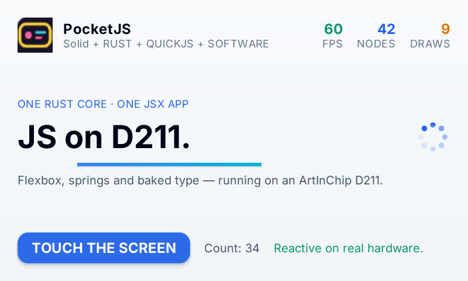

# d211-linux host

PocketJS on the **ArtInChip D211DBV** running Luban Linux 5.10.
**The host renders with the Rust software rasterizer, presents through
`/dev/fb0`, and reads the GT911 through evdev.** There is no GPU, no EGL, no
DRM, and no window system.



Pipeline for one frame:

```text
pocket_runtime_tick(PocketRuntimeInput)
        │
ui_render_incremental_scaled(1)     800x480 BGRA, damage bounds in logical px
        │
fb_present()                        dirty rect × density, row copy to /dev/fb0
        │
FBIOPAN_DISPLAY(yoffset=0)          visible page fixed at startup
```

## Display

The panel is **800×480, 32 bpp, `line_length` 3200**, configured with two
virtual pages (`yres_virtual` 960). **The host reads `fb_var_screeninfo` and
`fb_fix_screeninfo` and verifies the channel bitfields before selecting a blit
path.** When the layout matches red 16:8, green 8:8, blue 0:8 the rows are
copied; any other 32 bpp layout goes through the per-pixel packer. A non-32 bpp
mode is rejected with a message instead of guessed.

The BSP leaves page 1 visible after another UI has owned the panel.
**`fb_open()` calls `FBIOPAN_DISPLAY` with `yoffset = 0` before the first
frame**, so the host always writes the page the controller scans out. Damage
bounds from `pocket_runtime_damage_bounds()` are logical pixels and are
multiplied by the target raster density for the physical rect.

The logical viewport is the **full 800×480 panel at raster density 1**, so
layout coordinates map one-to-one onto the framebuffer.

## Input

**The touch device is found by capability, not by `eventN`.** `d211_input_open`
scans `/dev/input`, reads `EVIOCGNAME`, and accepts a device with the
`ABS_MT_POSITION_X/Y` pair, falling back to `ABS_X/ABS_Y` plus `BTN_TOUCH`. The
board exposes `goodix-ts` with the MT pair and a 800×480 axis range.

Raw axis values are scaled into the logical viewport with the `EVIOCGABS`
maximum. **The bounds hit is resolved once at the contact's down edge** with
`pocket_runtime_hit_test_bounds()`, and the same contact id is delivered for
the rest of the press. `POCKET_TOUCH_LOG=1` writes down/up edges with raw
coordinates, logical coordinates, and the resolved hit to stderr.

## Memory

`MemTotal` is **54 MB** and the stock system leaves about 20 MB available.
**Run the installed binary from the rootfs, not `/tmp`:** `/tmp` is a tmpfs,
so a resident bundle there consumes RAM directly, and a `/tmp` install
OOM-killed the host under touch input at 11 MB available. `/opt/pocketjs` on
the UBI rootfs keeps the same bytes reclaimable as page cache. With the
bundle on the rootfs the host holds **13 MB RSS and `MemAvailable` stays above
11 MB through repeated touch input**.

## Build

The canonical builder is the Ubuntu host with the built Luban SDK; the
Xuantie GCC wrapper and sysroot are x86_64 Linux binaries. **The final link
uses LLVM LLD from the pinned Rust nightly** because Luban binutils 2.35
cannot parse the `Zaamo`/`Zalrsc` RISC-V ELF attributes that modern LLVM
emits. The wrapper stays the driver, so CRT and glibc come from the Luban
sysroot.

```sh
# on the builder
bun tools/d211-linux.ts setup           # pinned QuickJS checkout + LLD shim
bun tools/d211-linux.ts build           # guest bundle, Rust core, host, receipt
bun tools/d211-linux.ts doctor
```

From macOS, `tools/d211-linux/remote-build.sh` syncs the checkout to the
builder, runs the build, and fetches `dist/d211-linux/`. **The build root
resolves to `$HOME/d211` unless `D211_LUBAN_SDK` names another SDK, and the
workflow takes the builder from `D211_REMOTE` with an optional
`D211_REMOTE_PORT`.**

## Deploy

```sh
# on the machine with the D211 on USB
bun tools/d211-linux.ts stop-ui         # test_lvgl owns the panel at boot
bun tools/d211-linux.ts deploy          # /opt/pocketjs on the rootfs
bun tools/d211-linux.ts run             # foreground, stats on stderr
```

The host reads `app.js` and `app.pak` beside its executable; `POCKET_JS` and
`POCKET_PAK` override the paths. `POCKET_FPS` caps the frame loop (default
60), `POCKET_FB` selects a framebuffer other than `/dev/fb0`.

## Validation on the D211DBV board

Build `472f7e072276bd38` with PocketJS `d211-linux-dev` (host ABI 11),
2026-09-12, kernel 5.10.44:

| Measurement | Value |
| ----------- | ----- |
| Boot (init + `app.js` eval) | 353 ms |
| Frame rate | 59.9 fps |
| Tick | avg 1.34 ms |
| Software render | avg 2.17 ms |
| Present | avg 0.04 ms |
| Process RSS | 6,836 kB |
| Damage | 4,080 attempts, 0 failures, 2 full redraws |
| Touch | 33 clean down/up pairs at 800×480, one action per tap |

The 800×480 framebuffer was captured through `dd if=/dev/fb0` and converted
to PNG; every pixel is non-black, the channel order matches the guest output,
and the screenshot above is the captured frame after thirty-three taps.

`dist/d211-linux/build-receipt.json` records the PocketJS commit, the Rust
toolchain and target, GCC and LLD versions, the sysroot path, the pinned
QuickJS revision, and the guest, core, and executable digests.
