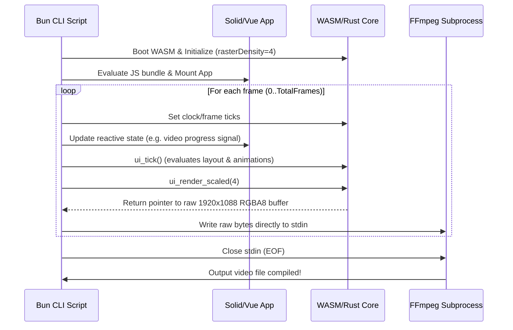

# High-Performance Video Rendering Pipeline with PocketJS

This proposal explores the feasibility, architecture, and performance benefits of using **PocketJS** as the core frame-generation engine in a video rendering pipeline (similar to Remotion or Hyperframes).

---

## 1. Architectural Overview: Remotion vs. PocketJS

Traditional JS-based video renderers (like Remotion) rely on headless browser automation (Puppeteer or Playwright running Chromium) to load pages, step animations, capture frame screenshots, and encode them. 

PocketJS allows for an in-process, headless architecture that runs entirely inside a single [Bun](https://bun.sh) process without browser overhead.

### Render Pipeline Flow

```mermaid
graph TD
    subgraph Remotion / Browser-Based
        R_App[React JSX App] --> R_DOM[DOM Tree Update]
        R_DOM --> R_Browser[Headless Chromium]
        R_Browser --> R_GPU[GPU Paint & Readback]
        R_GPU -->|Browser IPC: JPEG/PNG| R_Pipe[Node.js Parent Process]
        R_Pipe -->|Disk I/O / PNG Compress| R_Disk[Disk / FFmpeg Pipe]
    end

    subgraph PocketJS / In-Process
        P_App[Solid/Vue JSX App] -->|Reactive Graph| P_Wasm[WASM exports: ui_set_prop, etc.]
        P_Wasm -->|In-Process Layout| P_Core[Rust no_std Core]
        P_Core -->|Scanline Software Raster| P_RAM[WASM Buffer: Raw RGBA8]
        P_RAM -->|Direct RAM Pipe| P_FFmpeg[FFmpeg Subprocess]
    end
    
    style Remotion / Browser-Based fill:#f9d7d7,stroke:#c0392b,stroke-width:2px
    style PocketJS / In-Process fill:#d5f5e3,stroke:#27ae60,stroke-width:2px
```



### Comparison Matrix

| Criteria | Browser-Based (Remotion / Hyperframes) | PocketJS-Based Pipeline |
| :--- | :--- | :--- |
| **Runtime Environment** | Node.js + Headless Browser (Chromium) | Bun / Node.js + WASM (Rust Core) |
| **Memory Footprint** | ~200MB - 1GB+ per worker thread | **< 15 MB** per worker |
| **Startup / Boot Time** | ~1 to 3 seconds (browser launch & navigation) | **< 50 milliseconds** (wasm load & JS eval) |
| **Frame Generation Speed** | ~5 to 20 frames/sec (FPS) | **100+ to 500+ frames/sec** (pure CPU software scanline) |
| **Disk/GPU I/O Overhead** | High (GPU readback + PNG compression) | **Zero** (direct RAM piping of raw RGBA) |
| **Concurrency Scaling** | Heavy (constrained by Chrome CPU/GPU bounds) | **Extremely high** (constrained only by CPU cores) |

---

## 2. Why PocketJS is Uniquely Suited

### ⚡ Direct RAM-to-Process Piping
Rather than compressing frames into CPU-heavy PNG/JPEG formats and writing them to disk (which introduces massive Disk I/O bottlenecks), the raw 32-bit framebuffer bytes can be pulled directly from WASM linear memory and piped into FFmpeg via a standard OS pipe (`stdin`).

### ⏱️ Bulletproof Frame-Counter Determinism
As detailed in [DETERMINISM.md](file:///home/rayan/pocketjs/DETERMINISM.md), PocketJS uses a virtual clock (`@pocketjs/framework/clock`) where time is measured in frame ticks rather than the system wall clock. When rendering headlessly:
- Animations, spring physics, and transitions are evaluated frame-by-frame (`1/60s` increments).
- There is zero risk of frame drift, visual desync, or missed frames due to CPU lags.

### 📐 Integer-Scaled High Definition (1080p)
PocketJS's default canvas coordinates are fixed at `480 x 272` (logical PSP size). However, the Rust core exposes `ui_render_scaled(scale)` in [lib.rs](file:///home/rayan/pocketjs/wasm/src/lib.rs#L295-L298).
- **Scale Factor 4** generates a physical framebuffer of exactly **`1920 x 1088`** pixels.
- This is a standard H.264 macroblock-aligned width/height.
- To produce true 1080p (`1920 x 1080`), you can either discard/crop the 8 extra pixels in memory or instruct FFmpeg to crop them on the fly (`-vf "crop=1920:1080"`).

---

## 3. Reference Architecture: How to Pipe Frames

Here is a conceptual flow for the rendering script. It uses [Bun.spawn](https://bun.sh/docs/api/subprocess) to launch FFmpeg and pipes raw RGBA frames directly:



---

## 4. Proof of Concept Code (Bun/TypeScript)

Below is an implementation of a headless rendering script based on [tape.ts](file:///home/rayan/pocketjs/scripts/tape.ts) and [wasm-ops.js](file:///home/rayan/pocketjs/host-web/wasm-ops.js):

```typescript
import { existsSync, mkdirSync } from "node:fs";
import { createWasmUi } from "./host-web/wasm-ops.js";

const WASM_PATH = "./host-web/pocketjs.wasm";
const APP_JS_PATH = "./dist/tape-runtime/hero.js";
const APP_PAK_PATH = "./dist/tape-runtime/hero.pak";

async function renderVideo(app: string, durationInSec: number, fps: number, outputPath: string) {
  // 1. Load WASM and boot the PocketJS app
  const wasmBuffer = await Bun.file(WASM_PATH).arrayBuffer();
  const wasm = await createWasmUi(wasmBuffer);
  
  // Set raster density to 4x (1920x1088 output)
  wasm.init(4);

  const g = globalThis as Record<string, any>;
  g.ui = wasm.ops;
  g.__pak = existsSync(APP_PAK_PATH) ? await Bun.file(APP_PAK_PATH).arrayBuffer() : undefined;
  g.__pocketApp = app;
  
  // Load application bundle
  const src = await Bun.file(APP_JS_PATH).text();
  (0, eval)(src);
  
  const frameFn = g.frame as (buttons: number) => void;
  if (!frameFn) throw new Error("Entry bundle did not expose frame function");

  // 2. Spawn FFmpeg subprocess
  const width = 1920;
  const height = 1088;
  
  const ffmpeg = Bun.spawn([
    "ffmpeg",
    "-y",
    "-f", "rawvideo",
    "-pix_fmt", "rgba",
    "-s", `${width}x${height}`,
    "-r", String(fps),
    "-i", "-", // read raw frames from stdin
    "-vf", "crop=1920:1080:0:4", // Crop 8 vertical pixels (4 from top, 4 from bottom) to make it exactly 1920x1080
    "-c:v", "libx264",
    "-pix_fmt", "yuv420p",
    "-preset", "faster",
    "-crf", "18",
    outputPath
  ], {
    stdin: "pipe",
    stdout: "inherit",
    stderr: "inherit"
  });

  const totalFrames = durationInSec * fps;
  console.log(`Starting video render: ${totalFrames} frames @ ${fps}fps to ${outputPath}`);
  
  const start = Performance.now();

  // 3. Frame rendering loop
  for (let i = 0; i < totalFrames; i++) {
    // Tick the clock (or pass simulated button masks if replaying a user session)
    frameFn(0); 
    wasm.tick();
    
    // Pull the raw 1920x1088 RGBA8 buffer
    const frameBuffer = wasm.renderScaled(4); 
    
    // Write frame directly to FFmpeg stdin (no intermediate files!)
    ffmpeg.stdin.write(frameBuffer);
  }

  // 4. Close pipe and await completion
  ffmpeg.stdin.end();
  await ffmpeg.exited;

  const timeTaken = (Performance.now() - start) / 1000;
  console.log(`Render complete! Created ${outputPath} in ${timeTaken.toFixed(2)}s (${(totalFrames / timeTaken).toFixed(1)} FPS)`);
}

// Example usage:
// await renderVideo("hero", 10, 60, "./output.mp4");
```

---

## 5. Potential Challenges and Solutions

> [!IMPORTANT]
> Keep the following limitations in mind before committing to a full implementation:

### 1. Font Atlas Density
PocketJS bakes font atlases to support exactly the characters used at build time (see [README.md](file:///home/rayan/pocketjs/README.md#L60-L63)). 
- **Challenge**: Fonts baked at 1x density (for PSP) will look blurry when stretched 4x in the software rasterizer.
- **Solution**: Set `viewport.rasterDensity = 4` in your build environment or pass `--density=4` to the asset pipeline so the font baker rasterizes glyph atlases at high-resolution coordinates.

### 2. Missing Browser APIs
Because PocketJS runs on QuickJS / Bun + a custom Rust layout engine, typical browser dependencies (DOM APIs, Web Audio, SVG CSS filters) do not exist.
- **Challenge**: If your pipeline requires complex rendering elements, like dynamic WebGL shaders or third-party web charts, they will not run.
- **Solution**: Author components using PocketJS primitive elements (`<View>`, `<Text>`, `<Image>`). If canvas-like drawing is needed, use PocketJS texture uploads to stream raw textures into node handles.

### 3. Software Rasterization Constraints
- **Challenge**: CPU-based scanline rendering might become a bottleneck if the scene contains thousands of complex translucent shapes and high-resolution textures.
- **Solution**: The wgpu backend in `pocket3d/` can be used to run hardware-accelerated offscreen headless renders on servers equipped with a GPU. However, for most UI/composition tasks, the CPU scanline renderer in WASM remains faster than browser overhead.