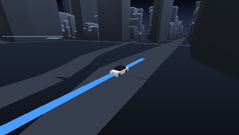
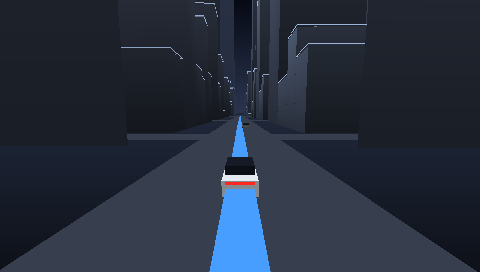
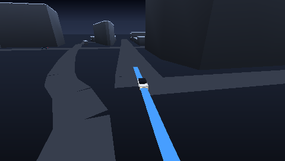
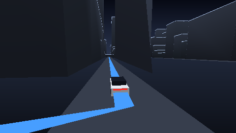

# pocket-drive — a real city, streamed onto a real PSP

A Tesla-dash-style night drive through Midtown Manhattan on PSP hardware:
OpenStreetMap building footprints and streets, cooked into simple extruded
meshes, **streamed tile-by-tile off the memory stick** around a car that
follows a baked route past real landmarks. New blocks rise out of the ground
as they load — the streaming is the show, not a loading screen.

| | |
| --- | --- |
|  |  |
|  |  |

The cooked area: ~2 × 2.2 km around the Flatiron / Empire State corridor,
4 390 buildings (94 % with real surveyed heights), 822 streets, 76 k
triangles across a 19×22 grid of 128 m tiles. The whole city pack is 2.6 MB;
resident tiles at any moment are ~5 MB of a 24 MB PSP.

```
cooker/cook.ts        Bun cooker: pinned OSM extract → tiled .pdrv pack + SVG preview
cooker/data/*.json.gz pinned extract (the source of truth; `fetch` refreshes it)
src/pack.rs           zero-copy .pdrv reader + 16-aligned tile buffers
src/stream.rs         residency ring, async sceIo loads, rise animation
src/scene.rs          backdrop (zero-triangle infinite ground), tiles, route ribbon
src/car.rs            box-art cars, route follower (arclength + corner slowdown)
src/main.rs           boot, pack probing, chase/orbit camera, frame loop, capture
```

## Run it

```sh
bun scripts/pocket-drive.ts                       # cook, build, PPSSPP, PNGs
bun scripts/pocket-drive.ts --cap-start 0 --cap-n 480   # capture the intro
bun scripts/pocket-drive.ts --embed               # no ms0 file: embedded-pack path
```

On a real PSP: copy `dist/drive/manhattan.pdrv` to `ms0:/pocket-drive/` next
to the EBOOT (or build with `--embed`). Controls: analog looks around,
CROSS boosts, SQUARE brakes, START pauses.

## How the streaming works

The pack is opened once; the streamer keeps a Chebyshev ring of tiles
resident around the car (`KEEP = 5`, ~640 m) with one async `sceIoReadAsync`
in flight at a time, polled per frame — the frame loop never blocks on the
memory stick. Load order is nearest-ring-first with a penalty for tiles
behind the car, so driving into fresh blocks streams the skyline in ahead of
arrival; tiles beyond `EVICT = 6` rings are dropped (free heap, GE-safe
because the previous display list is synced before update runs). A tile
becomes visible through a 30-frame ease-out rise animation driven by the
per-tile model matrix — `scale(32768, 32768·rise, 32768)`, the same matrix
that undoes the GE's 16-bit ÷32768 vertex normalization.

Without a memory-stick file the EBOOT falls back to a pack embedded at build
time (`DRIVE_PACK`), borrowing tile payloads straight out of `.rodata` behind
a 5-frame simulated latency — same choreography, zero copies, deterministic.

## The look, for cheap

- **Zero-triangle ground**: the backdrop fills sky-gradient / haze-band /
  ground-gradient screen quads split at the horizon row computed from camera
  pitch. The dark "infinite ground plane" is literally the clear color — no
  geometry, no z-fighting with roads.
- **Baked lighting in vertex color**: walls shaded by facing (fake NW sun),
  darkened toward the base (fake AO), roofs lighter with height; a per-id
  hash varies building tint. One `GU_COLOR_8888 | GU_VERTEX_16BIT` draw per
  tile plus one `GU_LINES` draw for the roof rim-light lines.
- **GE fog** (`sceGuFog`, 275–625 m) melts distant geometry into the same
  haze color the backdrop uses at the horizon, which also hides tile pop-in
  past the residency ring.
- **Route ribbon**: the navigation line is a flat miter-joined strip rebuilt
  each frame from the baked route, from just behind the car to 350 m ahead.

Typical frame: ~35 tiles, ~10 k triangles, ~80 draw calls.

## The cooker

`cooker/cook.ts` (Bun, zero deps) has two modes. `fetch` pulls buildings +
roads for the configured bbox from the Overpass API (or `--raw` an existing
response), clips roads to the area, projects to local meters and pins a
trimmed extract into `cooker/data/` (~220 KB gzipped) — cooking is offline
and byte-deterministic from that pin. The default mode ear-clips footprints,
extrudes them by surveyed `height` (falling back to `building:levels`, then
an id-hashed default), ribbons the streets by class width, quantizes
everything to the 12-byte GE vertex, buckets triangles into tiles, and walks
the street graph to bake the route: shortest-path legs (Dijkstra) between a
list of scenic waypoints — Flatiron → Empire State Building → Herald Square →
Garment District → Morgan Library → Park Avenue South — closed into a 4.1 km
loop. Cars (the player plus 16 box-art traffic cars running both directions)
follow it by arclength with corner slowdown at runtime.

Add a city by adding a bbox + waypoints to `CITIES` and running `fetch`.
Nothing in the format is Manhattan-specific.

## Format (`.pdrv` v1)

LE, 16-byte-aligned sections: 48 B header (units/m, tile size, grid origin +
dims, offsets) → tile directory (32 B/tile: payload offset, vert/index/line
counts, i16 AABB) → route (16 B/point: x, z, cumulative arclength, speed
class) → per-tile payloads `[12 B verts][u16 indices][12 B line verts]`.
Vertices are tile-local i16 at 1 unit = 0.25 m, ABGR vertex color; index and
vertex data are consumed by the GE in place (file tiles after one writeback,
embedded tiles straight from the module image).

## Verification

- Cook determinism: two cooks from the pinned extract are byte-identical.
- PPSSPPHeadless (software renderer) via `scripts/pocket-drive.ts`: boot,
  intro rise, avenue drive, 90° turns, oncoming traffic, and both pack
  sources verified frame-by-frame; streaming stats via `--features stats`
  (121 async tile loads in the first seconds, ~35 tiles/frame drawn).
- Real-hardware pass (PSPLINK, `--features stats` for `avg` numbers):
  pending, same acceptance bar as gu-demo.

Map data © OpenStreetMap contributors, via the Overpass API — ODbL. The
pinned extract in `cooker/data/` is a derived database of that data.
