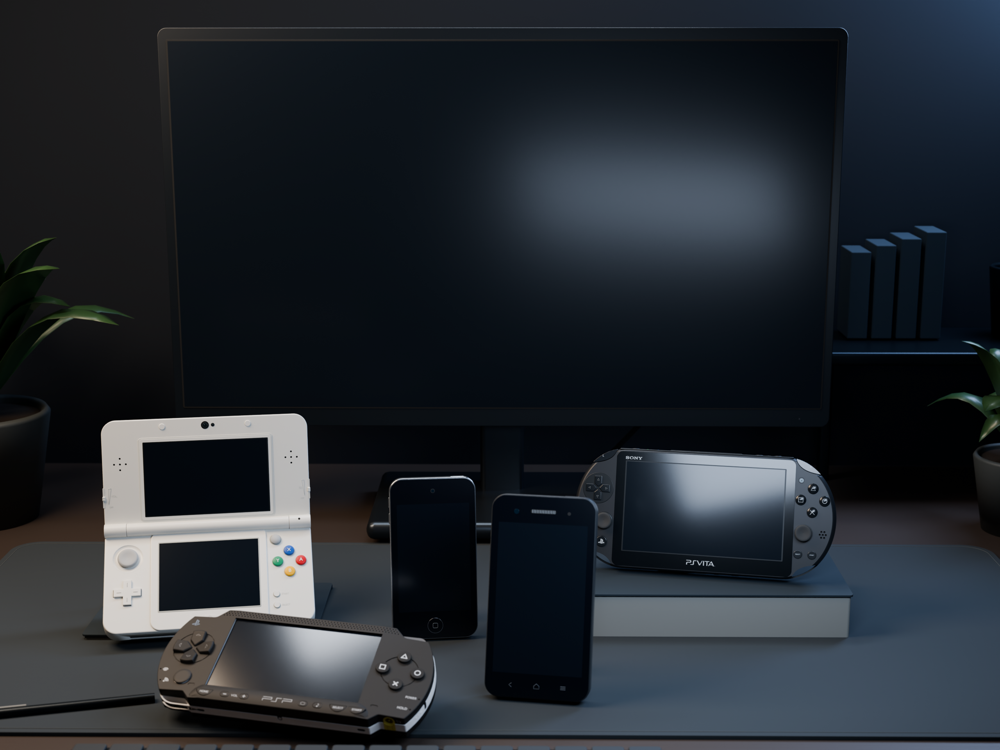
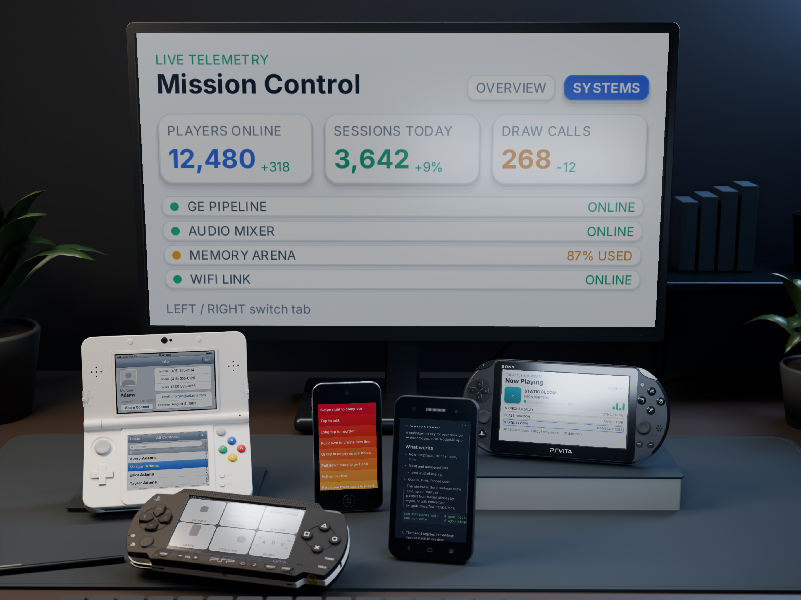

# Device desk scene

An editable Blender composition based on the supplied desktop mockup: dark oak,
a fabric mat, plants, books, a cropped keyboard, a central desktop monitor,
and five handheld devices. The group uses staggered depths and heights: the 3DS
sits at the left, the PSP leans at 24° in the foreground, and the Vita sits on a
33 mm riser at the right. The iPod stands behind the Android phone.
The render contains **no webpage UI, promotional copy, or screen content**.
Hardware markings remain part of the existing console models.



The image above is the maintained art preview for this scene. Intermediate
renders, logs, and verification receipts belong in ignored
`.pocket-build/validation/desk-scene/<run>/` directories.

## Assets and reproduction

`assets/scenes/desk-scene/` contains the editable `desk-scene.blend`,
`scene.json`, `web.json`, the maintained preview images, and attribution.
**`desk-scene.glb` is a generated artifact and is not tracked in Git.**
Build it with `--export-glb` into the ignored output directory shown below. The Blender
file includes packed PSP textures, separate manufactured parts, the hero camera,
four area lights, and procedural environment materials. Open it and render with
F12 to reproduce the composition. Blender **5.1.2** was used for the export.

From the repository root:

```sh
/Applications/Blender.app/Contents/MacOS/Blender --background --factory-startup --python-exit-code 1 \
  --python tools/desk-scene/build.py -- \
  --output .pocket-build/validation/desk-scene/local \
  --width 2560 --samples 128 --export-glb

/Applications/Blender.app/Contents/MacOS/Blender --background --factory-startup --python-exit-code 1 \
  --python tools/desk-scene/verify.py -- \
  .pocket-build/validation/desk-scene/local

/Applications/Blender.app/Contents/MacOS/Blender --background --factory-startup --python-exit-code 1 \
  --python tools/desk-scene/verify.py -- \
  .pocket-build/validation/desk-scene/local --glb
```

Use `--width 1200 --samples 24` for composition work. `--no-render` skips the
image; `--export-glb` emits the geometry handoff. The source generator imports
the existing handheld part helpers without rebuilding or modifying those assets.
`scene.json` records SHA-256 identities for the three imported model sources.

## Devices and screens

| Device root | Source | Display nodes / framebuffer pixels |
| --- | --- | --- |
| `Device__desktop-monitor` | Authored generic 24-inch desktop monitor | `Screen__desktop-monitor__primary`, 1920 × 1080 |
| `Device__psp` | Repository Dibad PSP interactive LOD | `Screen__psp__primary`, 480 × 272 |
| `Device__3ds` | Repository KTR-001 white New Nintendo 3DS `.blend` | `Screen__3ds__primary`, 400 × 240; `Screen__3ds__auxiliary`, 320 × 240 |
| `Device__vita` | Repository PCH-2000 PS Vita `.blend` | `Screen__vita__primary`, 960 × 544 |
| `Device__ipod-touch-4` | Authored by this generator | `Screen__ipod-touch-4__primary`, 640 × 960 |
| `Device__android-budget` | Authored generic budget Android handset | `Screen__android-budget__primary`, 480 × 800 |

The iPod uses Apple's **58.9 × 111 × 7.2 mm** envelope, with black front glass,
a curved stainless rear, Home button, front and rear cameras, volume and sleep
buttons, headphone opening, and 30-pin dock. The Android is a **66 × 126 × 10.5 mm**
design with a plastic rear, earpiece grille, thick bezels, capacitive navigation,
and micro-USB opening. The capacitive key symbols use **0.20 mm strokes**,
with a **3.3 mm home icon** and **3.2 mm menu icon**, printed in muted grey. Small details are authored approximations. The Android
does not represent a specific manufacturer or promise a device support target.

The monitor uses an authored **531.4 × 298.9 mm** 16:9 display inside a
**548 × 326 mm** cabinet. Its stand, tilt joint, VESA plate, ventilation slots,
rear connectors, rubber feet and power cable remain separate parts. The wider
desk mat and camera framing keep every device body in view. A **215 mm support
column** places the cabinet's lower edge **87 mm above the desk**.
All seven screens remain clear of the surrounding devices.

The 3DS sits at a **145° opening**. `3ds__Lid_Hinge` owns the upper screen and
lid components; the lower screen belongs to the base. The imported source
`Lid_OpenClose` action remains in the Blender data with a fake user, detached
from this fixed composition. The original device package remains the source
for its animated open/close export.

## Web handoff

**The GLB contains geometry and PBR base materials; it is not a baked lighting
match for the Cycles render.** Area lights, depth of field, the world shader,
and procedural bump networks remain in the Blender source. The hero camera is
exported. The render aspect is **4:3**. World dimensions in both deliverables are
metres; the named root converts the millimetre-authored parts with a 0.001 scale.

Each screen in the source and generated GLB has its own mesh, material, full-panel UVs, `device_id`,
`touch_surface`, `framebuffer_size`, and `bake_exclude` properties. glTF extras
carry these values. `scene.json` enumerates all seven bindings. Screen materials
use the existing `dynamic_screen` / `dynamic_screen_auxiliary` roles. The blank
material has no emissive content. The PSP glass overlay is omitted from the
scene as in its existing stage profile.

A Web renderer with camera movement can bind a PocketJS framebuffer to each
named screen material and use ray-hit UV coordinates for input. Preserve the
auxiliary surface identity on the lower 3DS screen. UVs have a bottom-left
origin; convert to the framebuffer's top-left origin at the host boundary.
The GLB retains separate objects for editing and has no draw-call batching.

For lighting work, bake environment and shell lighting into additional UVs or
textures while excluding the seven display meshes. Keep screen emission and
reflections adjustable in the Web renderer. Camera movement and hinge movement
will require a choice of baked indirect light and dynamic direct shadows.
**The GLB has no lightmaps or reflection probes.** The browser route below
retains lighting through a fixed-camera image composite.

The verifier loads the saved Blender scene or imports the GLB into an empty
scene. It checks all seven UV ranges, independent materials, on-camera screen
extents, camera-to-screen visibility rays, hinge ownership, metre-scale device
dimensions, and uncropped device bodies. This validates the geometry handoff;
it does not exercise a browser or a physical device.


## Interactive desk

Demo copy, status messages, input hints, accessibility labels, and source
comments use English.

**`/desk/` runs six PocketJS AppInstances across seven screens.** Each instance
owns an iframe, WASM runtime, bundle, asset pack, and framebuffer. The 3DS
instance owns both LCDs; lower-screen input carries the auxiliary surface ID.



This image is the maintained preview for the interactive route. The scene uses
`preview.png` as its background. `web.json` contains the screen triangles
projected from the Blender camera, with depth and UV coordinates. WebGL draws
these triangles with live app textures and combines them with the original
glass highlights through a screen blend. **Panel white is capped at 0.64**
in the display-referred composite, leaving brightness headroom for reflections.
A pure-white app therefore retains the glass gradient instead of erasing it.
Black pixels retain the original plate. **Pixels outside the screen triangles
retain the rendered environment lighting.** Perspective-correct interpolation
and hit testing keep pointer coordinates aligned with each angled display.
Apps retain their aspect ratios; input in letterbox margins is ignored.

| Device | App | Logical viewport | Input |
| --- | --- | --- | --- |
| Monitor | Mission Control | 480 × 272, density 2 | Left/right arrows switch panels |
| New 3DS | Contacts | 400 × 240 + 320 × 240 | Tap contacts on the lower LCD; drag the list |
| PSP | Motion Lab | 480 × 272 | Arrows and Enter |
| Vita | Now Playing | 480 × 272 | Q/E switch tracks; arrows and Enter |
| iPod touch 4 | Pocket Clear (Vue Vapor) | 320 × 480 | Tap lists; swipe tasks |
| Android | Pocket Note | 300 × 500 | Up/down arrows or wheel scroll the sample |

Click a screen to focus it, or use Tab. Input goes to that instance. The host
steps apps at 60 Hz and presents at up to 30 Hz, skipping unchanged primary
framebuffers. Pause, original-image mode, hidden tabs, and WebGL context loss
stop the simulation clock. A resumed clock caps catch-up work. Pointer cancel,
focus loss, and pause clear held input.

**The camera and environment lighting are fixed.** Screen changes do not cast
new light on nearby shells or the desk. This route does not use the GLB as its
background renderer. Full camera movement requires the lighting work described
above. Music demonstrates its interface without an audio adapter; Note displays
its sample document without a companion connection. These are browser instances,
not physical-device or sustained frame-rate acceptance. The input host supports
one pointer contact per selected screen; multi-finger gestures are not wired.

Build the desk package and start the local server:

```sh
bun tools/desk-scene/web.ts
bun site/preview.ts --no-build --port=4173
# Open http://127.0.0.1:4173/desk/
```

The lean build reuses existing WASM binaries. Run `bun tools/wasm.ts` and
`bun tools/text-wasm.ts` after changing their sources. `bun tools/site-build.ts`
builds the complete website, including WASM and the desk route, from source.
Both paths build apps in sequence because the compiler writes a shared style
table. App choices and dimensions live in `site/desk-apps.ts`.

The scene generator emits `web.json`. To re-export camera projection from an
existing Blender file without rendering the background again:

```sh
/Applications/Blender.app/Contents/MacOS/Blender --background --factory-startup --python-exit-code 1 \
  --python tools/desk-scene/export-web.py -- assets/scenes/desk-scene
```

Camera or geometry edits require a new background render and projection export.

Browser verification uses the repository's isolated headless Chrome runner and
real CDP mouse/key input. A GPU regression renders solid-black and solid-white
framebuffers through the production compositor and checks reflection contrast
on all seven screens; pure white must retain at least 30% of the black-screen
reflection range. It checks contact selection across the 3DS LCDs, Clear
list opening and swipe, panel/track changes, Note scrolling, pause/resume, and
390-pixel-wide layout. It compares live and original scene captures pixel by
pixel outside screen edges (a four-pixel margin excludes rasterization coverage;
a 1/255 channel tolerance allows Chrome image-layer rounding).

```sh
bun tools/build.ts note-main
bun test tests/desk-scene.test.ts tests/note.test.ts
mkdir -p .pocket-build/validation/desk-scene/local
WIDTH=1440 HEIGHT=1140 POCKETJS_VERIFY_DRIVER=site/verify-desk-driver.ts \
  DESK_RECEIPTS=.pocket-build/validation/desk-scene/local \
  SHOT=.pocket-build/validation/desk-scene/local/browser.png \
  bun site/verify.ts http://127.0.0.1:4173/desk/ 4000 '__deskReceipt()' \
  > .pocket-build/validation/desk-scene/local/browser.json
```

The report must contain no page, console, or network errors. Unit tests cover
perspective UV recovery, letterboxing, and all seven committed screen bindings.
