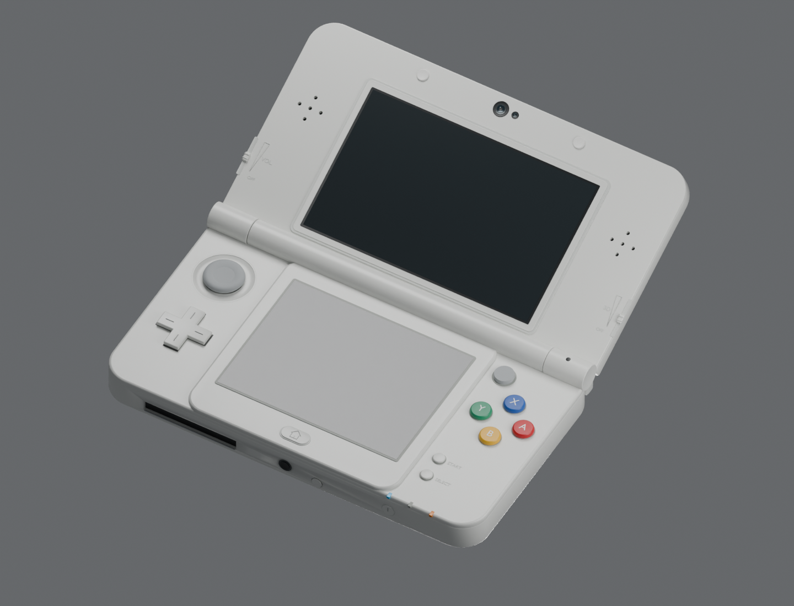
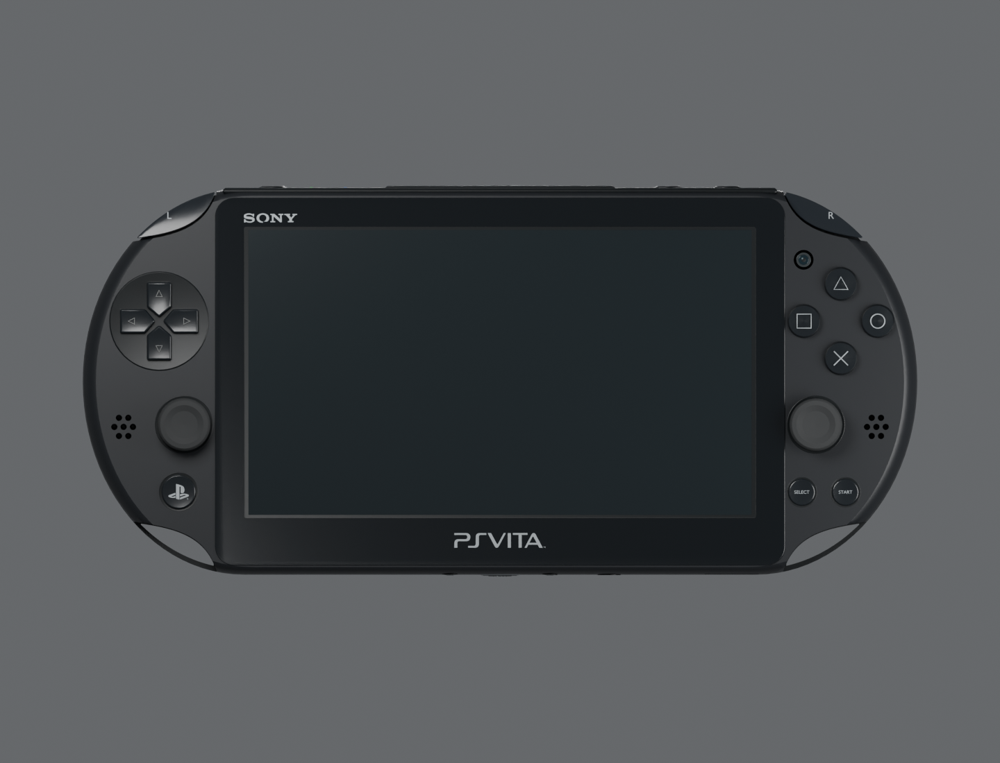
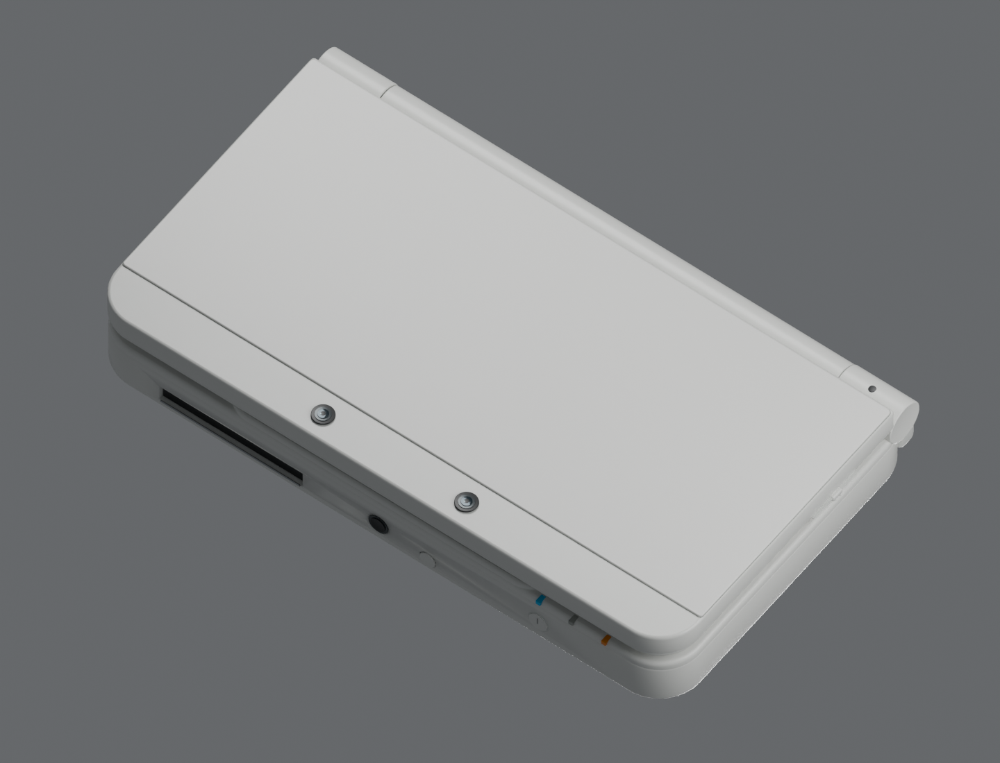
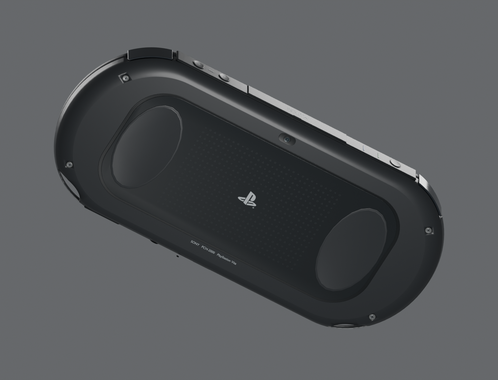
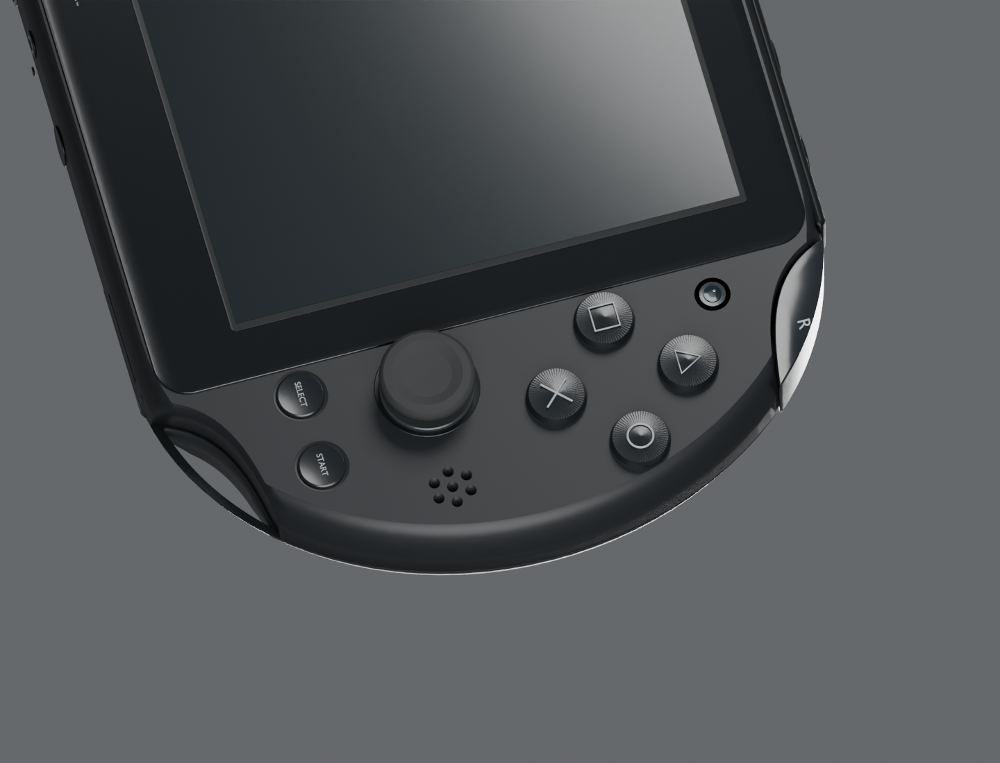

# Handheld model sources

`build.py` authors the white **KTR-001 New Nintendo 3DS, standard size**, and
black **PCH-2000 PS Vita** in Blender. Each asset directory contains its editable
`.blend`, web `.glb`, Stage profile, attribution and export receipt. The Blender
files include the individual named parts, materials, studio lights and camera.

```sh
/Applications/Blender.app/Contents/MacOS/Blender --background \
  --python tools/handheld-models/build.py -- all
```

Use `3ds` or `vita` to build one device; append `--no-render` to export the
assets without the inspection renders. Blender 5.1.2 was used for the checked
exports. The generator reads the committed vector contours without third-party
Python modules. Photos and dimensional sources are listed in `references.json`.
The dimensions come from the manufacturers; the small-feature placements and
material values are estimates from the photographs.

| New Nintendo 3DS | PS Vita 2000 |
| --- | --- |
|  |  |
|  |  |

The Vita front panel has concave reliefs at all four corners. The L/R buttons
sit in the upper chassis pockets and complete the outer curve below the front
lip. The lower reliefs open through the chassis and assembly seam, leaving the
curved strap bridges. The corner geometry follows the 4Gamer PCH-2000 teardown
close-ups in the reference manifest.



The 3DS `Lid_Hinge` empty owns the lid, display, speakers, cameras and sliders.
Its `Lid_OpenClose` clip runs closed at frame 1, open at 155 degrees at frames
40–60, and closed at frame 100. The native Blender X rotation is
`180 degrees - opening angle`. The browser exposes 0–175 degrees. The fixed
bottom screen retains its touch coordinates throughout the animation.

`dist/handheld-models/` receives front, rear, angled, closed and side renders.
The source scene stays editable; export batches static objects by material and
hinge parent. Displays keep separate materials and full-panel UVs. Fine rear
touch-panel markings are flat ink geometry, with no cylindrical sidewalls.

The homepage hero presents both devices beside the existing heading, with
PSPMAN first in the four-case strip. The Motion chapter retains its PSP.
The unlisted `/hero-layouts/` gallery compares three compositions, with desktop
and mobile screenshots and links to their live pages:

- `/?hero=cascade`: angled devices, 3DS at upper left and Vita at lower right.
- `/?hero=duet`: front views side by side.
- `/?hero=stack`: angled devices arranged above and below each other.

The default preview is `cascade`. The captions read **Nintendo 3DS** and
**PS Vita**. Drag the shell to rotate either device; the borderless clamshell
icon beside Nintendo 3DS toggles its lid between closed and 155° open.
The heading, CTA row and case strip use the same structure in all three layouts.

The homepage loads the device packages as they approach the viewport. Each new
device owns an AppInstance iframe and WebAssembly instance. New 3DS runs the
existing `apps/3ds-demo` Contacts app at **400×240 plus 320×240**. Vita runs
`apps/motions` at **480×272 logical pixels, rasterized at 960×544**. Pointer hits
on the lower 3DS glass retain their auxiliary-surface identity. Buttons hold
until a guest tick has consumed the press; hidden previews stop their clocks.

```sh
bun run site:build
bun test tests/handheld-models.test.ts tests/site-stage.test.ts
bun site/preview.ts --no-build --port=4173
# In another terminal:
bun site/verify-handhelds.ts http://127.0.0.1:4173/
WIDTH=390 HEIGHT=1200 MOBILE=1 SHOT=dist/handheld-models/homepage-handhelds-mobile.png \
  bun site/verify-handhelds.ts http://127.0.0.1:4173/
# Capture all three hero layouts at 1440 and 390 CSS pixels, then rebuild the gallery:
bun site/verify-hero-layouts.ts http://127.0.0.1:4173/
bun site/build.ts
```

The browser verifier checks contact selection, lower-screen scrolling, lid
close/reopen, Vita button raycasts and release, and records a screenshot plus
JSON receipt. Browser and Blender receipts cover the homepage models and demos;
they do not constitute physical-console deployment or acceptance.

[View the hinge animation](../../engine/pocket3d/examples/handheld/assets/new-nintendo-3ds/preview-hinge.gif).
Render it from the committed `.blend` file:

```sh
/Applications/Blender.app/Contents/MacOS/Blender --background \
  --python tools/handheld-models/render-animation.py
ffmpeg -y -framerate 6 -i dist/handheld-models/hinge-frames/%03d.png \
  -vf 'split[a][b];[a]palettegen=max_colors=128[p];[b][p]paletteuse' \
  -loop 0 dist/handheld-models/new-nintendo-3ds-hinge.gif
```
