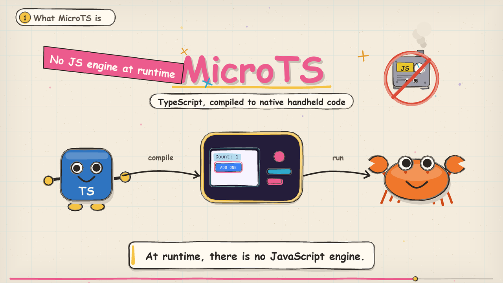

# MicroTS explainer video

A hand-drawn cartoon explainer, in English, of how MicroTS compiles TypeScript
to native code. **Every outline is a wobbled path redrawn from a per-frame
seed**, so the ink boils the way hand-inked animation does, and marker fills
sit a pixel or two off their outlines. Frames are drawn with Pillow at 2x and
downsampled on export, so a render needs no browser, no Blender and no
`node_modules`.



```sh
python3 tools/microts-explainer/render.py
```

The run writes to the ignored `dist/microts-explainer/` directory:
`microts-explainer.mp4` (1920x1080, 30 fps, H.264 + AAC), the mixed
`narration.wav`, the per-line voice cache in `voice/`, and `receipt.json` with
the duration, resolution, SHA-256 and every spoken line.

| Flag | Effect |
| --- | --- |
| `--stills` | one PNG per chapter into `dist/microts-explainer/stills/` |
| `--still-at 0.62` | fraction into each chapter the stills are taken at |
| `--scene pipeline,trait` | render the named chapters only |
| `--no-audio` | estimate line lengths instead of speaking them |
| `--voice am_michael --speed 1.0` | another Kokoro voice and rate |
| `--width 1280 --preset veryfast` | draft render |
| `--jobs 8` | frame workers; the default is CPU count minus four |

| File | Contents |
| --- | --- |
| `stagecraft.py` | paper stock, wobbled strokes and marker fills, lettering, cards, captions |
| `cast.py` | the cast and props: the TS mascot, Ferris, the script engine, the PocketJS handheld, a Game Boy Advance, the counter and Hero screens |
| `storyboard.py` | ten chapters, each with its narration lines and draw function |
| `soundtrack.py` | narration cache, square-wave music, sidechain ducking, mix |
| `tts_kokoro.py` | speaks the lines with Kokoro-82M inside the TTS virtual environment |
| `render.py` | timing plan, parallel frame render, ffmpeg mux, receipt |

**Every chapter is timed from its own narration.** `plan()` measures each
spoken line, places it on the clock and hands the scene the resulting beats, so
`ctx.since(i)` is the time since line `i` started and a visual beat lands on
the sentence that describes it.

## Narration

The voice is [Kokoro-82M](https://huggingface.co/hexgrad/Kokoro-82M)
(Apache-2.0) running on MLX, in a separate Python 3.12 environment so the
renderer itself stays dependency-light. Lines are cached by voice, speed and
text; delete `dist/microts-explainer/voice/` to re-record.

```sh
uv venv --python 3.12 .pocket-build/tts/venv
uv pip install --python .pocket-build/tts/venv/bin/python mlx-audio soundfile socksio "misaki[en]" \
  https://github.com/explosion/spacy-models/releases/download/en_core_web_sm-3.8.0/en_core_web_sm-3.8.0-py3-none-any.whl
brew install espeak-ng
```

**`misaki` points phonemizer at a wheel whose espeak data path does not
exist**, so `tts_kokoro.py` repoints it at the Homebrew install before loading
the model. Without that environment, `--no-audio` renders silent frames.

## What the video claims, and where it comes from

| Chapter | Claim | Source |
| --- | --- | --- |
| 1-2 | TypeScript compiles to native code that runs with no JavaScript engine | [microts.md](../../site/content/docs/microts.md) |
| 3 | A view plus its basename model; `i32` maps to a Rust `i32`, `number` is rejected under `--strict` | [typescript-support.md](../../site/content/docs/typescript-support.md) |
| 4 | Type checker, View IR and Model IR, Rust printer, `gen/*.rs` and `styles.bin`, Cargo with `microts` | [microts-model.md](../../site/content/docs/microts-model.md), [STRUCTURE.md](../../docs/STRUCTURE.md) |
| 5 | The view-model trait; `compiled` generates the methods, `rust` leaves them to the application | [microts-boundaries.md](../../site/content/docs/microts-boundaries.md) |
| 6 | `frame(input)` dispatches input, updates changed bindings, then the core lays out and emits a DrawList | [microts.md](../../site/content/docs/microts.md) |
| 7 | The admitted subset, the `file:line:column` error and the absence of a fallback | [typescript-support.md](../../site/content/docs/typescript-support.md) |
| 8 | The differential test compares the JavaScript run against the Rust run frame by frame | [tests/aot-differential.test.ts](../../tests/aot-differential.test.ts) |
| 9 | `apps/gba-hero` becomes a GBA ROM; about 11 FPS measured in mGBA against a 30 FPS target, hardware untested | [hosts/gba/README.md](../../hosts/gba/README.md) |

The screen in chapter 9 redraws the layout of
[`apps/gba-hero/app.tsx`](../../apps/gba-hero/app.tsx) at 240x160. The console
around it follows the AGB-001 front panel: the long shell with its deep left
round, the recessed d-pad, the diagonal A and B, angled START and SELECT, the
corner shoulder buttons and the bottom-right speaker slots.

## Requirements

`ffmpeg` on `PATH`, Python 3 with Pillow, and the TTS environment above for
narration. Code is set in JetBrains Mono from `assets/fonts/`; the lettering is
the first of Marker Felt, Noteworthy or Comic Sans MS that the system has, and
arrows fall back to a CJK face that carries them.
