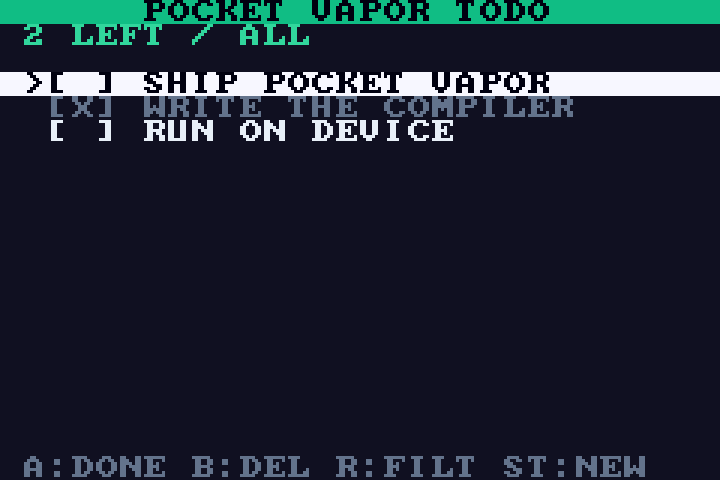
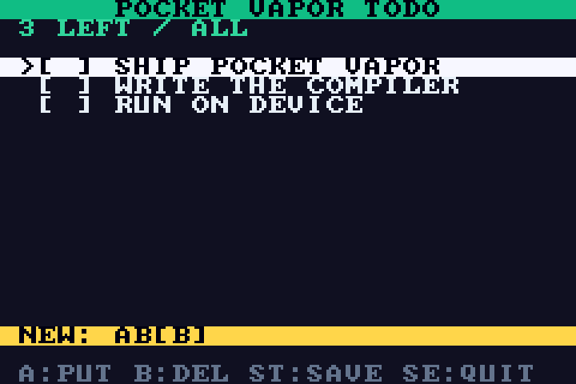
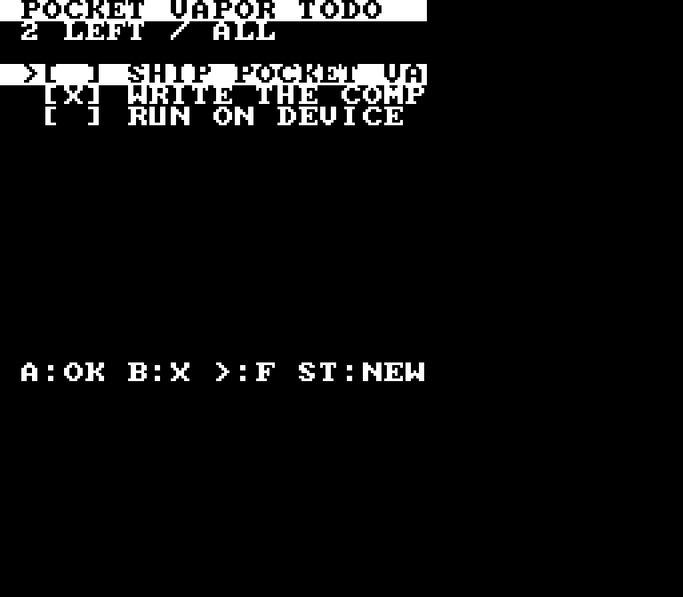
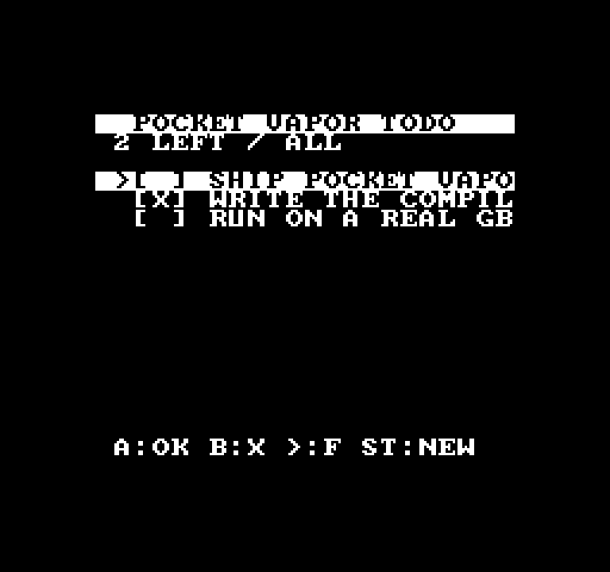

# Pocket Vapor

**Vue Vapor, compiled all the way down.** You write a component in a strict
TypeScript subset of Vue Vapor — real `ref`/`computed`, real JSX — and the
Pocket Vapor compiler emits native code for devices that could never host
a JavaScript engine: **ARM7 on the Game Boy Advance, SM83 on the Game Boy,
6502 on the NES, and Xtensa LX6 on the ESP32**. No JS engine, no GC, no
allocator. Vue Vapor compiles the virtual DOM away; Pocket Vapor compiles
the JavaScript engine away.

| GBA (arm-none-eabi-gcc) | GBA edit mode |
|---|---|
|  |  |

| Game Boy (sdcc, 20x18) | NES (cc65, 22x18) |
|---|---|
|  |  |

One component file, five executions: the oracle on real vue 3.6, three
cartridges, and one ESP32 firmware image. Screen geometry is a compile-time
constant (`SCREEN.width`/`SCREEN.height` from the host module): layout math
and width ternaries fold per target, so the narrow help strings on
GB/NES/ESP32 cost zero bytes on GBA — compile-time responsive UI.

The proof is [`examples/todo/todo.tsx`](examples/todo/todo.tsx) — TodoMVC
with filters, a computed remaining-count, windowed scrolling and a glyph
editor. The **same file** runs two ways:

- **Oracle**: unmodified on `vue@3.6` `runtime-with-vapor` (through the
  repo's vue-jsx-vapor pipeline) over a micro-DOM, in bun.
- **Device**: compiled to C by `vapor/compiler/compile.ts`, linked against a
  target runtime, and run as native code on a console or ESP32 — still with
  no JavaScript engine.

The parity suite drives one tape of button presses through the oracle and
each console emulator, then compares the rendered logical cell grid —
characters *and* palettes — cell-for-cell after every press. The ESP32
device verifier applies the same contract over UART to the physical board;
it is an opt-in hardware check, not a claim made by the emulator-only test
suite.

```
$ bun test vapor/tests/                 # incl. 3-console per-press parity

$ bun vapor/compiler/cli.ts vapor/examples/todo/todo.tsx
== reactive graph ==
refs:      todos cursor filter editing draft glyph      (6 dirty bits)
computeds: filtered remaining current scroll visible    (masks inferred)
effects:   eff_0 rows [1,2)   mask {todos, filter}
           eff_1 rows [3,15)  mask {todos, cursor, filter}
           eff_2 rows [17,18) mask {editing, draft, glyph}
           eff_3 rows [19,20) mask {editing}
== memory plan ==
state RAM: 41 B scalars/strings + 833 B pools + 66 B computed views
dist/vapor/todo.gba  (9.1 KB)
```

The business logic is keymaps, not branch ladders — and the compiler meets
the style: each named action becomes one C function, each keymap becomes a
10-slot function-pointer table in ROM, and the dispatch line becomes a
bounds-checked indexed call:

```tsx
const listKeys: Keymap = {
  [Button.Up]: () => moveCursor(-1),
  [Button.Down]: () => moveCursor(1),
  [Button.A]: toggleDone,
  [Button.B]: deleteCurrent,
  [Button.R]: cycleFilter,
  [Button.Select]: clearDone,
  [Button.Start]: openEditor,
};

onButton((b) => (editing.value ? editKeys : listKeys)[b]?.());
```

Deleting is `todos.value = todos.value.filter((x) => x !== t)` (compiled to
in-place pool compaction), and the selected todo is itself a computed —
`const current = computed(() => filtered.value[cursor.value])` — cached as
a nullable record pointer with the same validity-bit laziness as any other
computed.

The view is semantic components, not raw rows — real vapor functional
components under the oracle, **inlined to zero-cost paint code** by the
compiler (props substitute at the AST level, so const folding, dependency
masks and row spans all see through; six components add zero effects and
zero RAM):

```tsx
function TodoRow(props: { line: number; todo: Todo; selected: boolean }) { … }

<TitleBar line={0} text="POCKET VAPOR TODO" />
<StatusBar line={1} count={remaining.value} label={FILTERS[filter.value]} />
{visible.value.map((t, i) => (
  <TodoRow line={LIST_Y + i} todo={t} selected={t === current.value} />
))}
{editing.value ? <EditorBar line={17} draft={draft.value} glyph={GLYPHS[glyph.value]} /> : null}
```

Reactivity survives compilation as data: every ref is a dirty bit, every
dependency edge is a bitmask baked into ROM, computeds are lazy cached
functions with validity bits, and template bindings are paint effects that
run only when their mask intersects the dirty word. Pressing a button that
changes nothing costs zero repaints; pressing ↑ repaints only the list
block. See [DESIGN.md](DESIGN.md) for the whole argument, including where
it deliberately over-approximates Vue (static dependency analysis).

The look is declarative now — the same Tailwind names the big framework
compiles, lowered through each target's style contract (GBA: real palette
banks; ESP32: RGB565 ink/paper pairs; GB/NES: two glyph styles by
luminance), with the whole diagnostics matrix one command away:

```tsx
<row y={0} class="bg-emerald-500 text-slate-950 align-center">
<row class={selected ? "bg-slate-100 text-slate-950" : done ? "text-slate-500" : ""}>
```

```
$ bun run vapor:check
gba     OK    30x20, 6 style pairs
gb      OK    20x18, 6 style pairs
        warn  VS104: 3 distinct color pairs render as the same glyph style ...
nes     OK    22x18, 6 style pairs
        warn  VS104: 3 distinct color pairs render as the same glyph style ...
esp32   OK    20x18, 6 style pairs
meowbit OK    board (esp32)
        warn  VB103: "start" is only reachable as the a+b chord on meowbit ...
$ bun vapor/compiler/cli.ts check app.tsx --strict   # lossy lowering = failure
$ bun vapor/compiler/cli.ts check app.tsx --json     # demands + verdicts as data
```

Board rows are the AOT admission rule at work: MCU devices are data files
(`boards/meowbit.json`), the compiler derives what the app demands (buttons
used, style pairs, grid), and `check` judges every registered board against
them — see [BOARDS.md](BOARDS.md) for how this scales past one store's
ability to enumerate devices.

And the oracle is visible: `bun run vapor:dev` serves the app on real Vue
Vapor in your browser — inspectable DOM rows, keyboard as the pad,
`?target=gb` to see the DMG's two-style world before you burn a cart, or
`?target=esp32` to preview the MeowBit's 20×18 logical viewport.

## Commands

The ESP32 `flash` and default `verify` commands below write the connected
board; make a full-flash backup first as described in
[`runtime/esp32/README.md`](runtime/esp32/README.md). The standalone
`todo.esp32.bin` is app-only and, if written manually, belongs at
`0x10000`—never offset zero. Prefer the segmented flash script.

```sh
bun vapor/compiler/cli.ts vapor/examples/todo/todo.tsx                 # → dist/vapor/todo.gba
bun vapor/compiler/cli.ts vapor/examples/todo/todo.tsx --target gb     # → todo.gb  (32 KB)
bun vapor/compiler/cli.ts vapor/examples/todo/todo.tsx --target nes    # → todo.nes (40 KB)
bun run vapor:esp32                                        # → app-only todo.esp32.bin + gen-esp32/
bun run vapor:esp32:flash                                  # build + flash the connected ESP32 MeowBit
bun run vapor:esp32:verify                                 # build + flash + replay the Vue-oracle tape
bun vapor/scripts/play.ts                                 # build + open in mGBA
bun vapor/scripts/dev.ts [app.tsx]                        # visible oracle in the browser
bun vapor/compiler/cli.ts check <app.tsx> [--strict]      # cross-target diagnostics matrix
bun vapor/scripts/shot.ts                                 # bake docs screenshots
bun test vapor/tests/                                     # oracle + compiler + 3-console parity + shared device tape
```

Toolchains: `arm-none-eabi-gcc` + `mgba` (GBA/GB), `sdcc` + `rgbfix` (GB),
`cc65` (NES, emulated by the jsnes dev-dependency), and **ESP-IDF v6.0.2**
(ESP32; set `IDF_PATH` / `IDF_TOOLS_PATH` when auto-discovery does not find
the installation). Oracle tests run with bun alone. Notable per-target facts the
runtime absorbs: the console shadow grid IS the debug block (fixed
WRAM/CPU-RAM addresses), so the harness reads the logical screen even while
a 1 MHz SM83 trickles VRAM through vblank; DMG has one palette, so logical
palettes map to baked glyph styles; NES fits grid + pool + views into 2 KB
of CPU RAM with the font in CHR-ROM; ESP32 rasterizes the same logical
20×18 grid into RGB565 on a 160×128 ST7735; and sdcc 4.6's SM83 port
miscompiles some u8-by-u8 multiplies, so generated indexing is u16 pointer
arithmetic and bit masks come from a ROM table.

## Layout

```
vapor/
  DESIGN.md            the thesis + subset + target/style contracts
  examples/todo/       todo.tsx — the multi-console demo app
  host/                input.ts (Button/onButton), screen.ts (SCREEN geometry)
  oracle/              micro-DOM + grid painter + bundle boot (real vue)
  compiler/            compile.ts (TS AST → C), styles.ts (class DSL), rom.ts, cli.ts
  runtime/             vapor.h contract + vapor_core.c (shared grid/strings/line)
  runtime/gba|gb|nes/  per-console halves: crt0, video commit, input, debug block
  runtime/esp32/       ESP-IDF loop, ST7735 RGB565 raster, buttons, UART receipt
  scripts/             dev.ts (visible oracle), play.ts, shot.ts, esp32.ts (device protocol)
  tests/               styles + compiler + oracle + 3-console parity + shared device tape
  tests/harness/       headless libmgba runner (GBA+GB) + jsnes runner (NES)
```
